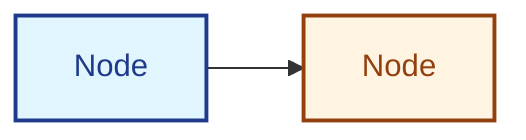

# AI Agent Instructions for LeanSpec Documentation Site

## Core Principles

When working with the LeanSpec documentation site:

1. **File paths MUST align with sidebar structure** - No exceptions
2. **Chinese translations MUST mirror English docs** - Complete parity required
3. **MDX formatting matters** - Bold with quotes/Chinese needs special handling
4. **Always validate builds** - Run `npm run build` before committing

## Critical Rules

### File Structure Alignment

Documentation folder structure must exactly match the sidebar hierarchy in `sidebars.ts`.

**Example:**
- Sidebar: `Usage → CLI Usage → Creating & Managing Specs`
- File: `./docs/guide/usage/cli/creating-managing.mdx` ✅

### Translation Completeness

Every English `.mdx` file needs a Chinese translation in `i18n/zh-Hans/docusaurus-plugin-content-docs/current/` with identical folder structure.

### Chinese Translation Quality

**CRITICAL**: Translations must be professional, natural, and technically accurate. Avoid literal word-by-word translation.

#### Translation Principles

**1. Keep English Terms for Core Concepts**

Never translate these terms - they are technical concepts with established English usage:

- **Core terms**: Spec, LeanSpec, CLI, Token, README, frontmatter, MCP
- **Commands**: `lean-spec create`, `lean-spec update`, `lean-spec board`, etc.
- **Status values**: `planned`, `in-progress`, `complete`, `archived`
- **File types**: `.md`, `.mdx`, `.json`, `.yaml`
- **Technical terms**: SDD (Spec-Driven Development), API, JWT, URL, JSON

**Examples:**
```markdown
✅ "使用 `lean-spec create` 创建新 Spec"
❌ "使用 `精益规范创建` 创建新规格说明"

✅ "Spec 文件使用 Markdown 格式"
❌ "规格说明文件使用 Markdown 格式"

✅ "状态从 `planned` 变为 `in-progress`"
❌ "状态从"已计划"变为"进行中""
```

**2. Add English References for Technical Concepts**

When translating technical terms that don't have established Chinese equivalents, include the English term in parentheses on first use:

```markdown
✅ "上下文经济 (Context Economy)"
✅ "信噪比 (Signal-to-Noise Ratio)"
✅ "渐进式披露 (Progressive Disclosure)"
✅ "依赖图 (Dependency Graph)"
✅ "工作记忆 (Working Memory)"

❌ "上下文经济" (without English reference)
```

After first use with English reference, you can use Chinese only in the same document.

**3. Use Natural Chinese Expression**

Avoid word-by-word literal translation. Use idiomatic Chinese that reads naturally:

```markdown
❌ "为什么这个很重要" (literal: why this is important)
✅ "重要性" or "为什么重要" (natural)

❌ "规格文件" (literal: specification file)  
✅ "Spec 文件" (natural, keeps technical term)

❌ "它是什么" (literal: what it is)
✅ "功能介绍" or "简介" (natural)

❌ "怎么做" (literal: how to do)
✅ "操作步骤" or "使用方法" (natural)
```

**4. Maintain Technical Accuracy**

Balance readability with precision:

- Keep code examples unchanged (English)
- Keep error messages unchanged (English)
- Keep file paths unchanged (English)
- Translate explanatory text naturally
- Preserve technical meaning

**5. Follow Chinese Typography Standards**

- Use full-width punctuation: ，。！？（）【】
- Add spaces between Chinese and English: "使用 CLI 工具"
- Add spaces between Chinese and numbers: "版本 2.0"
- No spaces inside Chinese text: "这是示例" not "这 是 示 例"

#### Translation Glossary

**Always Keep in English:**

| English | Chinese (Don't Use) | Usage |
|---------|-------------------|--------|
| Spec | ❌ 规格/规范 | "创建新 Spec" ✅ |
| LeanSpec | ❌ 精益规范 | "LeanSpec 方法论" ✅ |
| CLI | ❌ 命令行界面 | "使用 CLI 命令" ✅ |
| Token | ❌ 令牌/标记 | "Token 数量" ✅ |
| README | ❌ 说明文件 | "README.md 文件" ✅ |
| frontmatter | ❌ 前置元数据 | "frontmatter 配置" ✅ |
| MCP | ❌ 模型上下文协议 | "MCP 服务器" ✅ |

**Translate with English Reference (First Use):**

| English | Chinese Translation | First Use Example |
|---------|-------------------|------------------|
| Context Economy | 上下文经济 | "上下文经济 (Context Economy) 原则" |
| Signal-to-Noise | 信噪比 | "信噪比 (Signal-to-Noise) 最大化" |
| Progressive Disclosure | 渐进式披露 | "渐进式披露 (Progressive Disclosure)" |
| Dependency Graph | 依赖图 | "查看依赖图 (Dependency Graph)" |
| Working Memory | 工作记忆 | "适应工作记忆 (Working Memory)" |
| Intent Over Implementation | 意图优于实现 | "意图优于实现 (Intent Over Implementation)" |
| Bridge the Gap | 弥合差距 | "弥合差距 (Bridge the Gap)" |
| Spec-Driven Development | 规格驱动开发 | "规格驱动开发 (Spec-Driven Development, SDD)" |

**Pure Chinese Translation (Common Terms):**

| English | Chinese | Notes |
|---------|---------|-------|
| Overview | 概述 | Common, no English needed |
| Getting Started | 快速开始 | Standard phrase |
| Tutorial | 教程 | Common term |
| Examples | 示例 | Common term |
| Installation | 安装 | Common action |
| Configuration | 配置 | Common term |
| Usage | 使用 | Common term |
| Reference | 参考 | Common term |
| FAQ | 常见问题 | Common term |
| Best Practices | 最佳实践 | Common phrase |

#### Common Translation Patterns

**Section Headers:**

```markdown
✅ "## 什么是 LeanSpec？"
✅ "## 快速开始"
✅ "## 核心概念"
✅ "## 为什么使用 LeanSpec"

❌ "## What is LeanSpec?" (in Chinese docs)
❌ "## Getting Started" (in Chinese docs)
```

**Feature Descriptions:**

```markdown
✅ "LeanSpec 是一种轻量级的规格驱动开发 (SDD) 方法论"
❌ "LeanSpec 是一个轻量级规范驱动的开发方法"

✅ "使用 `lean-spec board` 查看 Spec 看板"
❌ "使用 `lean-spec board` 查看规格说明看板"
```

**Technical Explanations:**

```markdown
✅ "Spec 文件使用 Markdown 格式，包含 frontmatter 元数据"
❌ "规格说明文件使用 Markdown 格式，包含前置元数据"

✅ "Token 数量影响上下文经济 (Context Economy)"
❌ "令牌数量影响上下文经济"
```

#### Quality Checklist

Before committing Chinese translations, verify:

- [ ] All "Spec" references use "Spec" (not "规格" or "规范")
- [ ] All commands remain in English (e.g., `lean-spec create`)
- [ ] Technical terms have English references on first use
- [ ] Chinese text reads naturally (not word-by-word translation)
- [ ] Full-width punctuation used consistently
- [ ] Spaces between Chinese and English/numbers
- [ ] Code blocks and examples unchanged
- [ ] No MDX syntax errors (run `pnpm validate:mdx`)

**See**: `specs/115-chinese-translation-quality/` for detailed guidelines and examples.

### MDX Formatting

**Chinese text with multiple bolds:**
```markdown
这与 **语法属性（Syntactic Properties）** 形成对比  ✅ (space before second **)
```

**Bold with quotes:**
```markdown
** "quoted text" **  ✅ (spaces inside bold markers)
```

### Mermaid Diagram Dark Theme Styling

**CRITICAL**: Mermaid diagrams MUST have custom styling for dark theme contrast. Default colors are unreadable in dark mode.

**Always apply styles to Mermaid nodes:**
```markdown

```

**Use color palette:** Light background + dark text for contrast in both themes. See `agents/documentation-quality-standards.md` section 6 for full color palette and examples.

### Build Validation

Before committing:
```bash
cd docs-site && npm run build
```

Must pass with no broken links, MDX errors, or missing translations.

### MDX Syntax Validation

Validate source MDX files for syntax issues that cause build failures:
```bash
cd docs-site && pnpm validate:mdx
```

This checks Chinese docs and blogs for:
- Unescaped special characters (`<` `>` `{` `}`)
- Bold formatting spacing issues
- Other MDX syntax problems

Run before committing Chinese content changes.

## Workflow

1. Update English docs
2. Update Chinese translations (mirror structure exactly)
3. Update config files (`sidebars.ts`, `docusaurus.config.ts`)
4. Run `npm run build` - must succeed
5. Verify pages in dev mode
6. Commit only if build passes

## Detailed Guidelines

For comprehensive documentation quality standards, see [agents/documentation-quality-standards.md](./agents/documentation-quality-standards.md).

---

**Formula**: Documentation Quality = Content × Structure × Translation Completeness
