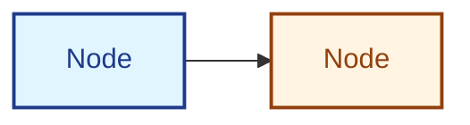

# AI Agent Instructions for LeanSpec Documentation Site

## Core Principles

When working with the LeanSpec documentation site:

1. **File paths MUST align with sidebar structure** - No exceptions
2. **Chinese translations MUST mirror English docs** - Complete parity required
3. **MDX formatting matters** - Bold with quotes/Chinese needs special handling
4. **Always validate builds** - Run `npm run build` before committing

## Critical Rules

### File Structure Alignment

Documentation folder structure must exactly match the sidebar hierarchy in `sidebars.ts`.

**Example:**
- Sidebar: `Usage → CLI Usage → Creating & Managing Specs`
- File: `./docs/guide/usage/cli/creating-managing.mdx` ✅

### Translation Completeness

Every English `.mdx` file needs a Chinese translation in `i18n/zh-Hans/docusaurus-plugin-content-docs/current/` with identical folder structure.

### Chinese Translation Quality

**CRITICAL**: Translations must be professional, natural, and technically accurate. Avoid literal word-by-word translation.

**Core Rules:**

1. **Keep English Terms for Core Concepts**
   - Use "Spec" (not "规格"), "LeanSpec", "CLI", "Token", "README", "frontmatter"
   - Keep all commands in English: `lean-spec create`, `lean-spec update`, etc.
   - Keep status values: `planned`, `in-progress`, `complete`, `archived`
   - Keep file extensions: `.md`, `.mdx`, `.json`

2. **Add English References for Technical Terms**
   ```markdown
   上下文经济 (Context Economy)  ✅
   信噪比 (Signal-to-Noise)  ✅
   依赖图 (Dependency Graph)  ✅
   ```

3. **Use Natural Chinese Expression**
   ```markdown
   ❌ "规格文件" (too literal)
   ✅ "Spec 文件" (natural, clear)
   
   ❌ "为什么这个很重要" (awkward)
   ✅ "重要性" or contextual phrasing (natural)
   ```

4. **Translation Glossary Reference**
   - **Keep English**: Spec, LeanSpec, CLI, Token, README, frontmatter, commands
   - **Add English ref**: Context Economy, Signal-to-Noise, Progressive Disclosure, Dependency Graph, Working Memory
   - **Pure Chinese**: 概述 (Overview), 快速开始 (Getting Started), 教程 (Tutorial), 示例 (Examples), 安装 (Installation)

**See**: `specs/115-chinese-translation-quality/` for complete translation guidelines and glossary.

### MDX Formatting

**Chinese text with multiple bolds:**
```markdown
这与 **语法属性（Syntactic Properties）** 形成对比  ✅ (space before second **)
```

**Bold with quotes:**
```markdown
** "quoted text" **  ✅ (spaces inside bold markers)
```

### Mermaid Diagram Dark Theme Styling

**CRITICAL**: Mermaid diagrams MUST have custom styling for dark theme contrast. Default colors are unreadable in dark mode.

**Always apply styles to Mermaid nodes:**
```markdown

```

**Use color palette:** Light background + dark text for contrast in both themes. See `agents/documentation-quality-standards.md` section 6 for full color palette and examples.

### Build Validation

Before committing:
```bash
cd docs-site && npm run build
```

Must pass with no broken links, MDX errors, or missing translations.

### MDX Syntax Validation

Validate source MDX files for syntax issues that cause build failures:
```bash
cd docs-site && pnpm validate:mdx
```

This checks Chinese docs and blogs for:
- Unescaped special characters (`<` `>` `{` `}`)
- Bold formatting spacing issues
- Other MDX syntax problems

Run before committing Chinese content changes.

## Workflow

1. Update English docs
2. Update Chinese translations (mirror structure exactly)
3. Update config files (`sidebars.ts`, `docusaurus.config.ts`)
4. Run `npm run build` - must succeed
5. Verify pages in dev mode
6. Commit only if build passes

## Detailed Guidelines

For comprehensive documentation quality standards, see [agents/documentation-quality-standards.md](./agents/documentation-quality-standards.md).

---

**Formula**: Documentation Quality = Content × Structure × Translation Completeness
