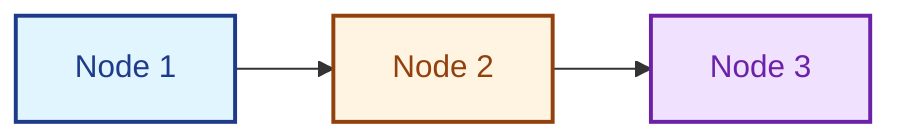
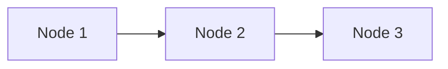

# Documentation Quality Standards

Comprehensive guidelines for maintaining high-quality documentation in the LeanSpec documentation site.

## 1. File Path and Sidebar Alignment

**CRITICAL**: Documentation file paths MUST always align with the sidebar structure.

### Examples

- Sidebar: `Usage → CLI Usage → Creating & Managing Specs`
- File path: `./docs/guide/usage/cli/creating-managing.mdx` ✅

- Sidebar: `Usage → Overview`
- File path: `./docs/guide/usage/overview.mdx` ✅

### Rule

The folder structure should mirror the sidebar hierarchy exactly. If the sidebar shows a nested structure, the file system must reflect that nesting.

### Verification Checklist

After any documentation restructuring, always verify:

1. File paths match sidebar item `to` or `label` values
2. Folder nesting matches sidebar category structure
3. Build succeeds with `npm run build` (no broken links)

### File Path Patterns

```
docs/
├── guide/
│   ├── index.mdx                    → sidebar: "Guide"
│   ├── usage/
│   │   ├── overview.mdx            → sidebar: "Usage → Overview"
│   │   ├── cli/
│   │   │   ├── creating-managing.mdx   → "Usage → CLI Usage → Creating & Managing"
│   │   │   └── finding-specs.mdx       → "Usage → CLI Usage → Finding Specs"
│   │   └── advanced-features/
│   │       └── templates.mdx           → "Usage → Advanced Features → Templates"
```

## 2. Chinese Translation Completeness

**CRITICAL**: Chinese documentation must ALWAYS align with English documentation. NO MISSING translations.

### Requirements

- Every English `.mdx` file MUST have a corresponding Chinese translation in `i18n/zh-Hans/docusaurus-plugin-content-docs/current/`
- Folder structure in Chinese docs MUST mirror English docs exactly
- When adding new English docs, immediately add Chinese translations
- When moving/renaming English docs, move/rename Chinese docs identically

### Verification Commands

```bash
# Check English structure
find docs/guide -name "*.mdx" | sort

# Check Chinese structure (should match)
find i18n/zh-Hans/docusaurus-plugin-content-docs/current/guide -name "*.mdx" | sort
```

### Chinese Mirror Structure

```
i18n/zh-Hans/docusaurus-plugin-content-docs/current/
└── [EXACT SAME STRUCTURE AS docs/]
```

## 3. MDX Syntax Rules

### Special Characters That Break MDX

MDX is stricter than regular Markdown. Certain characters must be escaped or wrapped in code blocks.

#### Angle Brackets `<` `>`

**Problem:** Unescaped angle brackets are interpreted as JSX/HTML tags and can break rendering.

**Correct:**
```markdown
Use &lt; for less than and &gt; for greater than.
Or wrap in code: `x < y` and `a > b`
```

**Incorrect:**
```markdown
x < y will break MDX parsing
```

**When they're OK:**
- In proper HTML/JSX tags: `<div>content</div>`
- In inline code: `` `<example>` ``
- In code blocks

#### Curly Braces `{` `}`

**Problem:** Curly braces are interpreted as JSX expressions.

**Correct:**
```markdown
Use escaped braces: \{ and \}
Or wrap in code: `{example}`
```

**Incorrect:**
```markdown
Object {key: value} will break
```

**When they're OK:**
- In JSX expressions: `{variableName}`
- In inline code: `` `{example}` ``
- In code blocks

### Bold Formatting in Chinese Text

When using multiple bold sections on the same line in Chinese text, **add a space before the second `**`** to ensure proper rendering.

**Correct:**
```markdown
这与 **语法属性（Syntactic Properties）** 形成对比
```

**Incorrect:**
```markdown
这与**语法属性（Syntactic Properties）**形成对比
```

**Why**: MDX parser needs clear token boundaries in Chinese text where word spacing isn't natural.

### Bold Formatting with Quotes

When bolding text that contains double quotes, **add spaces inside the bold markers** to prevent MDX parsing issues.

**Correct:**
```markdown
** "quoted text" **
```

**Incorrect:**
```markdown
**"quoted text"**
```

**Why**: MDX can misinterpret `**"` as the start of a JSX attribute. The space prevents this.

### Other Special Characters

**Angle brackets in bold text:**
```markdown
** &lt;example&gt; **  <!-- Use HTML entities -->
```

**Avoid:**
```markdown
**<example>**  <!-- MDX tries to parse as JSX -->
```

### Bold Formatting Checklist

- [ ] Chinese text with multiple bolds: Space before second `**`
- [ ] Bold with quotes: Spaces inside bold markers `** "text" **`
- [ ] Angle brackets: Use HTML entities `&lt;` and `&gt;`
- [ ] Test rendering in both languages

## 4. Link Maintenance

When restructuring documentation:

### Always Update

- Internal markdown links (relative paths)
- `docusaurus.config.ts` (footer links, navbar links)
- `sidebars.ts` (sidebar structure)
- Chinese translations of ALL affected files

### Never

- Leave broken links (build will fail)
- Update only English docs without Chinese
- Use absolute paths when relative paths work

## 5. Build Validation

**REQUIRED**: Before committing any documentation changes:

```bash
# From docs-site directory
npm run build
```

### Must Pass

- ✅ No broken links
- ✅ No MDX parsing errors
- ✅ Both English and Chinese locales build successfully

### Common Errors

- **Broken links**: Check file paths match new structure
- **MDX parsing errors**: Check bold formatting with quotes/Chinese
- **Missing translations**: Ensure Chinese docs are updated

## 6. Mermaid Diagram Styling

**CRITICAL**: Mermaid diagrams must be readable in both light and dark themes. Default colors often have poor contrast in dark mode.

### Required Styling for All Mermaid Diagrams

When creating Mermaid diagrams, ALWAYS apply custom styles to ensure proper contrast in dark theme:

**Correct - With Dark Theme Support:**
````markdown

````

**Incorrect - Default Colors:**
````markdown

````

### Color Palette Guidelines

Use these color combinations for good contrast in both themes:

**Blue variants:**
- `fill:#e1f5ff,stroke:#1e3a8a,color:#1e3a8a` (light blue background, dark blue text)

**Orange/Brown variants:**
- `fill:#fff4e1,stroke:#92400e,color:#92400e` (light orange background, dark brown text)

**Purple variants:**
- `fill:#f0e1ff,stroke:#6b21a8,color:#6b21a8` (light purple background, dark purple text)

**Green variants:**
- `fill:#e1ffe1,stroke:#166534,color:#166534` (light green background, dark green text)

**Red variants:**
- `fill:#ffe1e1,stroke:#991b1b,color:#991b1b` (light red background, dark red text)

**Gray/Neutral:**
- `fill:#f5f5f5,stroke:#525252,color:#525252` (light gray background, dark gray text)

### Style Properties Explained

- **`fill`**: Background color of the node (use light colors)
- **`stroke`**: Border color of the node (use dark colors for contrast)
- **`stroke-width`**: Border thickness (typically `2px`)
- **`color`**: Text color inside the node (should match stroke color for consistency)
- **`linkStyle`**: Arrow/line styling between nodes

### Flowchart vs Graph Diagrams

**For flowcharts** (with `flowchart TD` or `flowchart LR`):
```markdown
flowchart TD
    A[Step 1] --> B[Step 2]
    
    style A fill:#e1f5ff,stroke:#1e3a8a,stroke-width:2px,color:#1e3a8a
    style B fill:#fff4e1,stroke:#92400e,stroke-width:2px,color:#92400e
```

**For graphs** (with `graph LR` or `graph TD`):
```markdown
graph LR
    A[Node 1] --> B[Node 2]
    
    style A fill:#e1f5ff,stroke:#1e3a8a,stroke-width:2px,color:#1e3a8a
    linkStyle default stroke:#333,stroke-width:2px
```

### Subgraph Styling

For diagrams with subgraphs, apply styles to the subgraph container:

```markdown
graph LR
    subgraph S1["Group 1"]
        A[Item 1]
        B[Item 2]
    end
    
    style S1 fill:#e1f5ff,stroke:#1e3a8a,stroke-width:2px
    style A fill:#f5f5f5,stroke:#525252,stroke-width:1px,color:#525252
    style B fill:#f5f5f5,stroke:#525252,stroke-width:1px,color:#525252
```

### Testing Dark Theme

After adding/updating Mermaid diagrams:

1. Run dev server: `npm start`
2. Toggle dark theme in the site's theme switcher
3. Verify all diagram nodes have clear, readable text
4. Check that colors have sufficient contrast

### Reference Example

See `docs/advanced/ai-assisted-spec-writing.mdx` for comprehensive examples of properly styled Mermaid diagrams.

## Workflow for Documentation Changes

1. **Plan**: Understand full scope of changes (English + Chinese)
2. **Update English**: Make changes to English docs
3. **Update Chinese**: Mirror ALL changes in Chinese docs
4. **Update Config**: Fix links in config files and sidebars
5. **Validate**: Run `npm run build` - must pass
6. **Verify**: Check changed pages in development mode
7. **Commit**: Only commit if build succeeds

## Quality Formula

**Documentation Quality = (Content Quality) × (Structure Quality) × (Translation Completeness)**

All three dimensions must be maintained for effective documentation.

---

**Note**: These rules prevent hours of debugging broken builds. They're based on real issues encountered during development.
