# LeanSpec vs Other SDD Approaches

An honest comparison of LeanSpec with other Spec-Driven Development tools and methodologies.

## Quick Comparison Matrix

| Tool | Type | Lightweight | Flexible | Dev Velocity | Learning Curve | AI-Friendly | Vendor Lock-in | Stars |
|------|------|-------------|----------|--------------|----------------|-------------|----------------|-------|
| **[LeanSpec](https://github.com/codervisor/lean-spec)** | Methodology + CLI | ✅ Lean | ✅ Adaptive | 🚀 Fast | Low | High | None |  |
| **[OpenSpec](https://openspec.dev)** | CLI | ✅ Simple | ✅ Good | 🚀 Fast | Low | High | None |  |
| **[GitHub Spec-Kit](https://github.com/github/spec-kit)** | CLI/Slash | ❌ Heavy | ❌ Rigid | 🐢 Medium | Medium | High | Medium |  |
| **[BMAD](https://github.com/bmad-code-org/BMAD-METHOD)** | Framework | ❌ Complex | ✅ Flexible | 🦥 Slow | High | Medium | None |  |
| **[Agent OS](https://buildermethods.com/agent-os)** | Framework | ❌ Heavy | ⚠️ Structured | 🐢 Medium | Medium | High | Low |  |
| **[cc-sdd](https://github.com/gotalab/cc-sdd)** | CLI | ✅ Simple | ⚠️ Template-based | 🚀 Fast | Medium | High | Medium |  |
| **[Kiro IDE](https://kiro.dev)** | IDE | ❌ Heavy | ❌ Rigid | 🚀 Fast | Low | High | High |  |

**Legend:**
- **Type**: What kind of approach (Methodology, CLI, IDE, Framework, etc.)
- **Dev Velocity**: How quickly can teams write specs and start implementation?
- **Lightweight**: Can you get started without drowning in setup and documentation?
- **Flexible**: Can you adapt the structure to different feature types and team sizes?
- **Vendor Lock-in**: Can you easily move your specs/work to another tool?
  - None: Specs are plain markdown/text, portable anywhere
  - Medium: Some migration effort needed (structured format/proprietary)
  - High: Specs locked into proprietary IDE/platform

## The Gap in the Market

**Current problem**: Developers must choose between:
- **Heavyweight IDEs with lock-in** (Kiro) - Powerful but proprietary IDE/credit system
- **Heavyweight slash-command systems** (Spec-Kit) - Comprehensive but rigid workflow
- **Comprehensive workflow frameworks** (Agent OS) - Structured multi-phase process but heavy setup
- **Change-tracking focused** (OpenSpec) - Good for brownfield but complex state management
- **Template-based Kiro variants** (cc-sdd) - Structured but methodology lock-in
- **Full-featured development frameworks** (BMAD) - Comprehensive but complex with high ceremony

**LeanSpec's position**: A lightweight methodology with supporting tools—optimized for velocity without sacrificing quality or freedom. Like Agile, it's a philosophy first, implementation second.

---

## Detailed Comparisons

### vs OpenSpec (Fission-AI)

**OpenSpec Strengths**:
- Brownfield-first design (~7k GitHub stars)
- Change-tracking with separate `specs/` and `changes/` folders
- Good AI agent integration (15+ tools)
- Delta format for spec modifications
- No API keys required
- Archive workflow for completed changes

**OpenSpec Weaknesses**:
- More complex state management (two folder system)
- Higher cognitive overhead for simple features
- Change proposal overhead for every feature
- Less intuitive for solo developers
- More ceremony around spec updates

**LeanSpec vs OpenSpec**:

| Aspect | OpenSpec | LeanSpec |
|--------|----------|----------|
| **Mental Model** | Two folders (specs + changes) | Single source of truth |
| **Workflow** | Formal proposals for every change | Direct updates with git history |
| **Simplicity** | Good but with overhead | Simpler, fewer concepts |
| **Flexibility** | Limited customization | Highly customizable |
| **PM Tools** | Dashboard only | Board, stats, timeline, Gantt |
| **Best For** | Multi-team brownfield | Solo to enterprise, any phase |

**When to Choose OpenSpec**:
- Primarily modifying existing features
- Need explicit change tracking and diffs
- Multiple teams touching same specs
- Want formal proposal/review cycle

**When to Choose LeanSpec**:
- Want simpler mental model
- Solo or small team development
- Need flexibility without ceremony
- Prefer single source of truth over change tracking
- Want faster iteration cycles
- Need project management visibility

**Migration Path**: Consolidate OpenSpec's `specs/` and merge with `changes/` into LeanSpec's single spec structure.

---

### vs GitHub Spec-Kit

**Spec-Kit Strengths**:
- Comprehensive slash command system (44k+ GitHub stars)
- Strong GitHub/AI agent integration (15+ agents)
- Multi-phase workflow (constitution → specify → plan → tasks → implement)
- Well-documented process with video guides
- Enterprise-backed (GitHub official)

**Spec-Kit Weaknesses**:
- Heavy setup with Python dependencies (uv/Python 3.11+)
- Rigid 6-step workflow that can't be adapted
- Opinionated structure forces specific format
- Generates extensive boilerplate
- Slow iteration for simple changes
- Less suitable for brownfield projects

**When to Choose Spec-Kit**:
- Large enterprise wanting GitHub-official solution
- Teams building completely new ("greenfield") projects
- Need for extensive governance and audit trails
- Want guided, hand-holding workflow

**When to Choose LeanSpec**:
- Want flexibility to adapt workflow
- Working on existing codebases
- Need speed for iterative development
- Prefer minimal setup (just npm install)
- Want to scale from simple to complex as needed

**Migration Path**: Extract key specs from Spec-Kit's constitution/specify files into LeanSpec format. Drop rigid workflow phases.

---

### vs BMAD (BMAD Method)

**BMAD Strengths**:
- Comprehensive development framework (20k+ GitHub stars)
- Multi-phase methodology (Analysis → Planning → Solutioning → Implementation)
- Specialized AI agents (PM, Analyst, Architect, Developer, etc.)
- Scale-adaptive workflows (Levels 0-4)
- Strong game development support
- Extensive documentation and community

**BMAD Weaknesses**:
- Complex installation and setup
- Heavyweight framework (entire bmad/ folder structure)
- Steep learning curve
- High ceremony for simple features
- Opinionated multi-phase workflow
- Overkill for small projects

**When to Choose BMAD**:
- Building complex enterprise applications
- Game development projects
- Need comprehensive agent orchestration
- Want guided multi-phase methodology
- Large projects requiring extensive planning

**When to Choose LeanSpec**:
- Want lightweight, focused specs
- Small to medium projects
- Iterative development workflow
- Need flexibility over framework
- Prefer simplicity and speed

**Migration Path**: Extract key specs from BMAD's PRD/GDD documents into LeanSpec format. Simplify multi-phase workflow to core specs.

---

### vs Agent OS

**Agent OS Strengths**:
- Comprehensive workflow framework with 6-phase process
- Multi-agent orchestration (Claude Code subagents)
- Structured spec → tasks → implementation workflow
- Built-in visual asset handling and requirements research
- Profile system for different project types
- Standards management with Claude Code Skills integration
- Verification and testing workflows built in
- Active development by Builder Methods community

**Agent OS Weaknesses**:
- **Heavy installation process** - Base + project installation setup
- **Complex folder structure** - `agent-os/specs/YYYY-MM-DD-name/planning/` hierarchy
- **Rigid multi-phase workflow** - Shape → Write → Create Tasks → Implement
- **High ceremony** - Mandatory requirements gathering, verification reports
- **Agent-specific** - Optimized heavily for Claude Code (some Cursor support)
- **Overkill for simple features** - All features go through same heavy process
- Verbose output and documentation requirements
- Steeper learning curve than simple CLI tools

**When to Choose Agent OS**:
- Using Claude Code heavily with subagents
- Need comprehensive multi-phase workflow guidance
- Want structured requirements research built in
- Building complex features that benefit from verification
- Team needs standardized multi-agent orchestration
- Have time for installation and configuration

**When to Choose LeanSpec**:
- Want minimal setup and faster iteration
- Need flexibility to adapt process per feature
- Tool-agnostic workflow (any AI coding assistant)
- Prefer simplicity over comprehensive structure
- Solo or small team without need for heavy orchestration
- Want single source of truth vs multi-folder structure

**Migration Path**: Extract spec content from Agent OS's `agent-os/specs/*/spec.md` and `planning/requirements.md` into LeanSpec format. Consolidate multi-folder structure into single spec files. Preserve visual assets and key decisions, drop verification reports.

**Time estimate**: 30-60 min per spec (restructuring multi-phase outputs)

---

### vs cc-sdd (Kiro-based)

**cc-sdd Strengths**:
- Kiro-compatible SDD workflow (~1.6k GitHub stars)
- Multi-language support (12 languages)
- Team-customizable templates
- Project Memory (steering) for context
- Requirements → Design → Tasks workflow
- AI-DLC (AI-Driven Development Life Cycle) integration

**cc-sdd Weaknesses**:
- Tightly coupled to Kiro methodology
- Template-based (less flexible for variants)
- More ceremony than LeanSpec
- Steeper learning curve than OpenSpec
- Less suitable for teams not using Kiro philosophy

**When to Choose cc-sdd**:
- Using or familiar with Kiro IDE
- Need structured AI-DLC workflow with steering
- Multi-language team requirements
- Want template-driven team standardization

**When to Choose LeanSpec**:
- Want flexibility without Kiro lock-in
- Minimal setup with max control
- Need project management tools beyond specs
- Prefer single source of truth

**Migration Path**: Extract cc-sdd specs and convert Kiro-style commands to LeanSpec structure. Preserve steering docs as project context.

---

### vs Kiro IDE

**Kiro IDE Strengths**:
- Integrated development environment (not just specs)
- Built-in AI agents with autonomous execution (agent hooks)
- Spec-driven development methodology native to IDE
- Fast iteration with steering/project memory
- Multimodal input (images, diagrams, code)
- AWS-backed (enterprise credibility)
- Single tool for the entire workflow

**Kiro IDE Weaknesses**:
- **Vendor lock-in** - Proprietary IDE, can't use elsewhere
- **Credit-based pricing** - $20-200/month plus overage costs
- **Closed source** - No portability, no community forks
- IDE-only (not terminal/CLI friendly)
- Rigid Kiro-specific workflow
- No open export format for specs
- Overkill for simple projects

**When to Choose Kiro IDE**:
- Need all-in-one IDE + SDD + AI agents
- Don't mind vendor lock-in for convenience
- Want autonomous agent execution (hooks)
- Have budget for ongoing subscription

**When to Choose LeanSpec**:
- Want portable, vendor-neutral specs
- Need flexibility without lock-in
- Prefer CLI/git-friendly workflow
- Want free, open-source tooling
- Need to own your specs forever
- Working in non-IDE environments

**Migration Path**: Export specs from Kiro (if possible), convert to markdown. You may lose agent definitions, but specs remain portable.

---

## Feature Comparison

### Core Features

| Feature | Spec-Kit | Agent OS | OpenSpec | cc-sdd | Kiro IDE | BMAD | LeanSpec |
|---------|----------|----------|----------|--------|----------|------|----------|
| Spec creation | ✅ | ✅ | ✅ | ✅ | ✅ | ✅ | ✅ |
| Templating | ✅ | ✅ | ❌ | ✅ | ✅ | ✅ | ✅ |
| Custom fields | ❌ | ⚠️ Standards | ❌ | ⚠️ Limited | ✅ | ⚠️ Limited | ✅ |
| Status tracking | ✅ Phases | ⚠️ Folder-based | ✅ Changes | ✅ Workflows | ✅ Built-in | ✅ Workflows | ✅ |
| Tagging | ❌ | ❌ | ❌ | ⚠️ Basic | ✅ | ✅ | ✅ |
| Search | ⚠️ Basic | ⚠️ Basic | ✅ | ⚠️ Basic | ✅ | ✅ | ✅ |
| AI Integration | ✅ 15+ agents | ✅ Multi-agent | ✅ 15+ agents | ✅ 7+ agents | ✅ Native | ✅ Built-in | ✅ |

### Project Management

| Feature | Spec-Kit | Agent OS | OpenSpec | cc-sdd | Kiro IDE | BMAD | LeanSpec |
|---------|----------|----------|----------|--------|----------|------|----------|
| Board view | ❌ | ❌ | ✅ Dashboard | ❌ | ✅ Tasks | ❌ | ✅ |
| Statistics | ❌ | ❌ | ❌ | ❌ | ⚠️ Basic | ⚠️ Basic | ✅ |
| Timeline | ❌ | ❌ | ❌ | ❌ | ❌ | ❌ | ✅ |
| Gantt chart | ❌ | ❌ | ❌ | ❌ | ❌ | ❌ | ✅ |
| Dependencies | ⚠️ Manual | ❌ | ❌ | ❌ | ⚠️ Manual | ⚠️ Manual | ✅ |

### Workflow Features

| Feature | Spec-Kit | Agent OS | OpenSpec | cc-sdd | Kiro IDE | BMAD | LeanSpec |
|---------|----------|----------|----------|--------|----------|------|----------|
| Workflow flexibility | ❌ Rigid | ❌ 6-phase | ✅ Flexible | ⚠️ Template-based | ❌ Rigid | ⚠️ Opinionated | ✅ Flexible |
| Brownfield support | ⚠️ Limited | ✅ Good | ✅ Excellent | ✅ Good | ⚠️ Limited | ✅ Good | ✅ |
| Change tracking | ❌ | ⚠️ Folder-based | ✅ Delta format | ❌ | ✅ Built-in | ⚠️ Manual | ⚠️ Git-based |
| Test integration | ⚠️ Manual | ✅ Built-in | ❌ | ❌ | ✅ Hooks | ⚠️ Manual | ⚠️ Optional |
| Coverage tracking | ❌ | ❌ | ❌ | ❌ | ❌ | ❌ | ❌ |

### Developer Experience

| Feature | Spec-Kit | Agent OS | OpenSpec | cc-sdd | Kiro IDE | BMAD | LeanSpec |
|---------|----------|----------|----------|--------|----------|------|----------|
| Learning curve | Medium | Medium | Low | Medium | Low | High | Low |
| Setup time | 15-30 min | 20-40 min | 5 min | 5-10 min | 10-15 min | 20-40 min | 5-15 min |
| Cognitive load | Medium | High | Medium | Medium | Medium | High | Low |
| Maintenance | Medium | Medium | Medium | Medium | Low | High | Low |
| Flexibility | Low | Low | Medium | Low | Low | Medium | **High** |
| Ceremony | High | High | Medium | Medium | Medium | High | Low |

---

## When to Choose Each Tool

### Choose LeanSpec if:
- Want lightweight AND flexible
- Building features, not just following process
- Working with AI coding agents (any tool, not just Claude Code)
- Agile/iterative workflow
- Team size from 1 to 50+
- Need to scale from minimal to enterprise
- Value velocity and adaptability
- Prefer single source of truth over multi-folder structures
- Want minimal installation and setup time

### Choose OpenSpec if:
- Primarily working on existing codebases
- Need explicit change tracking and proposals
- Multiple teams modifying same specs
- Want formal review workflow
- Brownfield is your primary use case

### Choose GitHub Spec-Kit if:
- Large enterprise wanting GitHub-official solution
- Teams building completely new ("greenfield") projects
- Need for extensive governance and audit trails
- Want guided, hand-holding workflow

### Choose BMAD if:
- Building complex enterprise applications
- Game development projects
- Need comprehensive agent orchestration
- Want guided multi-phase methodology
- Large team with formal process needs
- Have time for extensive setup and learning

### Choose Agent OS if:
- Using Claude Code with subagents heavily
- Need comprehensive 6-phase workflow guidance
- Want structured requirements research built in
- Building complex features that benefit from verification
- Need multi-agent orchestration with context management
- Team wants standardized spec → tasks → implementation flow
- Have time for base + project installation setup

### Choose cc-sdd if:
- Using or planning to use Kiro IDE
- Need structured AI-DLC workflow with steering
- Multi-language support is essential
- Want template-driven team standardization

### Choose Kiro IDE if:
- Need integrated IDE with built-in SDD workflow
- Want autonomous agent hooks for automation
- Value all-in-one convenience over portability
- Have budget for subscription ($20-200/month)
- AWS-backed solution matters to your org

---

## Migration Guides

### From OpenSpec

**Challenge**: Consolidating two-folder state management

**Steps**:
1. Merge `specs/` (current state) into LeanSpec structure
2. Review `changes/` for in-progress work
3. Archive completed changes or integrate into specs
4. Adopt simpler single-source model
5. Optional: Keep change tracking via Git

**Time estimate**: 15-30 min per project

---

### From Spec-Kit

**Challenge**: Simplifying rigid multi-phase workflow

**Steps**:
1. Extract constitution/principles → project context
2. Extract specify/plan content → spec files
3. Extract tasks → track in LeanSpec if needed
4. Drop rigid phase transitions
5. Keep what adds clarity, remove ceremony

**Time estimate**: 20-40 min per spec

---

### From BMAD

**Challenge**: Simplifying comprehensive framework to lean specs

**Steps**:
1. Extract key specs from PRD/GDD documents
2. Consolidate Analysis/Planning phases into spec files
3. Map specialized agents' outputs to LeanSpec structure
4. Drop multi-phase workflow complexity
5. Keep essential architecture decisions, remove ceremony

**Time estimate**: 40-90 min per feature (BMAD specs are comprehensive)

---

### From Agent OS

**Challenge**: Consolidating multi-folder structure and multi-phase workflow

**Steps**:
1. Extract spec content from `agent-os/specs/YYYY-MM-DD-name/spec.md`
2. Merge `planning/requirements.md` into spec as context
3. Consolidate task breakdown from `tasks.md` if needed
4. Preserve visual assets from `planning/visuals/`
5. Drop verification reports and implementation folders
6. Convert date-prefixed folders to LeanSpec date-based structure
7. Simplify multi-phase approach to single spec file

**Time estimate**: 30-60 min per spec (restructuring outputs)

---

### From cc-sdd

**Challenge**: Decoupling from Kiro methodology while preserving specs

**Steps**:
1. Extract requirements from `.kiro/specs/` files
2. Convert Kiro-style structure to LeanSpec format
3. Preserve steering docs as project context
4. Migrate slash commands to standard Git workflow
5. Update templates to match your workflow

**Time estimate**: 20-40 min per spec

---

### From Kiro IDE

**Challenge**: Extracting specs from proprietary IDE format

**Steps**:
1. Export specs from Kiro (check if export feature exists)
2. Convert proprietary format to markdown
3. Extract steering/context docs as project documentation
4. Migrate agent hooks to standard git hooks or CI/CD
5. Accept loss of some IDE-specific features

**Time estimate**: 30-60 min per spec (proprietary format)

---

## Real-World Scenarios

### Scenario 1: Growing Startup

**Situation**: Team of 3-5, rapid iteration, need flexibility

**Why LeanSpec**:
- Start with Standard template (lightweight)
- Add custom fields when team grows
- Use board/stats for visibility
- Adapt structure per feature type

**Not Spec-Kit**: Too much process overhead, slows velocity  
**Not OpenSpec**: Change tracking adds unnecessary complexity early  
**Not Agent OS**: Multi-phase workflow and installation overhead too heavy  
**Not Kiro**: Vendor lock-in and costs don't justify benefits for small team  
**Not BMAD**: Comprehensive framework overkill for small teams

---

### Scenario 2: Enterprise with Governance

**Situation**: 50+ developers, compliance requirements, audit trails

**Why LeanSpec**:
- Use Enterprise template
- Custom fields for compliance (reviewer, issue, epic)
- PM tools for oversight
- Still lean compared to heavy alternatives

**Not Spec-Kit**: Can work, but more rigid and heavyweight  
**Not OpenSpec**: Lacks enterprise features  
**Not Agent OS**: More complexity than needed for governance  
**Not Kiro**: Vendor lock-in risk and budget concerns at scale  
**Not BMAD**: Can work, but higher complexity and learning curve

---

### Scenario 3: AI-Powered Development Team

**Situation**: Humans + AI agents, need clear but scannable specs

**Why LeanSpec**:
- AGENTS.md integration
- Merge with existing AI prompts
- Lightweight = less context for AI to process
- Flexible structure = different features, different formats
- Tool-agnostic (works with Claude Code, Cursor, etc.)

**Not Spec-Kit**: Heavy slash commands, rigid phases  
**Not OpenSpec**: Two-folder complexity harder for AI  
**Not Agent OS**: Optimized for Claude Code specifically, heavy folder structure  
**Not Kiro**: IDE-only limits flexibility, vendor lock-in  
**Not BMAD**: Heavy agent orchestration, complex for AI context

---

### Scenario 4: Brownfield/Legacy Modernization

**Situation**: Large existing codebase, adding specs retroactively

**Why OpenSpec or LeanSpec**:
- OpenSpec: Excellent change tracking for modifications
- LeanSpec: Simpler if you don't need delta tracking

**Not Spec-Kit**: Designed for greenfield  
**Not Agent OS**: Heavy multi-phase process better for greenfield  
**Not Kiro**: IDE workflow doesn't fit legacy modernization  
**Not BMAD**: Better for greenfield than brownfield

---

## Competitive Positioning

### LeanSpec's Unique Value

**A methodology that combines principles with practical tools**:
1. Lightweight philosophy (clarity over documentation)
2. Adaptive workflow (unlike rigid frameworks)
3. Built-in project visibility (board, stats, timeline, Gantt)
4. AI-native design (AGENTS.md for AI-human collaboration)
5. Zero vendor lock-in (specs are portable markdown)
6. Scales from solo to enterprise

Like Agile is a methodology supported by tools (Jira, Trello), LeanSpec is a spec methodology supported by a CLI.

### Market Position

```mermaid
quadrantChart
    title SDD Tools Market Position
    x-axis Lightweight --> Heavyweight
    y-axis Rigid --> Flexible
    "LeanSpec ⭐": [0.12, 0.88]
    OpenSpec: [0.22, 0.68]
    cc-sdd: [0.28, 0.48]
    "Agent OS": [0.68, 0.32]
    BMAD: [0.78, 0.62]
    Spec-Kit: [0.82, 0.28]
    "Kiro IDE": [0.88, 0.32]
```

**LeanSpec (⭐) occupies the optimal position**: lightweight AND flexible (top-left quadrant).

---

## FAQ

**Q: Can I migrate from Agent OS to LeanSpec gradually?**  
A: Yes. Start with new specs in LeanSpec, migrate old specs from `agent-os/specs/*/` as you touch them. Extract `spec.md` and consolidate multi-folder structure.

**Q: Can I migrate from BMAD to LeanSpec gradually?**  
A: Yes. Start with new specs in LeanSpec, migrate old specs as you touch them.

**Q: Can I use LeanSpec with Agent OS's Claude Code workflow?**  
A: Yes. LeanSpec specs are markdown files—they can feed into any workflow including Agent OS commands. You might find LeanSpec's simpler structure faster than Agent OS's multi-phase process.

**Q: Is Agent OS too heavy for my needs?**  
A: If you find the 6-phase workflow (shape → write → create-tasks → implement → orchestrate → verify) cumbersome, or the `agent-os/specs/YYYY-MM-DD-name/planning/` folder structure complex, LeanSpec offers a lighter alternative with single-file specs and flexible workflows.

**Q: Is LeanSpec just another opinionated framework?**  
A: No. LeanSpec is a methodology, not a framework. It provides principles (like Agile) and supporting tools, but you adapt the structure to your needs. It's anti-opinionated by design.

**Q: What if I need BMAD-level documentation for compliance?**  
A: Use LeanSpec Enterprise template with custom fields. If compliance mandates BMAD, check if they'll accept lean alternatives.

**Q: Can I use LeanSpec with Spec-Kit's GitHub integration?**  
A: Yes. LeanSpec specs are markdown files—use them with any tool.

**Q: Does LeanSpec work with Claude Code subagents like Agent OS?**  
A: Yes. As a methodology, LeanSpec is tool-agnostic. You can apply LeanSpec principles with Claude Code, Cursor, or any AI coding assistant. The CLI tool supports any workflow, while Agent OS is tightly coupled to Claude Code's subagent system.

**Q: Is LeanSpec only for AI-powered teams?**  
A: No. It works great for human-only teams too. AI integration is a bonus, not a requirement.

---

## Summary

**LeanSpec is a methodology, not just a tool**. Like Agile transformed project management, LeanSpec transforms spec-driven development.

**It solves the false choice** between:
- Lightweight tools with limited flexibility (OpenSpec, cc-sdd)
- Flexible but heavyweight frameworks (BMAD, Spec-Kit)
- Powerful but proprietary platforms (Kiro IDE, Agent OS)

**Choose LeanSpec when you want**:
- A methodology that values clarity over documentation
- Flexibility to adapt to your workflow (not forced into rigid phases)
- An approach that scales from solo to enterprise
- AI-native collaboration patterns
- Zero vendor lock-in (methodology + portable specs)
- Minimal ceremony with maximum velocity

**Check others when**:
- You need an all-in-one IDE (Kiro)
- Compliance mandates specific formats (BMAD)
- You need deep GitHub integration (Spec-Kit)
- You need explicit change tracking (OpenSpec)
- You want Kiro-compatible workflow (cc-sdd)
- You need comprehensive multi-agent orchestration (Agent OS)

The market needs a methodology that's both lean and flexible. That's LeanSpec.

---

## External Links

### Official Websites & Repos

- **GitHub Spec-Kit**: [github.com/github/spec-kit](https://github.com/github/spec-kit)
- **Agent OS**: [buildermethods.com/agent-os](https://buildermethods.com/agent-os) | [github.com/buildermethods/agent-os](https://github.com/buildermethods/agent-os)
- **OpenSpec**: [openspec.dev](https://openspec.dev/) | [github.com/Fission-AI/OpenSpec](https://github.com/Fission-AI/OpenSpec)
- **cc-sdd**: [npmjs.com/package/cc-sdd](https://www.npmjs.com/package/cc-sdd) | [github.com/gotalab/cc-sdd](https://github.com/gotalab/cc-sdd)
- **Kiro IDE**: [kiro.dev](https://kiro.dev/) | [Pricing](https://kiro.dev/pricing/) | [Docs](https://kiro.dev/docs/)
- **BMAD**: [github.com/bmad-code-org/BMAD-METHOD](https://github.com/bmad-code-org/BMAD-METHOD)
- **LeanSpec**: [github.com/codervisor/lean-spec](https://github.com/codervisor/lean-spec)

### Community & Support

- **Spec-Kit**: [Discussions](https://github.com/github/spec-kit/discussions)
- **Agent OS**: [Builder Methods Pro](https://buildermethods.com/pro) | [YouTube](https://youtube.com/@briancasel)
- **OpenSpec**: [Discord](https://discord.gg/YctCnvvshC)
- **cc-sdd**: [Issues](https://github.com/gotalab/cc-sdd/issues)
- **Kiro IDE**: [Discord](https://discord.gg/kirodotdev) | [Support](https://support.aws.amazon.com/#/contacts/kiro)
- **BMAD**: [Discord](https://discord.gg/gk8jAdXWmj) | [YouTube](https://www.youtube.com/@BMadCode)
- **LeanSpec**: [Issues](https://github.com/codervisor/lean-spec/issues)
