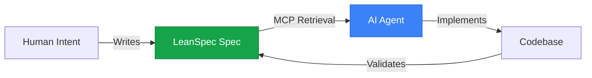

# AI Agent Memory

> "Specs serve as persistent semantic memory for AI agents."

LeanSpec specs function as a **persistent memory layer** for AI agents—providing long-term knowledge storage that persists across sessions and enables effective human-AI collaboration.

## The Memory Problem

AI agents face a fundamental challenge: **working memory is ephemeral**.

- Each chat session starts fresh (no memory of previous conversations)
- Context windows are limited (even with 1M+ tokens)
- Important decisions and rationale are lost between sessions
- Agents repeat questions or make decisions inconsistent with past work

**Traditional solution**: RAG (Retrieval-Augmented Generation) over documentation

**LeanSpec solution**: Specs as **semantic memory** - structured, persistent knowledge that agents can reliably access

## Specs as Semantic Memory

Drawing from cognitive science research ([CoALA paper](https://arxiv.org/pdf/2309.02427)), AI agents benefit from two types of memory:

### Working Memory (Ephemeral)
- **What**: Current conversation context, active task information
- **Lifetime**: Single session or task
- **Storage**: Chat history, context window
- **Size**: Limited by context window (100k-1M tokens)

### Semantic Memory (Persistent)
- **What**: Long-term knowledge, facts, decisions, rationale
- **Lifetime**: Persists across sessions and tasks
- **Storage**: LeanSpec specs + MCP retrieval
- **Size**: Unlimited (external storage)

**LeanSpec specs = Semantic memory for AI agents**

## How It Works

### Memory Storage (Writing Specs)

When working with an AI agent, specs capture:

1. **Decisions Made**: What was chosen and why
2. **Trade-offs Evaluated**: Options considered, pros/cons analyzed
3. **Constraints Discovered**: Technical limits, business requirements
4. **Intent Clarified**: The "why" behind the work
5. **Success Criteria Defined**: How to know when it's done

**Example:**
```markdown
# Feature: API Rate Limiting

## Problem
API getting hammered, 40% of requests from 2% of users.

## Solution
Implement token bucket rate limiting (100 req/min per API key).

## Why Token Bucket?
- Allows bursts (better UX than fixed window)
- Battle-tested (used by AWS, Stripe)
- Simple to implement with Redis

## Trade-offs
- Added complexity (Redis dependency)
- Potential UX friction (users hit limits)
- Worth it: Protects 98% of users from 2% abuse

## Success Criteria
- [ ] 95% of API requests succeed (up from 60%)
- [ ] Response time p95 < 200ms (was 2-3 seconds)
- [ ] Zero false positives (legitimate users rate-limited)
```

This becomes **semantic memory** the agent can reference in future sessions.

### Memory Retrieval (AI Accessing Specs)

AI agents access spec memory through:

1. **MCP Server Integration**: LeanSpec MCP server provides spec search/retrieval
2. **Semantic Search**: Agents query specs by topic, status, tags
3. **Selective Loading**: Load only relevant specs into working memory
4. **Cross-Reference**: Follow `depends_on` and `related` links

**Workflow:**
```markdown
Human: "Why did we choose PostgreSQL over MongoDB?"

AI Agent:
1. Queries LeanSpec MCP: search_specs("database decision")
2. Retrieves spec 023: Database Selection
3. Reads decision rationale from semantic memory
4. Responds: "Per spec 023, PostgreSQL chosen because..."
```

### Memory as Context Bridge

Specs bridge the gap between:
- **Human memory** (why we're doing this, what matters)
- **AI working memory** (current task, active context)
- **Codebase reality** (what's actually implemented)



## Memory Types in LeanSpec

### 1. Procedural Memory (How)
- **What**: Standard patterns, templates, workflows
- **Storage**: Templates, AGENTS.md instructions
- **Example**: "Always validate frontmatter before commit"

### 2. Semantic Memory (What/Why)
- **What**: Facts, decisions, rationale, constraints
- **Storage**: LeanSpec specs (README, DESIGN, etc.)
- **Example**: "JWT tokens chosen for stateless auth (see spec 042)"

### 3. Episodic Memory (When/Context)
- **What**: Historical events, what happened when
- **Storage**: Git history, spec transitions, timestamps
- **Example**: "API redesign (spec 038) happened after auth refactor (spec 037)"

**LeanSpec primarily provides semantic memory** - the persistent knowledge layer.

## Benefits of Spec-as-Memory

### For AI Agents
✅ **Persistent context** across sessions  
✅ **Reliable retrieval** of past decisions  
✅ **Consistent behavior** aligned with project history  
✅ **Reduced hallucination** (facts come from specs, not guesses)  
✅ **Scalable knowledge** (not limited by context window)

### For Humans
✅ **Shared understanding** with AI agents  
✅ **Institutional knowledge** captured and accessible  
✅ **Onboarding simplified** (new humans AND new AI sessions)  
✅ **Decision audit trail** (why things are the way they are)  
✅ **Context switching** (return to project after months away)

### For Teams
✅ **Team alignment** (everyone reads the same memory)  
✅ **Async collaboration** (agents work from shared memory)  
✅ **Knowledge continuity** (doesn't depend on individuals)  
✅ **Reduced meetings** (decisions documented, not discussed repeatedly)

## Memory Maintenance

Like human memory, spec memory requires maintenance:

### Active Recall (Keep Current)
- Update specs as understanding evolves
- Mark superseded decisions clearly
- Archive completed work (compress to summary)

### Consolidation (Prevent Bloat)
- Apply [Context Engineering](/docs/advanced/context-engineering) strategies
- Partition large specs (>400 lines)
- Compact redundant content
- Compress historical phases

### Retrieval Practice (Verify Access)
- Test MCP search retrieves relevant specs
- Validate cross-references (depends_on, related)
- Check that critical decisions are findable

## Best Practices

**DO:**
- ✅ Capture "why" and trade-offs (stable semantic memory)
- ✅ Update specs as reality changes (keep memory accurate)
- ✅ Use MCP search to retrieve before asking humans
- ✅ Cross-reference related specs (memory associations)
- ✅ Archive completed work (free up working memory)

**DON'T:**
- ❌ Document everything (memory overload)
- ❌ Let specs drift from reality (corrupted memory)
- ❌ Repeat information across specs (memory bloat)
- ❌ Leave conflicting information (context clash)

## The Bottom Line

**LeanSpec transforms specs from static documentation into active semantic memory for AI agents.**

- **Working memory** (chat history) is ephemeral and limited
- **Semantic memory** (specs) is persistent and scalable
- **MCP integration** enables reliable memory retrieval
- **Context Engineering** keeps memory manageable

When AI agents can reliably access past decisions, understand rationale, and build on prior work, they become **true collaborators** rather than session-bound assistants.

---

**Related**: Learn about [Context Engineering](/docs/advanced/context-engineering) for managing memory size, or explore [MCP Integration](/docs/reference/mcp-server) for the technical implementation of memory retrieval.
