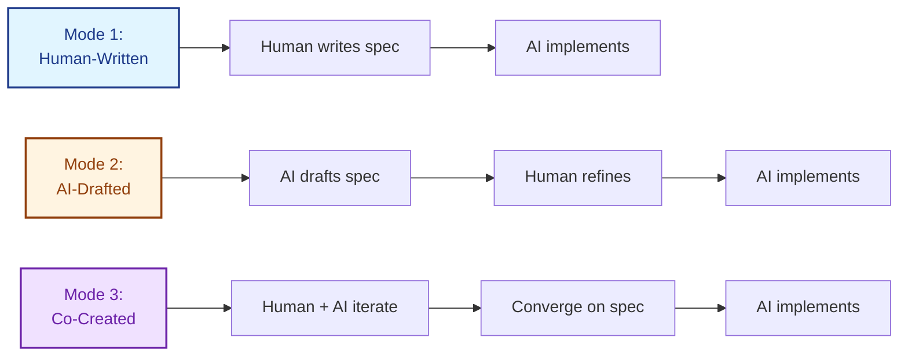
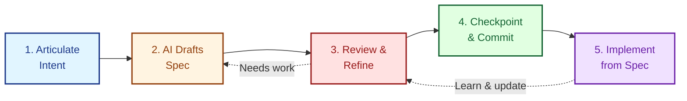
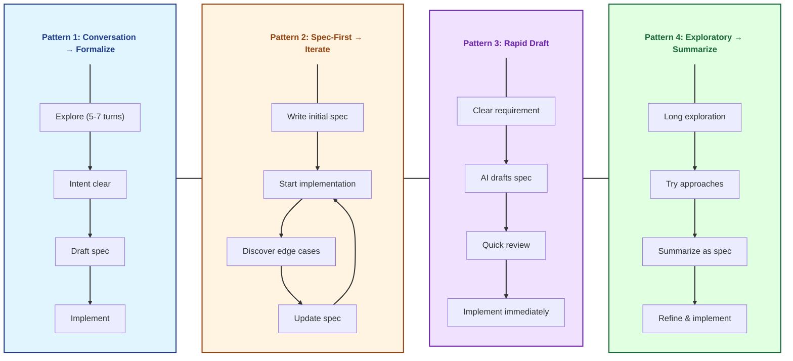
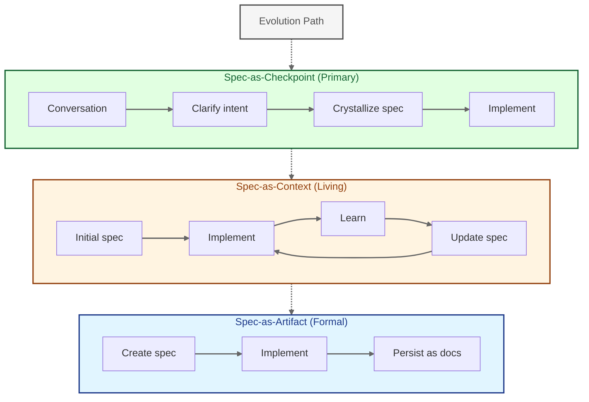

LeanSpec specs can be written by humans, AI, or co-created collaboratively. This guide covers how to work with AI to draft, refine, and maintain specs while keeping them lean and actionable.

## The Three Modes



### Mode 1: Human-Written, AI-Implemented (Traditional)
You write the spec from scratch, AI implements from it. Best when you have deep domain knowledge and clear vision.

### Mode 2: AI-Drafted, Human-Refined (Assisted)
AI drafts the initial spec from your intent, you review and refine. Best for getting started quickly or when structure is unclear.

### Mode 3: Co-Created Iteratively (Collaborative)
You and AI build the spec together through conversation, progressively refining. Best for complex features where discovery happens during specification.

**All three modes are valid.** Choose based on your context, not ideology.

## When to Use AI-Assisted Spec Writing

### Write a spec (with AI help) when:

✅ **Intent needs to persist** - Decisions, rationale, and context should outlive the conversation  
✅ **Multiple stakeholders need alignment** - Can't have everyone chat with AI individually  
✅ **Complexity warrants structure** - Conversation would drift or lose important details  
✅ **Compliance or audit trail required** - Formal documentation needed  
✅ **Conversation has clarified intent** - You've iterated enough to know what you want  

### Skip the spec and just converse when:

❌ **Quick feature with no ambiguity** - AI can implement directly from clear instruction  
❌ **Exploratory work** - Still discovering what to build  
❌ **One-off prototype** - No future reference needed  
❌ **Context is already clear in codebase** - Implementation speaks for itself  

**Key insight:** AI-assisted authoring makes specs MORE accessible (easier to create), but doesn't change WHEN they're needed. The decision point is still: **"Does formalization add value?"**

## The 5-Step Workflow



### Step 1: Articulate Intent

Start with a clear problem statement or desired outcome. Don't worry about structure yet.

**Good prompts:**
- "We need to reduce user onboarding time from 14 to 5 minutes"
- "Add rate limiting to prevent API abuse"
- "Migrate authentication to support SSO"

**Poor prompts:**
- "Make the app better" (too vague)
- "Add a button" (too trivial for a spec)
- "Implement OAuth 2.0 with PKCE flow using JWT tokens..." (jumping to implementation)

### Step 2: AI Drafts Initial Spec

Ask AI to draft a spec following LeanSpec principles:

```
Draft a LeanSpec for [your intent]. Follow these principles:
- Context Economy: Keep it under 300 lines
- Signal-to-Noise: Every sentence must inform decisions
- Intent Over Implementation: Focus on WHY and WHAT, not HOW
- Include: Problem, Solution, Success Criteria, Trade-offs
```

**What to expect:**
- Structured sections (Problem, Solution, Success Criteria)
- Initial implementation ideas
- Possibly some verbosity (AI tends to over-explain)

### Step 3: Review and Refine

This is where you add value. Check for:

**Context Economy violations:**
- Is it under 300 lines? (Warning at 300, red flag at 400+)
- Can you read it in 5-10 minutes?
- Can you hold the structure in your head?

**Signal-to-Noise issues:**
- Does every sentence inform a decision?
- Is there obvious or inferable content that can be cut?
- Are there "maybe future" features that should be removed?

**Missing intent:**
- Is the "why" clear?
- Are trade-offs explained?
- Are success criteria measurable?

**Prompt for refinement:**
```
Review this spec against LeanSpec first principles:
1. Cut anything that doesn't inform decisions (Signal-to-Noise)
2. Ensure it's under 300 lines (Context Economy)
3. Add missing "why" and trade-offs (Intent Over Implementation)
4. Make success criteria measurable
```

### Step 4: Checkpoint and Commit

Once refined, the spec becomes a **checkpoint** - a formalized agreement between you and AI about what to build.

**Mark as checkpoint:**
- Save the spec file
- Mark status as "planned" or "in-progress"
- Use `lean-spec create` or update frontmatter
- Reference spec in commits and PRs

**The spec now serves as:**
- Source of truth for implementation
- Context for future conversations
- Documentation for team alignment
- Artifact for compliance/audit

### Step 5: Implement from Spec

AI now implements from the refined spec, not the original conversation. The spec is the contract.

**Benefits:**
- Clear scope (what's in/out)
- Measurable success criteria
- Preserved rationale for future reference
- Team alignment on approach

## Common Patterns



### Pattern 1: Conversation → Formalize → Implement

Most common. You iterate with AI to clarify intent, then formalize into spec before implementation.

**Example:**
1. Conversation: "I want faster user onboarding"
2. AI asks clarifying questions (current flow, bottlenecks, constraints)
3. After 5-7 turns, intent is clear
4. Formalize: "Draft a spec for 2-screen onboarding with deferred profile enrichment"
5. Implement from refined spec

**When to use:** Most projects. Good balance of exploration and structure.

### Pattern 2: Spec-First → Iterate During Implementation

Write spec upfront, but evolve it as you learn during implementation (Spec-Driven Development style).

**Example:**
1. Draft spec for new API endpoint
2. Start implementation
3. Discover edge cases or better approaches
4. Update spec with learnings
5. Continue implementation with updated context

**When to use:** When initial requirements are clear but details will emerge during work.

### Pattern 3: Rapid Draft → Immediate Implementation

AI drafts spec and implements in one flow. Spec serves as snapshot of decisions made.

**Example:**
1. "Build rate limiting for API - 100 req/min per user"
2. AI drafts minimal spec (Problem, Solution, Success Criteria)
3. You approve or tweak
4. AI implements immediately
5. Spec exists for future reference

**When to use:** Simple features with clear requirements and minimal ambiguity.

### Pattern 4: Exploratory → Summarize → Spec

Explore through conversation, then summarize learnings into spec retrospectively.

**Example:**
1. Long exploratory conversation about authentication redesign
2. Try multiple approaches, discuss trade-offs
3. Once approach is clear: "Summarize our conversation as a LeanSpec"
4. AI distills conversation into structured spec
5. You refine and formalize
6. Implement from spec

**When to use:** High uncertainty work where discovery happens through conversation.

## Mental Models



### Spec-as-Checkpoint (Primary)

The most common mental model. Specs are formalized agreements/checkpoints in ongoing work.

**Flow:**
1. Conversation with AI clarifies intent
2. Crystallize into spec when ready
3. Continue implementation from spec

**Use when:**
- Intent has been clarified through conversation
- Ready to commit to approach
- Need formal agreement before proceeding

### Spec-as-Artifact (Formal)

Specs as durable artifacts that outlive the immediate work.

**Flow:**
1. Create spec for long-term reference
2. Implement from spec
3. Spec remains as documentation

**Use when:**
- Compliance or audit trail required
- Team onboarding documentation needed
- Decisions must be preserved long-term

### Spec-as-Context (Living)

Specs as evolving context that changes alongside implementation.

**Flow:**
1. Create initial spec
2. Implement while learning
3. Update spec with discoveries
4. Spec and code evolve together

**Use when:**
- Requirements will emerge during work
- Iterative refinement expected
- Spec serves as working documentation

**Key insight:** These are phases, not separate approaches. Most specs start as checkpoints, evolve as context, and end as artifacts.

## Best Practices

### DO: Keep AI Focused on Principles

Explicitly remind AI to follow LeanSpec principles when drafting:

```
Draft this spec following LeanSpec principles:
- Context Economy: Under 300 lines, readable in 10 minutes
- Signal-to-Noise: Every sentence informs decisions
- Intent Over Implementation: Focus on WHY and WHAT
- Progressive Disclosure: Start minimal, add only when needed
```

### DO: Test the "Decision Test"

For every section, ask: "What decision does this inform?"

If you can't answer clearly, cut or clarify that section.

### DO: Split at 400 Lines

If AI drafts a spec over 400 lines, split it. Use sub-specs (DESIGN.md, IMPLEMENTATION.md) or multiple smaller specs.

### DO: Capture Trade-offs

AI may present solutions without explaining why. Always ask:

```
What are the trade-offs of this approach?
What alternatives did we consider and why reject them?
```

### DON'T: Accept Verbose Drafts

AI tends to over-explain. Ruthlessly cut:
- Obvious statements
- Inferable details
- "Maybe future" features
- Redundant explanations

### DON'T: Skip Human Review

Never accept AI drafts without review. The human validates:
- Intent is captured correctly
- Trade-offs are clear
- First principles are followed
- Scope is appropriate

### DON'T: Over-Specify Implementation

Specs should capture intent and constraints, not prescribe every implementation detail.

**Good:** "Rate limit: 100 req/min per user, return 429 with Retry-After header"  
**Bad:** "Use Redis with sliding window algorithm, store timestamps in sorted set with ZREMRANGEBYSCORE..."

### DON'T: Forget to Update Status

Use `lean-spec update <spec> --status <status>` to track progress. AI can help draft, but you manage lifecycle.

## Common Pitfalls

### Pitfall 1: AI Verbosity

**Problem:** AI drafts 800-line spec for simple feature  
**Solution:** Set explicit constraints: "Draft in under 300 lines" or "One-page spec only"

### Pitfall 2: Missing "Why"

**Problem:** Spec describes what to build but not why  
**Solution:** Always ask AI to include rationale and trade-offs

### Pitfall 3: Implementation Bias

**Problem:** AI jumps to specific implementation before clarifying intent  
**Solution:** Force intent-first: "Don't suggest implementation yet. First, clarify the problem and constraints."

### Pitfall 4: Scope Creep

**Problem:** AI expands scope with "nice to have" features  
**Solution:** Explicitly state out-of-scope items. Cut aggressively.

### Pitfall 5: Assuming AI Knows Context

**Problem:** AI drafts without understanding codebase constraints  
**Solution:** Provide context: "Our API uses REST, not GraphQL" or "We're on PostgreSQL 14"

## Example: AI-Assisted Spec Creation

Here's a real example of AI-assisted spec writing:

**Step 1: Initial prompt**
```
We need API rate limiting. Currently we have none and are seeing abuse. 
Target is 100 requests per minute per user.
```

**Step 2: AI drafts spec (verbose, ~500 lines)**

AI produces detailed spec with:
- Problem statement
- Multiple implementation approaches
- Database schemas
- Caching strategies
- Monitoring plans
- (Too detailed, violates Context Economy)

**Step 3: Human refines**
```
This spec is too detailed. Simplify to:
1. Problem (why rate limiting?)
2. Solution (approach and limits)
3. Success criteria (measurable)
4. Trade-offs (what we're giving up)

Cut all implementation details about Redis, algorithms, schemas.
Keep under 200 lines.
```

**Step 4: AI revises (concise, ~180 lines)**

AI produces lean spec:
- **Problem:** API abuse, 1000 req/min from single user
- **Solution:** Rate limit at 100 req/min per user, return 429 + Retry-After
- **Success:** 99% of requests under limit, no legitimate users affected
- **Trade-offs:** Adds latency (~2ms), requires state storage

**Step 5: Human approves and commits**

Spec is saved, marked as "planned", and becomes checkpoint for implementation.

## When NOT to Use Specs {#when-not-to-use-specs}

Even with AI assistance, some work doesn't need specs:

- **Quick bug fixes** - Implementation is obvious, no decisions to document
- **Exploratory prototypes** - Still discovering what to build
- **Self-evident refactors** - Codebase clearly shows what needs changing
- **One-line changes** - No ambiguity, no context needed

**Remember:** Specs add value when they provide structure, persistence, or alignment. If the work is trivial or exploratory, skip the spec and just do the work.

## Summary

AI-assisted spec writing makes specs:
- **Easier to create** (AI handles first draft)
- **Faster to iterate** (AI refines on request)
- **More accessible** (Lower barrier to entry)

But it doesn't change:
- **When specs are needed** (persistence, alignment, structure)
- **First principles** (Context Economy, Signal-to-Noise, Intent)
- **What makes a good spec** (Clear intent, measurable success, appropriate scope)

**The workflow is simple:**
1. Articulate intent
2. AI drafts spec
3. Review against first principles
4. Refine ruthlessly
5. Checkpoint and implement

**The mindset is unchanged:**
- Keep it lean (Context Economy)
- Every word matters (Signal-to-Noise)
- Capture why, not just how (Intent Over Implementation)
- Make it work for humans AND AI (Bridge the Gap)
- Add complexity only when needed (Progressive Disclosure)

AI is a tool for authoring, not an excuse for verbose specs. The standards remain high.
