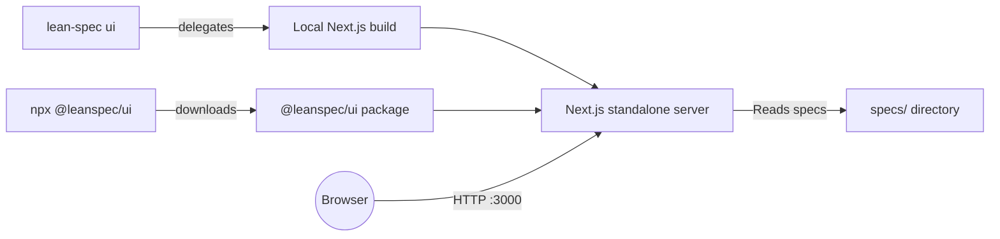
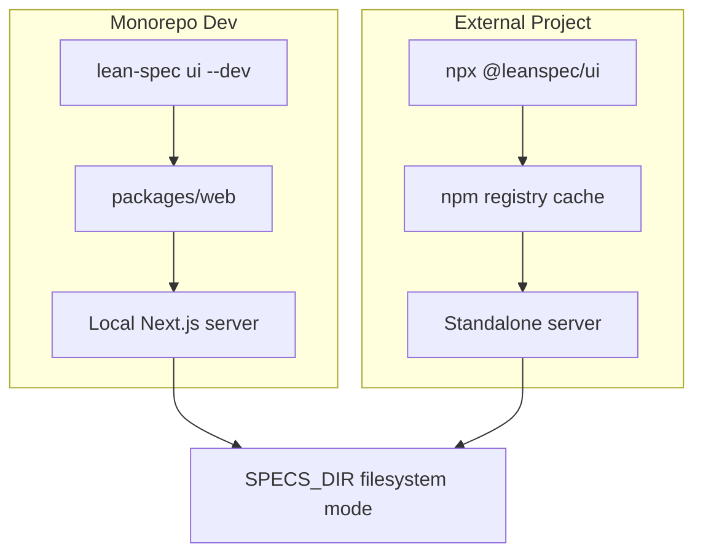
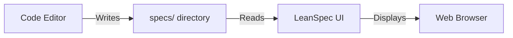

# Visual Mode

The LeanSpec UI provides a visual web interface for browsing and managing specs. It's perfect for visual learners, team presentations, and exploratory spec browsing.


## What is Visual Mode?

Visual Mode is a local web application that provides:

- **Interactive Spec Browser**: Browse specs with rich formatting and syntax highlighting
- **Dependency Visualization**: See relationships between specs as an interactive graph
- **Project Overview**: View project stats and metrics at a glance
- **Search & Filtering**: Quickly find specs by status, tags, or content
- **Board View**: Kanban-style visualization of spec status

## When to Use UI vs CLI

**Use the UI when you want to:**
- Explore and discover specs visually
- Present specs to stakeholders or team members
- Visualize dependencies and relationships
- Get a high-level project overview
- Browse specs without remembering commands

**Use the CLI when you want to:**
- Create or edit specs quickly
- Automate workflows with scripts
- Integrate with CI/CD pipelines
- Work in terminal-only environments
- Perform bulk operations

## Getting Started

### Method 1: Using `lean-spec ui`

If you have the LeanSpec CLI installed:

```bash
lean-spec ui
```

This command will:
- Auto-detect your specs directory
- Start the web server on port 3000
- Open your default browser automatically

### Method 2: Using `npx @leanspec/ui`

You can run the UI directly without installing the CLI:

```bash
npx @leanspec/ui
```

This is useful for:
- Projects that don't have the CLI installed
- Quick one-time usage
- Sharing with team members who don't have LeanSpec installed

### Options

Both methods support the same options:

```bash
# Custom specs directory
lean-spec ui --specs ./my-specs

# Custom port
lean-spec ui --port 3100

# Don't auto-open browser
lean-spec ui --no-open

# Combine options
lean-spec ui --specs ./docs/specs --port 3100 --no-open
```

**Available Options:**
- `-s, --specs <dir>` - Specify specs directory (auto-detected by default)
- `-p, --port <port>` - Server port (default: 3000)
- `--no-open` - Don't open browser automatically

## Features

### Spec Browser

The main interface shows all your specs in a list view:

- **Rich Formatting**: Markdown rendered with syntax highlighting
- **Status Indicators**: Visual badges for spec status (planned, active, done, etc.)
- **Quick Filters**: Filter by status, tags, or priority
- **Search**: Full-text search across all specs


### Spec Detail View

Click any spec to see:

- **Full Content**: Complete spec rendered with proper formatting
- **Metadata**: All frontmatter fields displayed clearly
- **Related Specs**: Links to dependencies and related work
- **Quick Actions**: Links to edit, view source, or open in file system


### Dependency Graph

Visualize how specs relate to each other:

- **Interactive Graph**: Drag nodes, zoom, and pan
- **Relationship Lines**: See which specs depend on others
- **Click to Navigate**: Click any node to view that spec
- **Filter by Status**: Show only active specs, completed work, etc.


### Board View

Kanban-style view of specs organized by status:

- **Drag and Drop**: Move specs between status columns (if enabled)
- **Status Columns**: Planned, Active, Done, etc.
- **Card Previews**: See spec title, tags, and assignee at a glance


### Project Stats

Dashboard showing project metrics:

- **Total Specs**: Overall spec count
- **By Status**: Breakdown of specs in each status
- **By Priority**: Distribution of priority levels
- **By Tags**: Most commonly used tags


### Search View

Need to find a specific spec? The search UI updates results instantly as you type, and the board view reflects the filtered set.


## Architecture Overview



### Monorepo vs External Projects



## How Filesystem Mode Works

The UI uses **filesystem mode**, which means it stays in sync with your local files automatically.



### Direct File Access
- No database required
- Reads directly from your `specs/` directory
- No setup or configuration needed

### Realtime Updates
- 60-second cache TTL
- Changes to spec files appear automatically
- Edit specs in your editor, see updates in UI

### Why This Architecture?

**Simplicity**: No database to configure, migrate, or maintain

**Reliability**: Your specs are always in sync with the file system

**Portability**: Works in any project with a `specs/` directory

**Performance**: Caching ensures fast load times while staying current

## Development Workflows

### Working with the UI and CLI Together

The UI and CLI complement each other:

```bash
# Terminal 1: Run the UI
lean-spec ui

# Terminal 2: Work with specs
lean-spec create new-feature
lean-spec update new-feature --status=active

# The UI automatically reflects changes within 60 seconds
```

### Team Collaboration

**Share on Local Network:**

```bash
# Find your IP address
ifconfig | grep "inet " # or ipconfig on Windows

# Start UI and share the URL
lean-spec ui --port 3000
# Share: http://192.168.1.xxx:3000
```

**For Remote Teams:**
- Consider deploying the UI to a shared server
- Use ngrok or similar tools for temporary sharing
- Or share screenshots/screen recordings

### Presentations and Demos

The UI is great for presenting specs to stakeholders:

1. **Clean Interface**: Professional, distraction-free view
2. **Dependency Graphs**: Visualize project structure
3. **Board View**: Show progress and status
4. **Interactive**: Navigate between related specs during discussion

## Troubleshooting

### Specs Directory Not Found

**Problem**: `Error: Could not find specs directory`

**Solution**:
```bash
# Explicitly specify the directory
lean-spec ui --specs ./path/to/specs

# Or ensure you're in the project root
cd /path/to/project
lean-spec ui
```

### Port Already in Use

**Problem**: `Error: Port 3000 is already in use`

**Solution**:
```bash
# Use a different port
lean-spec ui --port 3100

# Or stop the process using port 3000
# On macOS/Linux:
lsof -ti:3000 | xargs kill

# On Windows:
netstat -ano | findstr :3000
taskkill /PID <PID> /F
```

### UI Not Opening in Browser

**Problem**: Server starts but browser doesn't open

**Solution**:
```bash
# Manually open: http://localhost:3000
# Or disable auto-open and use your preferred browser
lean-spec ui --no-open
```

### Outdated UI Version

**Problem**: Features missing or UI looks different

**Solution**:
```bash
# Clear npm cache and reinstall
npx clear-npx-cache
npx @leanspec/ui@latest

# Or if using CLI, update it
npm install -g @leanspec/cli@latest
```

### Changes Not Appearing

**Problem**: Edited spec but UI still shows old content

**Solution**:
- Wait up to 60 seconds for cache to expire
- Hard refresh browser (Cmd+Shift+R / Ctrl+Shift+R)
- Check file was saved correctly

### Build Not Found (Monorepo Dev Mode)

**Problem**: `Error: Build directory not found`

**Solution**:
This only affects LeanSpec contributors in the monorepo:
```bash
cd packages/web
npm run build
```

## Tips & Best Practices

### Performance

- The UI caches specs for 60 seconds - large projects load quickly
- Use search and filters to narrow down what you're viewing
- Close other browser tabs if the UI feels slow

### Workflow Integration

- Keep the UI running in a browser tab while you work
- Use it as your "spec dashboard" alongside your code editor
- Review specs in the UI before starting implementation

### Team Adoption

- Demo the UI in team meetings to increase adoption
- Share the URL during spec reviews
- Use board view for sprint planning meetings

## Next Steps

- **Learn More**: See [CLI Reference](/docs/reference/cli#lean-spec-ui) for all command options
- **UI Package**: Check out [@leanspec/ui](/docs/reference/ui-package) for technical details
- **Get Started**: Read [Getting Started](/docs/guide/getting-started) to set up your first specs

## Related Documentation

- [CLI Reference - `lean-spec ui` command](/docs/reference/cli#lean-spec-ui)
- [UI Package Reference](/docs/reference/ui-package)
- [Getting Started Guide](/docs/guide/getting-started)
- [Managing Specs](/docs/guide/usage/essential-usage/creating-managing)
