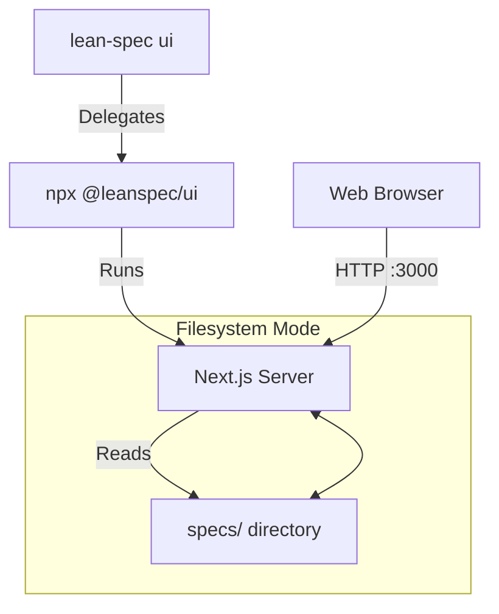
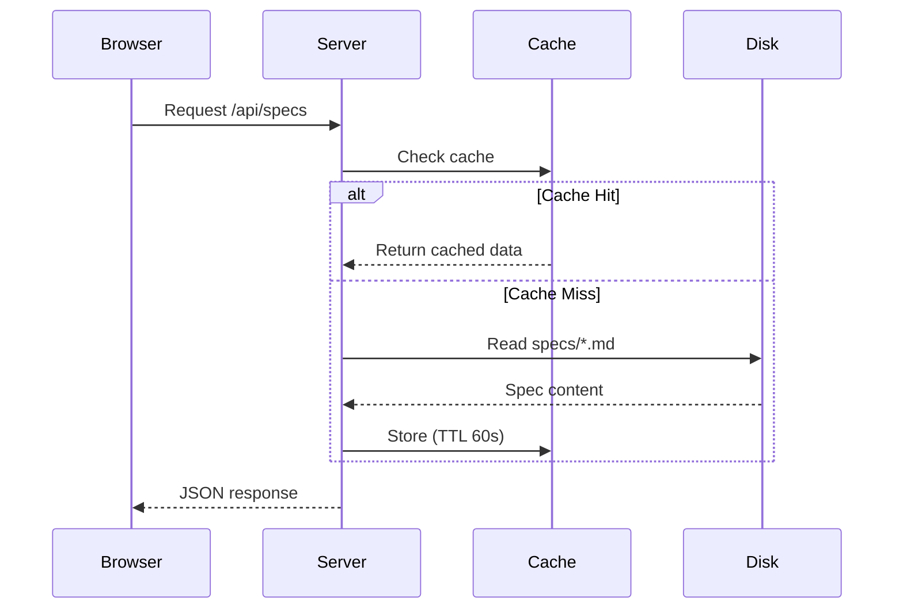

# @leanspec/ui Package

The `@leanspec/ui` package is a standalone web UI for LeanSpec that can be run without installing the CLI.

## Overview

`@leanspec/ui` is a Next.js-based web application that provides a visual interface for browsing and managing LeanSpec specifications. It's published to npm and can be run directly with `npx` or installed globally.

**Key Features:**
- Standalone package - no CLI installation required
- Filesystem mode - reads specs directly from disk
- Zero configuration - auto-detects specs directory
- Fast and responsive - built with Next.js standalone output

## Installation & Usage

### Direct Usage (Recommended)

No installation needed:

```bash
npx @leanspec/ui
```

This will:
1. Download the latest version (if not cached)
2. Auto-detect your specs directory
3. Start the web server on port 3000
4. Open your default browser

### Global Installation

Install once, use anywhere:

```bash
# Install globally
npm install -g @leanspec/ui

# Run from any directory
leanspec-ui

# Or use the shorter alias
lsui
```

### Project-Local Installation

Add to your project's dev dependencies:

```bash
npm install --save-dev @leanspec/ui
```

Then add to `package.json` scripts:

```json
{
  "scripts": {
    "specs": "leanspec-ui"
  }
}
```

Run with:

```bash
npm run specs
```

## CLI Options

The package provides a CLI interface with the following options:

```bash
leanspec-ui [options]
```

### Options

| Option | Alias | Description | Default |
|--------|-------|-------------|---------|
| `--specs <dir>` | `-s` | Specs directory path | Auto-detected |
| `--port <port>` | `-p` | Server port | 3000 |
| `--no-open` | - | Don't auto-open browser | false |
| `--help` | `-h` | Show help message | - |
| `--version` | `-v` | Show version number | - |

### Examples

```bash
# Basic usage (auto-detect specs)
npx @leanspec/ui

# Custom specs directory
npx @leanspec/ui --specs ./documentation/specs

# Custom port
npx @leanspec/ui --port 8080

# Don't open browser
npx @leanspec/ui --no-open

# Combine options
npx @leanspec/ui --specs ./specs --port 3100 --no-open
```

## Environment Variables

The package uses these environment variables internally:

| Variable | Description | Set By |
|----------|-------------|--------|
| `SPECS_MODE` | Operation mode (always "filesystem") | Package |
| `SPECS_DIR` | Absolute path to specs directory | Package |
| `PORT` | Server port | CLI option |
| `NODE_ENV` | Node environment | Node.js |

**Note**: These are set automatically by the package. You typically don't need to set them manually.

## Architecture
#### Component Interaction


### Next.js Standalone Output

The package uses Next.js's standalone output mode:

```javascript
// next.config.js
module.exports = {
  output: 'standalone',
  // ...
}
```

**Benefits:**
- Self-contained - all dependencies bundled
- Fast startup - pre-compiled and optimized
- Portable - single directory can be deployed anywhere

### Filesystem Mode

The UI operates in filesystem mode, which means:

**Data Flow:**



**Direct File Access:**
- Reads `README.md` files from the specs directory
- Parses frontmatter and markdown content
- No database or persistent storage required

**Caching Strategy:**
- Specs cached in memory for 60 seconds
- Cache invalidated on TTL expiration
- Subsequent requests fetch fresh data

**Implementation:**
```typescript
// Simplified caching logic
const cache = new Map<string, { data: any; timestamp: number }>();
const CACHE_TTL = 60 * 1000; // 60 seconds

function getCachedSpec(id: string) {
  const cached = cache.get(id);
  if (cached && Date.now() - cached.timestamp < CACHE_TTL) {
    return cached.data;
  }
  // Fetch from filesystem
  const data = readSpecFromDisk(id);
  cache.set(id, { data, timestamp: Date.now() });
  return data;
}
```

### Package Structure

```
@leanspec/ui/
├── bin/
│   └── ui.js              # CLI entry point
├── .next/
│   └── standalone/        # Next.js build output
│       ├── server.js      # Server entry
│       └── ...            # Dependencies and chunks
├── public/                # Static assets
├── package.json           # Package metadata
└── README.md              # Basic documentation
```

## How It Works

### Execution Flow

1. **CLI Parsing**: `bin/ui.js` parses command-line arguments
2. **Specs Detection**: Auto-detects specs directory or uses `--specs` option
3. **Environment Setup**: Sets `SPECS_MODE=filesystem` and `SPECS_DIR`
4. **Server Start**: Launches Next.js standalone server
5. **Browser Launch**: Opens default browser (unless `--no-open`)

### Specs Directory Detection

The package looks for specs in this order:

1. `--specs` CLI option (if provided)
2. `specs/` in current directory
3. `../specs/` (parent directory)
4. `../../specs/` (grandparent directory)

Stops at the first directory found that contains spec files.

### Auto-Detection Algorithm

```javascript
function detectSpecsDir() {
  // Check CLI option first
  if (options.specs) {
    return path.resolve(options.specs);
  }
  
  // Check current directory and parents
  const dirs = [
    path.join(process.cwd(), 'specs'),
    path.join(process.cwd(), '..', 'specs'),
    path.join(process.cwd(), '..', '..', 'specs'),
  ];
  
  for (const dir of dirs) {
    if (fs.existsSync(dir)) {
      // Verify it contains specs
      const files = fs.readdirSync(dir);
      if (files.some(f => f.match(/^\d{3}-/))) {
        return dir;
      }
    }
  }
  
  throw new Error('Could not find specs directory');
}
```

## Development

### For Contributors

If you're contributing to LeanSpec, you can work with the UI package locally:

```bash
# Clone the LeanSpec monorepo
git clone https://github.com/codervisor/lean-spec.git
cd lean-spec

# Install dependencies
pnpm install

# Build the UI package
cd packages/web
pnpm run build

# Prepare standalone distribution
node scripts/prepare-dist.mjs

# Test the package
cd packages/ui
node bin/ui.js
```

### Building from Source

The build process:

1. **Build Next.js**: `pnpm run build` in `packages/web`
2. **Extract Standalone**: Copy `.next/standalone` output
3. **Prepare Distribution**: Run `prepare-dist.mjs` script
4. **Copy to UI Package**: Move files to `packages/ui`

### Publishing

```bash
# From packages/ui
npm version patch  # or minor, major
npm publish
```

**Note**: Only maintainers can publish to npm.

## Troubleshooting

### Installation Issues

**Problem**: `npm install -g` fails with permission errors

**Solution**:
```bash
# Use npx instead (no installation needed)
npx @leanspec/ui

# Or fix npm permissions
# https://docs.npmjs.com/resolving-eacces-permissions-errors
```

### Port Conflicts

**Problem**: Port 3000 already in use

**Solution**:
```bash
# Use different port
npx @leanspec/ui --port 3100
```

### Specs Not Found

**Problem**: `Error: Could not find specs directory`

**Solution**:
```bash
# Specify explicitly
npx @leanspec/ui --specs ./path/to/specs

# Or ensure you're in the right directory
cd /path/to/project
npx @leanspec/ui
```

### Outdated Version

**Problem**: Features missing or different from documentation

**Solution**:
```bash
# Clear npx cache
npx clear-npx-cache

# Run latest version explicitly
npx @leanspec/ui@latest

# Or update global installation
npm update -g @leanspec/ui
```

### Server Won't Start

**Problem**: Server starts but immediately crashes

**Solution**:
```bash
# Check Node.js version (requires v18+)
node --version

# Update Node.js if needed
# https://nodejs.org/

# Check for error logs
npx @leanspec/ui 2>&1 | tee ui-error.log
```

## Comparison with CLI

| Feature | `@leanspec/ui` | `lean-spec ui` (CLI) |
|---------|----------------|---------------------|
| Installation | No install needed (npx) | Requires CLI install |
| Spec creation | No | Yes |
| Spec editing | No (view only) | Yes (via CLI) |
| Visual browsing | ✅ Yes | ✅ Yes |
| Dependency graphs | ✅ Yes | ✅ Yes |
| Board view | ✅ Yes | ✅ Yes |
| Monorepo dev mode | No | Yes |
| Use case | Quick viewing | Full workflow |

**When to use each:**

- **Use `@leanspec/ui`** for quick viewing without installing anything
- **Use `lean-spec ui`** if you already have the CLI and want consistent commands

Both launch the same web interface - the difference is how you start it.

## API Reference

While `@leanspec/ui` doesn't expose a programmatic API, you can import and use the Next.js server programmatically:

```javascript
// Not officially supported, but possible for advanced use cases
import { createServer } from '@leanspec/ui/.next/standalone/server.js';

const server = createServer({
  port: 3000,
  specsDir: '/path/to/specs',
});

server.listen();
```

**Note**: This is not a supported use case. The package is designed to be used via the CLI.

## Version History

The `@leanspec/ui` package follows semantic versioning:

- **Major**: Breaking changes to CLI interface or behavior
- **Minor**: New features, non-breaking changes
- **Patch**: Bug fixes, performance improvements

Check the [CHANGELOG](https://github.com/codervisor/lean-spec/blob/main/CHANGELOG.md) for version details.

## Package Information

- **npm**: https://www.npmjs.com/package/@leanspec/ui
- **Repository**: https://github.com/codervisor/lean-spec
- **Bug Reports**: https://github.com/codervisor/lean-spec/issues
- **License**: MIT

## Related Documentation

- [Visual Mode Guide](/docs/guide/visual-mode) - Comprehensive usage guide
- [CLI Reference](/docs/reference/cli#lean-spec-ui) - `lean-spec ui` command
- [Getting Started](/docs/guide/getting-started) - Set up LeanSpec
- [Configuration](/docs/reference/config) - Configure LeanSpec settings
