# Roadmap

LeanSpec is actively developed using AI-powered spec-driven development. Here's what's coming next—with links to the actual specs we're using to build them. (We dogfood LeanSpec!)

:::info AI-Powered Development Velocity
We're building LeanSpec with AI agents following our own spec-driven methodology. Traditional timeline estimates don't apply—features often ship weeks or months earlier than conventional development. Completed work shows actual dates; future work shows priority order, not fixed timelines.
:::

## Release Timeline

```mermaid
timeline
    title LeanSpec Development Journey
    section v0.1.0 Alpha
        Oct 2025 : Core CLI • MCP Server • Templates & Validation
    section v0.2.0 Production ✅
        Nov 2025 : First Principles • Spec Validation • Documentation
        🚀 Official Launch : Production-Ready Release (Completed Nov 10, 2025)
    section v0.3.0 Enhanced Tooling (Current)
        Next : Programmatic Spec Management
             : VS Code Extension
             : GitHub Action
             : Copilot Chat Integration
    section v0.4.0+ Integrations
        Future : PM System Integrations
               : Advanced Features
```

## Development Status

## Planned Near-Term (v0.3.0)

**Programmatic Spec Management** - Context engineering through automation
- Programmatic tools to split, compact, and transform specs
- 100x faster than manual LLM text generation
- AST-based transformations with human-in-the-loop workflow
- Apply context engineering principles at scale
- [View spec 059](https://web.lean-spec.dev/specs/059-programmatic-spec-management)

**VS Code Extension** - Native IDE integration
- Inline spec management without leaving your editor
- Tree view with status indicators and quick actions
- Frontmatter validation and autocomplete
- Integration with GitHub Copilot context
- [View spec 017](https://web.lean-spec.dev/specs/017-vscode-extension)

**GitHub Action** - Automate spec workflows in CI/CD
- Validate specs in pull requests
- Block PRs if planned specs aren't complete
- Auto-generate spec summaries in PR comments
- Track spec completion metrics over time
- [View spec 016](https://web.lean-spec.dev/specs/016-github-action)

**Copilot Chat Integration** - Interact with specs through AI chat
- Chat participant for natural language spec operations
- Context-aware spec suggestions during development
- Seamless AI-powered spec management
- [View spec 034](https://web.lean-spec.dev/specs/034-copilot-slash-commands)

**Live Specs Showcase** - Dogfooding transparency
- Embedded specs browser on documentation site
- Kanban board and stats dashboard
- Demonstrate LeanSpec in action
- [View spec 035](https://web.lean-spec.dev/specs/035-live-specs-showcase)

## Planned Long-Term (v0.4.0+)

**PM System Integrations** - Connect with existing workflows
- Bidirectional sync with GitHub Issues, Jira, and Azure DevOps
- LeanSpec as source of truth for specs, PM systems for tracking
- Maintain existing workflows while adding spec-driven clarity
- [View spec 036](https://web.lean-spec.dev/specs/036-pm-integrations)

## Completed

**v0.2.0** - Production-Ready Release (Nov 10, 2025) ✅
- 🎉 **Official Public Launch** - Production ready for teams and solo developers
- First principles foundation and documentation
- Spec validation with complexity analysis
- Context economy enforcement (\<400 lines)
- Unified dashboard (board + stats)
- Git-based timestamp backfilling
- Branding and comprehensive docs
- Migration guide from existing tools
- [View spec 043](https://web.lean-spec.dev/specs/043-official-launch-02)

**v0.1.0** - Alpha Release (Oct 2025)
- Core CLI with spec management
- MCP server for AI integration
- Templates and custom fields
- Pattern-aware list grouping
- Relationship tracking

---

## Want to Contribute?

LeanSpec is open source! Check out our [GitHub repository](https://github.com/codervisor/lean-spec) and see the [contributing guide](https://github.com/codervisor/lean-spec/blob/main/CONTRIBUTING.md).

Have ideas or feedback? [Open an issue](https://github.com/codervisor/lean-spec/issues) or start a [discussion](https://github.com/codervisor/lean-spec/discussions).
