# Practice SDD Without the Toolkit

Learn the **LeanSpec methodology** by having your AI agent build a custom spec management system for you. In minutes, you'll have a working SDD workflow—no toolkit installation required.

**Time**: 10 minutes  
**Outcome**: Working spec management system + AI-driven SDD workflow

:::tip Two Meanings of "LeanSpec"
1. **LeanSpec methodology** - The spec-driven development approach (this tutorial)
2. **LeanSpec toolkit** - The CLI/MCP/UI tools (`lean-spec`, MCP server, etc.)

This tutorial focuses on #1. Your AI will create a **custom scaffold script** that implements the methodology with zero dependencies.
:::

## The AI-First Approach

**You don't write any code. You don't edit any files. The AI does everything.**

You play the role of **commander**: give intent, review results, approve next steps. The AI is your **spec creator, maintainer, and executor**.

```mermaid
graph TB
    H[👤 Human<br/>Intent & Review] --> AI[🤖 AI Execution Loop]
    AI --> S[Setup]
    AI --> C[Create Specs]
    AI --> I[Implement]
    AI --> U[Update]
    U --> H
    
    style H fill:#e1f5ff,stroke:#1e3a8a,stroke-width:2px,color:#1e3a8a
    style AI fill:#fff4e1,stroke:#92400e,stroke-width:3px,color:#92400e
    style S fill:#f0fdf4,stroke:#166534,stroke-width:1px,color:#166534
    style C fill:#f0fdf4,stroke:#166534,stroke-width:1px,color:#166534
    style I fill:#f0fdf4,stroke:#166534,stroke-width:1px,color:#166534
    style U fill:#f0fdf4,stroke:#166534,stroke-width:1px,color:#166534
```



**This is the future of software development**: humans provide strategic direction, AI handles tactical execution.

## What You Need

- **AI coding assistant** (GitHub Copilot, Claude, Cursor, Windsurf, etc.)
- **Any project** to work on (or start fresh)

That's it. No npm packages, no installations, no setup.

## Step 1: Bootstrap Your Spec System

**Your command to AI:**

```
Set up a lightweight spec management system for this project.

Create:
1. specs/ folder for specifications
2. spec.js - Node.js script with these commands:
   - create <name> - Create new spec with auto-sequence number
   - update <spec> --status <status> - Update spec status
   - list [--status <status>] - List specs with optional filter
   - view <spec> - Display spec content
3. AGENTS.md - SDD workflow instructions for AI agents
4. Template for spec format (embedded in spec.js)

Requirements:
- Zero npm dependencies (use only Node.js built-ins)
- Specs use frontmatter (status, created, priority, tags)
- Follow LeanSpec first principles
- Keep it minimal and practical
```

**What the AI does** (you do nothing):

1. Creates `specs/` directory
2. Generates `spec.js` with complete CLI functionality
3. Writes `AGENTS.md` with SDD workflow instructions
4. Embeds spec template in the script

**Result**: Working spec management system in ~2 minutes.

:::tip Verify the Setup
```bash
node spec.js --help
```

You should see available commands. The AI created a fully functional CLI!
:::

## Step 2: Create Your First Spec

**Your command to AI:**

```
Create a spec for adding dark theme support to this app.

Requirements:
- Auto-detect system preference
- Smooth transitions
- Maintain current design aesthetic
```

**What the AI does**:

1. Runs `node spec.js create dark-theme`
2. Writes spec content following the template
3. Captures your requirements in Overview
4. Adds implementation plan
5. Commits: `git commit -m "spec: add 001-dark-theme"`

**You get** (without writing a single line):

```markdown title="specs/001-dark-theme/README.md"
---
status: planned
created: 2025-11-25
priority: high
tags: [ui, enhancement]
---

# Dark Theme Support

## Overview
Add dark theme that responds to system preferences. Currently only 
light theme available, causing eye strain in low-light environments.

**Why**: Improve user experience for users working at night or in 
dark environments.

## Design
- Use CSS `prefers-color-scheme` media query
- CSS variables for theme colors
- Smooth transition (200ms) between themes
- WCAG AA contrast standards

## Plan
- [ ] Define color variables (light + dark palettes)
- [ ] Add media query for dark mode
- [ ] Update all components to use variables
- [ ] Test contrast ratios

## Success Criteria
- [ ] Theme switches with system preference
- [ ] All text meets WCAG AA contrast
- [ ] No flash during theme transition
```

**Check it**:
```bash
node spec.js list
# 001-dark-theme [planned] Dark Theme Support
```

## Step 3: Implement the Feature

**Your command to AI:**

```
Implement spec 001.
```

That's it. Three words.

**What the AI does**:

1. Runs `node spec.js view 001` to read requirements
2. Updates status: `node spec.js update 001 --status in-progress`
3. Implements the feature:
   - Adds CSS variables
   - Implements media query
   - Updates all color references
   - Tests in both themes
4. Updates spec checkboxes as work progresses
5. Runs `node spec.js update 001 --status complete`
6. Commits: `git commit -m "feat: implement dark theme (closes #001)"`

**You review**: Open the app, toggle system theme. It works!

## Step 4: Complex Feature with Multiple Specs

**Your command to AI:**

```
Add user authentication with JWT.

This needs multiple specs:
- JWT service (token generation/validation)
- Login/logout endpoints
- Protected route middleware
- Password hashing

Create specs for each component and implement them in order.
```

**What the AI does**:

1. **Creates 4 related specs**:
   ```bash
   node spec.js create jwt-service
   node spec.js create auth-endpoints  
   node spec.js create auth-middleware
   node spec.js create password-hashing
   ```

2. **Links dependencies** (manually edits frontmatter):
   ```yaml
   # In 003-auth-endpoints/README.md
   depends_on: [002, 004]  # Needs JWT service + password hashing
   ```

3. **Implements in order**:
   - Spec 002 (JWT service) → complete
   - Spec 004 (password hashing) → complete
   - Spec 003 (auth endpoints) → complete
   - Spec 005 (auth middleware) → complete

4. **Updates all specs** automatically during implementation

**You review**: 
```bash
node spec.js list
# Shows 4 completed specs with dependencies handled correctly
```

## The Scaffold Script (spec.js)

Here's what the AI created for you:

```javascript title="spec.js (generated by AI)"
#!/usr/bin/env node
const fs = require('fs');
const path = require('path');

const SPECS_DIR = 'specs';
const TEMPLATE = `---
status: planned
created: {{DATE}}
priority: medium
tags: []
---

# {{TITLE}}

## Overview
[Describe the problem and why this solution]

## Design
[Key decisions and rationale]

## Plan
- [ ] Task 1
- [ ] Task 2

## Success Criteria
- [ ] Criterion 1
`;

// Command implementations
function create(name) {
  const seq = getNextSequence();
  const slug = \`\${seq}-\${name}\`;
  const dir = path.join(SPECS_DIR, slug);
  
  fs.mkdirSync(dir, { recursive: true });
  
  const content = TEMPLATE
    .replace('{{DATE}}', new Date().toISOString().split('T')[0])
    .replace('{{TITLE}}', toTitle(name));
    
  fs.writeFileSync(path.join(dir, 'README.md'), content);
  console.log(\`✓ Created \${slug}\`);
}

function update(spec, options) {
  const dir = findSpec(spec);
  const file = path.join(dir, 'README.md');
  let content = fs.readFileSync(file, 'utf8');
  
  // Update frontmatter
  content = content.replace(
    /status: \w+/,
    \`status: \${options.status}\`
  );
  
  fs.writeFileSync(file, content);
  console.log(\`✓ Updated \${spec}\`);
}

function list(options = {}) {
  const specs = fs.readdirSync(SPECS_DIR);
  
  specs.forEach(spec => {
    const content = fs.readFileSync(
      path.join(SPECS_DIR, spec, 'README.md'),
      'utf8'
    );
    const status = content.match(/status: (\w+)/)[1];
    
    if (!options.status || status === options.status) {
      console.log(\`\${spec} [\${status}]\`);
    }
  });
}

// Helper functions
function getNextSequence() {
  const specs = fs.readdirSync(SPECS_DIR);
  const numbers = specs
    .map(s => parseInt(s.split('-')[0]))
    .filter(n => !isNaN(n));
  
  return String(Math.max(0, ...numbers) + 1).padStart(3, '0');
}

function findSpec(spec) {
  const specs = fs.readdirSync(SPECS_DIR);
  return specs.find(s => s.startsWith(spec) || s.includes(spec));
}

function toTitle(slug) {
  return slug.split('-')
    .map(w => w[0].toUpperCase() + w.slice(1))
    .join(' ');
}

// CLI parser
const [,, command, ...args] = process.argv;

switch(command) {
  case 'create': create(args[0]); break;
  case 'update': update(args[0], { status: args[2] }); break;
  case 'list': list(); break;
  case 'view': 
    console.log(fs.readFileSync(
      path.join(findSpec(args[0]), 'README.md'), 
      'utf8'
    )); 
    break;
  default:
    console.log('Usage: node spec.js <create|update|list|view>');
}
```

**AI generated this in seconds. Zero dependencies. Pure Node.js.**

## The AGENTS.md File

The AI also created instructions for itself:

```markdown title="AGENTS.md (generated by AI)"
# AI Agent Instructions

## Spec-Driven Development Workflow

1. **Discover**: Run `node spec.js list` to check existing specs
2. **Plan**: Run `node spec.js create <name>` for new features
3. **Start Work**: Run `node spec.js update <spec> --status in-progress`
4. **Implement**: Write code, update spec checkboxes as you go
5. **Complete**: Run `node spec.js update <spec> --status complete`

## Spec Creation Guidelines

- Keep specs \<300 lines (~2K tokens)
- Focus on "why" and "what", not "how"
- Update specs as implementation reveals new insights
- Use clear, decision-informing language

## Status Workflow

- `planned` - Spec written, not started
- `in-progress` - Currently implementing
- `complete` - Implementation done and tested

## First Principles

Apply in order:
1. **Context Economy** - Fit in working memory
2. **Signal-to-Noise** - Every word informs decisions
3. **Intent Over Implementation** - Capture why, not just how
```

**Now every AI session starts with these instructions. Consistency guaranteed.**

## Why This Approach Works

**Human-AI collaboration at its best:**

| Role | Human | AI |
|------|-------|-----|
| **Strategic** | Define goals, priorities | Suggest trade-offs, alternatives |
| **Tactical** | Review, approve | Create specs, write code, update docs |
| **Operational** | Monitor outcomes | Execute commands, manage state |

**You stay in the "command center"**—high-level thinking, decision-making. The AI handles the grunt work.

## Extending the System

**Add more commands as you need them:**

```
Enhance spec.js with these commands:
- search <query> - Find specs by content
- deps <spec> - Show dependency graph
- board - Display Kanban-style status board
- validate - Check spec quality (token count, structure)
```

The AI adds them in minutes. Your system evolves with your needs.

**Add spec templates:**

```
Create templates/ directory with:
- feature.md - For new features
- bug.md - For bug fixes
- refactor.md - For refactoring work

Update spec.js to support: node spec.js create <name> --template <type>
```

## Applying First Principles

The LeanSpec methodology is built on 5 first principles (in priority order):

### 1. Context Economy
**Specs must fit in working memory—both human and AI.**

- Target: \<2,000 tokens (~300 lines)
- AI checks token count during creation
- Automatically suggests splitting if too large

### 2. Signal-to-Noise Maximization
**Every word must inform decisions or be cut.**

- AI removes fluff during spec writing
- Focuses on decisions, trade-offs, rationale
- Cuts obvious or inferable content

### 3. Intent Over Implementation  
**Capture "why" and "what," let "how" emerge.**

- AI emphasizes problem definition
- Documents design decisions
- Implementation details stay minimal

### 4. Bridge the Gap
**Both human and AI must understand.**

- Clear structure (frontmatter + sections)
- Natural language, no jargon
- Examples for complex concepts

### 5. Progressive Disclosure
**Add complexity only when pain is felt.**

- Start with minimal script (create, update, list)
- Add features as needed (search, deps, validate)
- No premature abstraction

**Learn more**: [First Principles](/docs/advanced/first-principles)

## Comparing Approaches

| Aspect | Custom Script (This Tutorial) | LeanSpec Toolkit |
|--------|------------------------------|------------------|
| **Setup** | AI creates in 2 min | `npm install -g lean-spec` |
| **Dependencies** | Zero (pure Node.js) | Node.js + several packages |
| **Customization** | Fully yours, modify anytime | Predefined features |
| **Features** | Start minimal, add as needed | Full feature set upfront |
| **Learning Curve** | Gentle (you see all the code) | Steeper (black box CLI) |
| **Best For** | Small teams, custom needs | Teams wanting batteries-included |
| **AI Integration** | AGENTS.md + script | MCP server + CLI |

**Both follow the same methodology.** Choose based on your needs.

## When to Adopt the Toolkit

Consider the official toolkit when:

**Pain points emerge:**
- Team size \>5 (need better collaboration)
- \>50 specs (need advanced search/analytics)
- Multiple projects (need shared tooling)
- Non-technical stakeholders (need visual mode)
- Complex dependencies (need dependency graphs)

**Toolkit advantages:**
- Intelligent semantic search
- Visual kanban board
- Dependency graph visualization
- MCP server for deep AI integration
- Validation and complexity analysis
- Battle-tested with edge cases handled

**Migration is easy:** Specs are just markdown files. The toolkit reads your existing `specs/` directory with zero changes needed.

## Practice Exercise

**Try it now** (takes ~10 minutes):

1. **Bootstrap**: "Set up spec system with spec.js + AGENTS.md"
2. **Create**: "Create spec for [feature you want]"
3. **Implement**: "Implement spec 001"
4. **Review**: Check the code, test the feature
5. **Complete**: AI marks spec complete automatically

**Bonus challenges:**
- Have AI create 3 related specs with dependencies
- Ask AI to implement them in correct order
- Add a `search` command to spec.js
- Create a custom template for your domain

## Key Takeaways

**AI-first development is here:**
- **You command**, AI executes
- **You review**, AI implements
- **You decide**, AI documents

**LeanSpec methodology enables this workflow:**
- Specs as shared memory between human and AI
- Clear workflow: Discover → Plan → Implement → Complete
- First principles keep specs focused and actionable
- Zero-dependency custom tooling when needed

**The future**: Human strategic thinking + AI tactical execution = 10x productivity

## Next Steps

**Continue with custom script:**
- Add more commands (search, deps, validate)
- Create custom templates for your domain
- Integrate with your existing tools
- Keep evolving as needs emerge

**Ready for the toolkit?**
- [Getting Started](/docs/guide/getting-started) - Install `lean-spec`
- [CLI Usage](/docs/guide/usage/cli/overview) - Full command reference
- [MCP Integration](/docs/guide/usage/mcp-integration) - Deep AI integration

**Go deeper on methodology:**
- [First Principles](/docs/advanced/first-principles) - Decision framework
- [Context Engineering](/docs/advanced/context-engineering) - Optimize for AI
- [AI-Assisted Spec Writing](/docs/advanced/ai-assisted-spec-writing) - Advanced patterns
- [SDD Workflow](/docs/guide/terminology/sdd-workflow) - Complete workflow guide

**Questions?** Check [FAQ](/docs/faq) or [file an issue](https://github.com/codervisor/lean-spec/issues).

---

**Remember**: The methodology is tool-agnostic. Whether you use a custom script or the full toolkit, the principles and workflow remain the same. Start simple, evolve as needed. Let AI do the heavy lifting while you focus on what matters—building great software.
