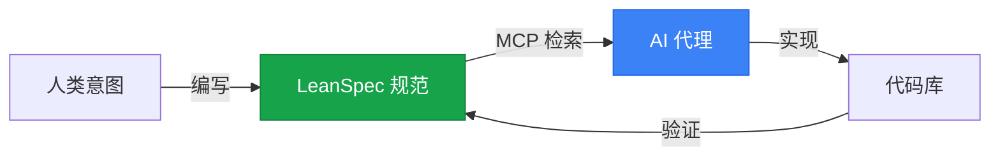

# AI 代理记忆

> "规范作为 AI 代理的持久语义记忆。"

LeanSpec 规范作为 AI 代理的**持久记忆层**——提供跨会话持续的长期知识存储，并支持有效的人类-AI 协作。

## 记忆问题

AI 代理面临一个根本挑战：**工作记忆是短暂的**。

- 每个聊天会话都重新开始（没有以前对话的记忆）
- 上下文窗口有限（即使有 1M+ 令牌）
- 重要决策和理由在会话之间丢失
- 代理重复问题或做出与过去工作不一致的决策

**传统解决方案**：对文档进行 RAG（检索增强生成）

**LeanSpec 解决方案**：规范作为**语义记忆** - 代理可以可靠访问的结构化、持久知识

## 规范作为语义记忆

借鉴认知科学研究（[CoALA 论文](https://arxiv.org/pdf/2309.02427)），AI 代理受益于两种类型的记忆：

### 工作记忆（短暂）
- **是什么**：当前对话上下文、活动任务信息
- **生命周期**：单个会话或任务
- **存储**：聊天历史、上下文窗口
- **大小**：受上下文窗口限制（100k-1M 令牌）

### 语义记忆（持久）
- **是什么**：长期知识、事实、决策、理由
- **生命周期**：跨会话和任务持续
- **存储**：LeanSpec 规范 + MCP 检索
- **大小**：无限（外部存储）

**LeanSpec 规范 = AI 代理的语义记忆**

## 它如何工作

### 记忆存储（编写规范）

在与 AI 代理合作时，规范捕获：

1. **做出的决策**：选择了什么以及为什么
2. **评估的权衡**：考虑的选项、分析的利弊
3. **发现的约束**：技术限制、业务需求
4. **澄清的意图**：工作背后的"为什么"
5. **定义的成功标准**：如何知道完成了

**示例：**
```markdown
# 功能：API 速率限制

## 问题
API 受到攻击，40% 的请求来自 2% 的用户。

## 解决方案
实现令牌桶速率限制（每个 API 密钥 100 请求/分钟）。

## 为什么选择令牌桶？
- 允许突发（比固定窗口更好的 UX）
- 经过实战检验（由 AWS、Stripe 使用）
- 易于用 Redis 实现

## 权衡
- 增加的复杂性（Redis 依赖）
- 潜在的 UX 摩擦（用户达到限制）
- 值得：保护 98% 的用户免受 2% 滥用

## 成功标准
- [ ] 95% 的 API 请求成功（从 60% 提高）
- [ ] 响应时间 p95 < 200ms（之前是 2-3 秒）
- [ ] 零误报（合法用户受速率限制）
```

这成为代理可以在未来会话中引用的**语义记忆**。

### 记忆检索（AI 访问规范）

AI 代理通过以下方式访问规范记忆：

1. **MCP 服务器集成**：LeanSpec MCP 服务器提供规范搜索/检索
2. **语义搜索**：代理按主题、状态、标签查询规范
3. **选择性加载**：仅将相关规范加载到工作记忆中
4. **交叉引用**：跟随 `depends_on` 和 `related` 链接

**工作流程：**
```markdown
人类："我们为什么选择 PostgreSQL 而不是 MongoDB？"

AI 代理：
1. 查询 LeanSpec MCP：search_specs("database decision")
2. 检索规范 023：数据库选择
3. 从语义记忆中读取决策理由
4. 响应："根据规范 023，选择 PostgreSQL 是因为..."
```

### 记忆作为上下文桥梁

规范弥合以下之间的鸿沟：
- **人类记忆**（我们为什么这样做、什么重要）
- **AI 工作记忆**（当前任务、活动上下文）
- **代码库现实**（实际实现了什么）



## LeanSpec 中的记忆类型

### 1. 程序记忆（如何）
- **是什么**：标准模式、模板、工作流程
- **存储**：模板、AGENTS.md 指令
- **示例**："提交前始终验证前置元数据"

### 2. 语义记忆（什么/为什么）
- **是什么**：事实、决策、理由、约束
- **存储**：LeanSpec 规范（README、DESIGN 等）
- **示例**："为无状态身份验证选择 JWT 令牌（见规范 042）"

### 3. 情景记忆（何时/上下文）
- **是什么**：历史事件、什么时候发生了什么
- **存储**：Git 历史、规范转换、时间戳
- **示例**："API 重新设计（规范 038）发生在身份验证重构（规范 037）之后"

**LeanSpec 主要提供语义记忆** - 持久知识层。

## 规范作为记忆的好处

### 对 AI 代理
✅ **持久上下文**跨会话  
✅ **可靠检索**过去的决策  
✅ **一致行为**与项目历史对齐  
✅ **减少幻觉**（事实来自规范，而不是猜测）  
✅ **可扩展知识**（不受上下文窗口限制）

### 对人类
✅ **与 AI 代理的共识**  
✅ **机构知识**被捕获和可访问  
✅ **简化入职**（新人类和新 AI 会话）  
✅ **决策审计跟踪**（为什么事情是这样的）  
✅ **上下文切换**（几个月后返回项目）

### 对团队
✅ **团队对齐**（每个人阅读相同的记忆）  
✅ **异步协作**（代理从共享记忆工作）  
✅ **知识连续性**（不依赖个人）  
✅ **减少会议**（决策被记录，而不是重复讨论）

## 记忆维护

像人类记忆一样，规范记忆需要维护：

### 主动回忆（保持最新）
- 随着理解的演变更新规范
- 明确标记被替代的决策
- 归档已完成的工作（压缩为摘要）

### 巩固（防止膨胀）
- 应用[上下文工程](/docs/advanced/context-engineering)策略
- 分区大型规范（>400 行）
- 压缩冗余内容
- 压缩历史阶段

### 检索练习（验证访问）
- 测试 MCP 搜索检索相关规范
- 验证交叉引用（depends_on、related）
- 检查关键决策是否可找到

## 最佳实践

**应该做：**
- ✅ 捕获"为什么"和权衡（稳定的语义记忆）
- ✅ 随着现实变化更新规范（保持记忆准确）
- ✅ 在询问人类之前使用 MCP 搜索检索
- ✅ 交叉引用相关规范（记忆关联）
- ✅ 归档已完成的工作（释放工作记忆）

**不应该做：**
- ❌ 记录一切（记忆过载）
- ❌ 让规范与现实脱节（记忆损坏）
- ❌ 在规范之间重复信息（记忆膨胀）
- ❌ 留下冲突信息（上下文冲突）

## 底线

**LeanSpec 将规范从静态文档转变为 AI 代理的活跃语义记忆。**

- **工作记忆**（聊天历史）是短暂和有限的
- **语义记忆**（规范）是持久和可扩展的
- **MCP 集成**支持可靠的记忆检索
- **上下文工程**保持记忆可管理

当 AI 代理能够可靠地访问过去的决策、理解理由并建立在先前工作的基础上时，它们成为**真正的协作者**，而不是会话绑定的助手。

---

**相关**：了解[上下文工程](/docs/advanced/context-engineering)以管理记忆大小，或探索 [MCP 集成](/docs/reference/mcp-server)以了解记忆检索的技术实现。
