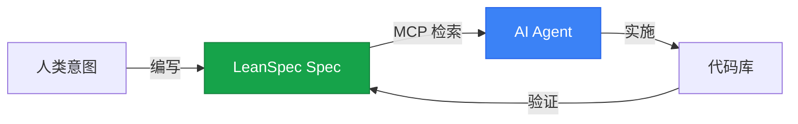

# AI Agent 记忆

> "Spec作为 AI 代理的持久性语义记忆。"

LeanSpec Spec充当 AI 代理的 **持久性记忆层**——提供跨会话持久的长期知识存储，并实现有效的人机协作。

## 记忆问题

AI 代理面临一个基本挑战：**工作记忆 (Working Memory)是短暂的**。

- 每个聊天会话都是全新开始（对先前对话没有记忆）
- 上下文窗口有限（即使有 1M+ tokens）
- 重要决策和理由在会话之间丢失
- 代理重复询问或做出与过去工作不一致的决策

**传统解决方案**：对文档进行 RAG（检索增强生成）

**LeanSpec 解决方案**：Spec作为 **语义记忆** - 代理可以可靠访问的结构化、持久性知识

## Spec作为语义记忆

借鉴认知科学研究（[CoALA 论文](https://arxiv.org/pdf/2309.02427)），AI 代理受益于两种类型的记忆：

### 工作记忆（短暂）
- **什么**：当前对话上下文、活动任务信息
- **生命周期**：单个会话或任务
- **存储**：聊天历史、上下文窗口
- **大小**：受上下文窗口限制（100k-1M tokens）

### 语义记忆（持久）
- **什么**：长期知识、事实、决策、理由
- **生命周期**：跨会话和任务持久
- **存储**：LeanSpec Spec + MCP 检索
- **大小**：无限制（外部存储）

**LeanSpec Spec = AI 代理的语义记忆**

## 工作原理

### 记忆存储（编写Spec）

与 AI 代理合作时，Spec捕获：

1. **已做决策**：选择了什么以及为什么
2. **已评估权衡**：考虑的选项、分析的利弊
3. **已发现约束**：技术限制、业务需求
4. **已阐明意图**：工作背后的"为什么"
5. **已定义成功标准**：如何知道何时完成

**示例**：
```markdown
# 功能：API 速率限制

## 问题
API 被大量请求攻击，40% 的请求来自 2% 的用户。

## 解决方案
实施Token桶速率限制（每个 API 密钥每分钟 100 个请求）。

## 为什么选择Token桶？
- 允许突发（比固定窗口更好的用户体验）
- 经过实战检验（AWS、Stripe 使用）
- 使用 Redis 简单实现

## 权衡
- 增加复杂性（Redis 依赖）
- 潜在用户体验摩擦（用户达到限制）
- 值得：保护 98% 的用户免受 2% 的滥用

## 成功标准
- [ ] 95% 的 API 请求成功（从 60% 提高）
- [ ] 响应时间 p95 < 200ms（之前为 2-3 秒）
- [ ] 零误报（合法用户被速率限制）
```

这成为代理可以在未来会话中引用的 **语义记忆**。

### 记忆检索（AI 访问Spec）

AI 代理通过以下方式访问Spec记忆：

1. **MCP 服务器集成**：LeanSpec MCP 服务器提供Spec搜索/检索
2. **语义搜索**：代理按主题、状态、标签查询Spec
3. **选择性加载**：仅将相关Spec加载到工作记忆中
4. **交叉引用**：遵循 `depends_on` 和 `related` 链接

**工作流**：
```markdown
人类："我们为什么选择 PostgreSQL 而不是 MongoDB？"

AI Agent：
1. 查询 LeanSpec MCP：search_specs("database decision")
2. 检索Spec 023：数据库选择
3. 从语义记忆读取决策理由
4. 回应："根据Spec 023，选择 PostgreSQL 是因为..."
```

### 记忆作为上下文桥梁

Spec弥合以下差距：
- **人类记忆**（我们为什么这样做，什么重要）
- **AI 工作记忆**（当前任务、活动上下文）
- **代码库现实**（实际实现了什么）



## LeanSpec 中的记忆类型

### 1. 程序性记忆（如何做）
- **什么**：标准模式、模板、工作流
- **存储**：模板、AGENTS.md 指令
- **示例**："提交前始终验证 frontmatter"

### 2. 语义记忆（什么/为什么）
- **什么**：事实、决策、理由、约束
- **存储**：LeanSpec Spec（README、DESIGN 等）
- **示例**："为无状态认证选择 JWT Token（见Spec 042）"

### 3. 情景记忆（何时/上下文）
- **什么**：历史事件、什么时候发生的
- **存储**：Git 历史、Spec转换、时间戳
- **示例**："API 重新设计（Spec 038）发生在认证重构（Spec 037）之后"

**LeanSpec 主要提供语义记忆** - 持久性知识层。

## Spec作为记忆的好处

### 对于 AI 代理
✅ **跨会话的持久上下文**  
✅ **可靠检索** 过去的决策  
✅ **一致的行为** 与项目历史保持一致  
✅ **减少幻觉**（事实来自Spec，而非猜测）  
✅ **可扩展的知识**（不受上下文窗口限制）

### 对于人类
✅ **与 AI 代理的共同理解**  
✅ **捕获和访问机构知识**  
✅ **简化入职**（新人类和新 AI 会话）  
✅ **决策审计跟踪**（事情为什么是这样的）  
✅ **上下文切换**（几个月后返回项目）

### 对于团队
✅ **团队对齐**（每个人阅读相同的记忆）  
✅ **异步协作**（代理从共享记忆工作）  
✅ **知识连续性**（不依赖于个人）  
✅ **减少会议**（决策已记录，不重复讨论）

## 记忆维护

像人类记忆一样，Spec记忆需要维护：

### 主动回忆（保持最新）
- 随着理解的发展更新Spec
- 明确标记被取代的决策
- 归档已完成的工作（压缩为摘要）

### 整合（防止膨胀）
- 应用 [上下文工程](/docs/advanced/context-engineering) 策略
- 分割大型Spec（>400 行）
- 压缩冗余内容
- 压缩历史阶段

### 检索练习（验证访问）
- 测试 MCP 搜索检索相关Spec
- 验证交叉引用（depends_on、related）
- 检查关键决策是否可找到

## 最佳实践

**应该做：**
- ✅ 捕获"为什么"和权衡（稳定的语义记忆）
- ✅ 随着现实变化更新Spec（保持记忆准确）
- ✅ 在询问人类之前使用 MCP 搜索检索
- ✅ 交叉引用相关Spec（记忆关联）
- ✅ 归档已完成的工作（释放工作记忆）

**不应该做：**
- ❌ 记录所有内容（记忆过载）
- ❌ 让Spec偏离现实（记忆损坏）
- ❌ 跨Spec重复信息（记忆膨胀）
- ❌ 留下冲突信息（上下文冲突）

## 底线

**LeanSpec 将Spec从静态文档转变为 AI 代理的主动语义记忆。**

- **工作记忆**（聊天历史）是短暂且有限的
- **语义记忆**（Spec）是持久且可扩展的
- **MCP 集成** 实现可靠的记忆检索
- **上下文工程** 保持记忆可管理

当 AI 代理可以可靠地访问过去的决策、理解理由并建立在先前工作的基础上时，它们成为 **真正的协作者** 而不是受会话限制的助手。

---

**相关**：了解 [上下文工程](/docs/advanced/context-engineering) 以管理记忆大小，或探索 [MCP 集成](/docs/reference/mcp-server) 以了解记忆检索的技术实现。
