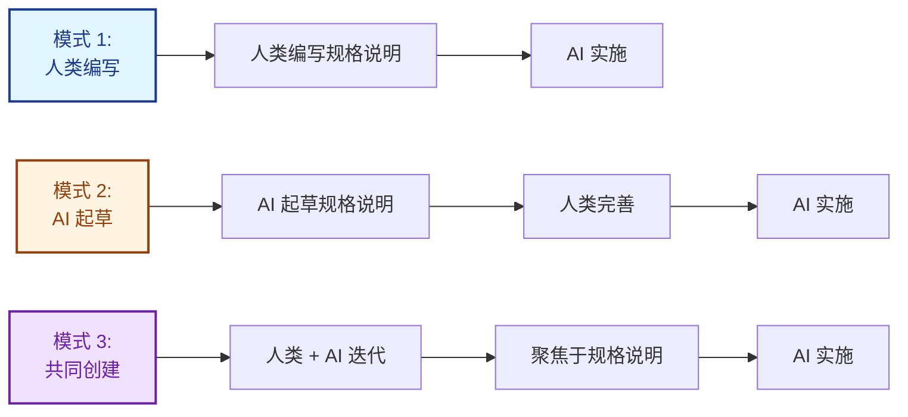
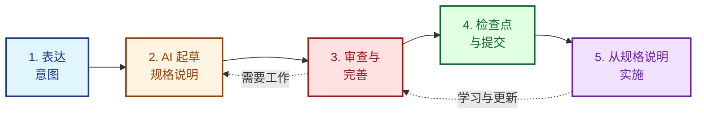
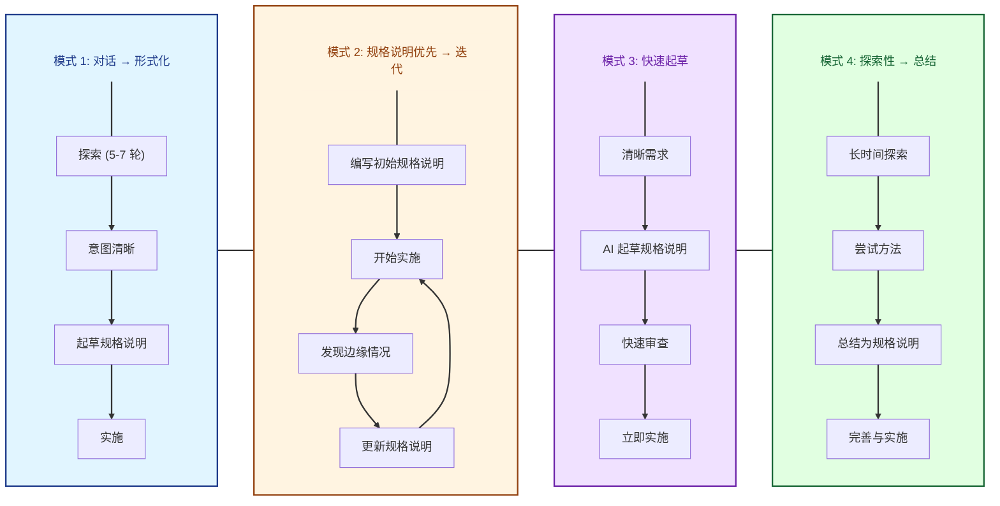
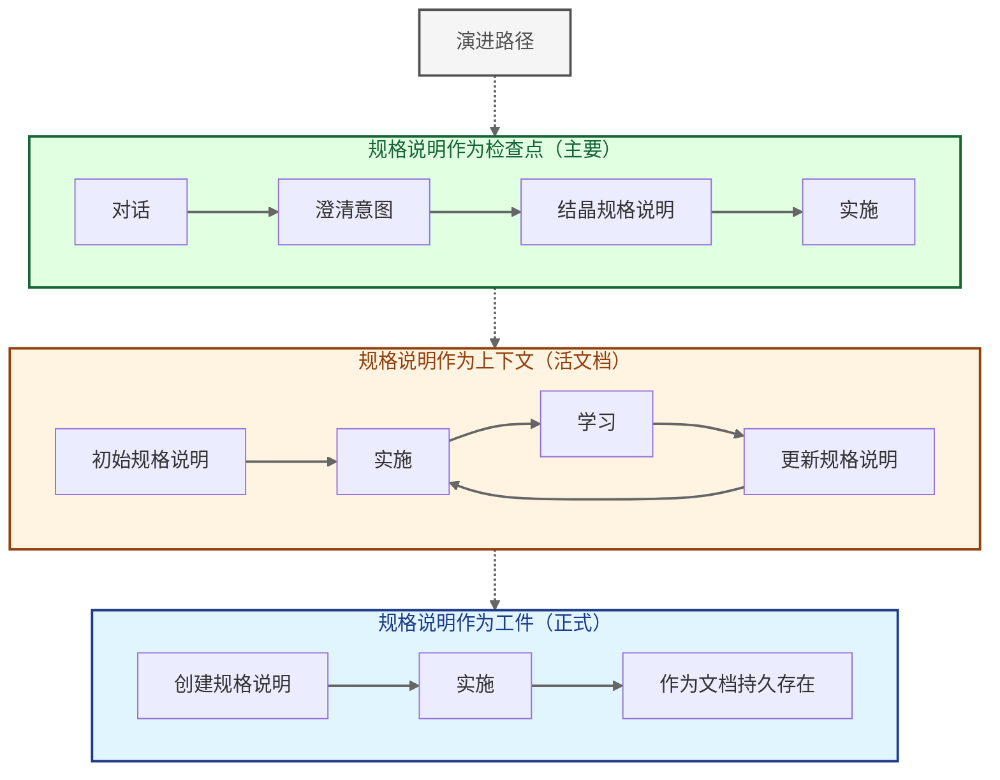

LeanSpec 规格说明可以由人类编写、AI 编写，或协作共同创建。本指南介绍如何与 AI 合作起草、完善和维护规格说明，同时保持它们精简且可操作。

## 三种模式



### 模式 1：人类编写，AI 实施（传统）
您从头编写规格说明，AI 根据它实施。当您拥有深厚的领域知识和清晰的愿景时最佳。

### 模式 2：AI 起草，人类完善（辅助）
AI 根据您的意图起草初始规格说明，您审查并完善。当需要快速开始或结构不清晰时最佳。

### 模式 3：迭代共同创建（协作）
您和 AI 通过对话共同构建规格说明，逐步完善。当复杂功能在规格说明过程中需要探索时最佳。

**所有三种模式都是有效的。** 根据您的上下文选择，而非意识形态。

## 何时使用 AI 辅助的规格说明编写

### 编写规格说明（在 AI 帮助下）当：

✅ **意图需要持久存在** - 决策、理由和上下文应该超越对话  
✅ **多个利益相关者需要对齐** - 不能让每个人单独与 AI 聊天  
✅ **复杂性需要结构** - 对话会漂移或丢失重要细节  
✅ **需要合规或审计跟踪** - 需要正式文档  
✅ **对话已澄清意图** - 您已足够迭代，知道您想要什么  

### 跳过规格说明，仅对话当：

❌ **快速功能且无歧义** - AI 可以直接从清晰指令实施  
❌ **探索性工作** - 仍在发现要构建什么  
❌ **一次性原型** - 不需要未来参考  
❌ **代码库中上下文已清晰** - 实施本身说明了一切  

**关键见解**：AI 辅助创作使规格说明 **更易访问**（更容易创建），但不会改变 **何时** 需要它们。决策点仍然是：** "形式化是否增加价值？" **

## 5 步工作流



### 步骤 1：表达意图

从清晰的问题陈述或期望结果开始。不要担心结构。

**好的提示**：
- "我们需要将用户入职时间从 14 分钟减少到 5 分钟"
- "添加速率限制以防止 API 滥用"
- "迁移认证以支持 SSO"

**不好的提示**：
- "让应用更好"（太模糊）
- "添加一个按钮"（对于规格说明来说太琐碎）
- "使用带 PKCE 流程的 OAuth 2.0 实现 JWT tokens..."（跳到实现）

### 步骤 2：AI 起草初始规格说明

要求 AI 遵循 LeanSpec 原则起草规格说明：

```
为 [您的意图] 起草一个 LeanSpec。遵循这些原则：
- 上下文经济：保持在 300 行以下
- 信噪比：每个句子都必须提供决策信息
- 意图优于实现：专注于为什么和什么，而非如何
- 包括：问题、解决方案、成功标准、权衡
```

**期望什么**：
- 结构化部分（问题、解决方案、成功标准）
- 初始实现想法
- 可能有些冗长（AI 倾向于过度解释）

### 步骤 3：审查和完善

这是您增加价值的地方。检查：

**上下文经济违规**：
- 是否在 300 行以下？（300 行警告，400+ 行红色标志）
- 您能在 5-10 分钟内阅读吗？
- 您能在脑海中记住结构吗？

**信噪比问题**：
- 每个句子都提供决策信息吗？
- 是否有显而易见或可推断的内容可以删除？
- 是否有应该删除的"未来可能"功能？

**缺少意图**：
- "为什么"清晰吗？
- 权衡是否解释了？
- 成功标准可测量吗？

**完善提示**：
```
根据 LeanSpec 第一性原理审查此规格说明：
1. 删除任何不提供决策信息的内容（信噪比）
2. 确保在 300 行以下（上下文经济）
3. 添加缺少的"为什么"和权衡（意图优于实现）
4. 使成功标准可测量
```

### 步骤 4：检查点和提交

一旦完善，规格说明成为 **检查点** - 您和 AI 之间关于要构建什么的正式协议。

**标记为检查点**：
- 保存规格说明文件
- 将状态标记为 "planned" 或 "in-progress"
- 使用 `lean-spec create` 或更新 frontmatter
- 在提交和 PR 中引用规格说明

**规格说明现在充当**：
- 实施的真相来源
- 未来对话的上下文
- 团队对齐的文档
- 合规/审计的工件

### 步骤 5：从规格说明实施

AI 现在从完善的规格说明实施，而非原始对话。规格说明是契约。

**好处**：
- 清晰的范围（什么在内/外）
- 可测量的成功标准
- 为未来参考保留理由
- 方法上的团队对齐

## 常见模式



### 模式 1：对话 → 形式化 → 实施

最常见。您与 AI 迭代以澄清意图，然后在实施前形式化为规格说明。

**示例**：
1. 对话："我想要更快的用户入职"
2. AI 提出澄清问题（当前流程、瓶颈、约束）
3. 5-7 轮后，意图清晰
4. 形式化："为 2 屏入职与延迟配置文件丰富起草规格说明"
5. 从完善的规格说明实施

**何时使用**：大多数项目。探索和结构的良好平衡。

### 模式 2：规格说明优先 → 实施期间迭代

预先编写规格说明，但在实施过程中随着学习演进它（规格说明驱动开发风格）。

**示例**：
1. 为新 API 端点起草规格说明
2. 开始实施
3. 发现边缘情况或更好的方法
4. 用学习更新规格说明
5. 使用更新的上下文继续实施

**何时使用**：当初始需求清晰但细节将在工作期间出现时。

### 模式 3：快速起草 → 立即实施

AI 起草规格说明并在一个流程中实施。规格说明作为所做决策的快照。

**示例**：
1. "为 API 构建速率限制 - 每用户 100 req/min"
2. AI 起草最小规格说明（问题、解决方案、成功标准）
3. 您批准或调整
4. AI 立即实施
5. 规格说明存在以供未来参考

**何时使用**：具有清晰需求和最小歧义的简单功能。

### 模式 4：探索性 → 总结 → 规格说明

通过对话探索，然后回顾性地将学习总结为规格说明。

**示例**：
1. 关于认证重新设计的长时间探索性对话
2. 尝试多种方法，讨论权衡
3. 一旦方法清晰："将我们的对话总结为 LeanSpec"
4. AI 将对话提炼为结构化规格说明
5. 您完善并形式化
6. 从规格说明实施

**何时使用**：高不确定性工作，其中发现通过对话发生。

## 心智模型



### 规格说明作为检查点（主要）

最常见的心智模型。规格说明是正在进行的工作中的正式协议/检查点。

**流程**：
1. 与 AI 对话澄清意图
2. 准备好时结晶为规格说明
3. 从规格说明继续实施

**使用当**：
- 意图已通过对话澄清
- 准备提交到方法
- 需要正式协议才能继续

### 规格说明作为工件（正式）

规格说明作为超越即时工作的持久工件。

**流程**：
1. 创建规格说明以供长期参考
2. 从规格说明实施
3. 规格说明作为文档保留

**使用当**：
- 需要合规或审计跟踪
- 需要团队入职文档
- 决策必须长期保留

### 规格说明作为上下文（活文档）

规格说明作为随实施变化的演进上下文。

**流程**：
1. 创建初始规格说明
2. 在学习的同时实施
3. 用发现更新规格说明
4. 规格说明和代码一起演进

**使用当**：
- 需求将在工作期间出现
- 预期迭代完善
- 规格说明作为工作文档

**关键见解**：这些是阶段，而非单独的方法。大多数规格说明从检查点开始，作为上下文演进，并作为工件结束。

## 最佳实践

### 做：保持 AI 专注于原则

在起草时明确提醒 AI 遵循 LeanSpec 原则：

```
遵循 LeanSpec 原则起草此规格说明：
- 上下文经济：300 行以下，10 分钟内可读
- 信噪比：每个句子都提供决策信息
- 意图优于实现：专注于为什么和什么
- 渐进式披露：从最小开始，仅在需要时添加
```

### 做：测试"决策测试"

对于每个部分，问："这提供什么决策信息？"

如果您不能清楚回答，删除或澄清该部分。

### 做：在 400 行拆分

如果 AI 起草的规格说明超过 400 行，拆分它。使用子规格说明（DESIGN.md、IMPLEMENTATION.md）或多个较小的规格说明。

### 做：捕获权衡

AI 可能呈现解决方案而不解释为什么。总是问：

```
这种方法的权衡是什么？
我们考虑了哪些替代方案，为什么拒绝它们？
```

### 不要：接受冗长的草稿

AI 倾向于过度解释。无情地删除：
- 显而易见的陈述
- 可推断的细节
- "未来可能"功能
- 冗余解释

### 不要：跳过人类审查

永远不要在没有审查的情况下接受 AI 草稿。人类验证：
- 意图被正确捕获
- 权衡清晰
- 遵循第一性原则
- 范围适当

### 不要：过度指定实现

规格说明应该捕获意图和约束，而非规定每个实现细节。

**好**："速率限制：每用户 100 req/min，返回 429 与 Retry-After 标头"  
**不好**："使用 Redis 与滑动窗口算法，在排序集中存储时间戳，使用 ZREMRANGEBYSCORE..."

### 不要：忘记更新状态

使用 `lean-spec update <spec> --status <status>` 跟踪进度。AI 可以帮助起草，但您管理生命周期。

## 常见陷阱

### 陷阱 1：AI 冗长

**问题**：AI 为简单功能起草 800 行规格说明  
**解决方案**：设置明确约束："在 300 行以下起草"或"仅一页规格说明"

### 陷阱 2：缺少"为什么"

**问题**：规格说明描述要构建什么但不说明为什么  
**解决方案**：总是要求 AI 包括理由和权衡

### 陷阱 3：实现偏见

**问题**：AI 在澄清意图之前跳到特定实现  
**解决方案**：强制意图优先："不要建议实现。首先，澄清问题和约束。"

### 陷阱 4：范围蔓延

**问题**：AI 用"很好拥有"的功能扩展范围  
**解决方案**：明确说明范围外项目。积极删除。

### 陷阱 5：假设 AI 知道上下文

**问题**：AI 在不理解代码库约束的情况下起草  
**解决方案**：提供上下文："我们的 API 使用 REST，而非 GraphQL"或"我们使用 PostgreSQL 14"

## 示例：AI 辅助的规格说明创建

这是 AI 辅助规格说明编写的真实示例：

**步骤 1：初始提示**
```
我们需要 API 速率限制。目前我们没有，正在看到滥用。
目标是每用户每分钟 100 个请求。
```

**步骤 2：AI 起草规格说明（冗长，约 500 行）**

AI 产生详细规格说明，包含：
- 问题陈述
- 多种实现方法
- 数据库模式
- 缓存策略
- 监控计划
- （太详细，违反上下文经济）

**步骤 3：人类完善**
```
此规格说明太详细。简化为：
1. 问题（为什么速率限制？）
2. 解决方案（方法和限制）
3. 成功标准（可测量）
4. 权衡（我们放弃了什么）

删除所有关于 Redis、算法、模式的实现细节。
保持在 200 行以下。
```

**步骤 4：AI 修订（简洁，约 180 行）**

AI 产生精简规格说明：
- **问题**：API 滥用，单个用户 1000 req/min
- **解决方案**：每用户 100 req/min 速率限制，返回 429 + Retry-After
- **成功**：99% 的请求在限制下，无合法用户受影响
- **权衡**：增加延迟（约 2ms），需要状态存储

**步骤 5：人类批准并提交**

规格说明被保存，标记为 "planned"，并成为实施的检查点。

## 何时不使用规格说明 {#when-not-to-use-specs}

即使有 AI 辅助，某些工作也不需要规格说明：

- **快速错误修复** - 实施显而易见，无需记录决策
- **探索性原型** - 仍在发现要构建什么
- **不言自明的重构** - 代码库清楚显示需要更改什么
- **单行更改** - 无歧义，不需要上下文

**记住**：规格说明在提供结构、持久性或对齐时增加价值。如果工作琐碎或探索性，跳过规格说明，直接做工作。

## 总结

AI 辅助的规格说明编写使规格说明：
- **更易创建**（AI 处理第一稿）
- **更快迭代**（AI 根据请求完善）
- **更易访问**（进入门槛更低）

但它不会改变：
- **何时需要规格说明**（持久性、对齐、结构）
- **第一性原则**（上下文经济、信噪比、意图）
- **什么是好规格说明**（清晰意图、可测量成功、适当范围）

**工作流很简单**：
1. 表达意图
2. AI 起草规格说明
3. 根据第一性原则审查
4. 无情地完善
5. 检查点并实施

**心态不变**：
- 保持精简（上下文经济）
- 每个字都重要（信噪比）
- 捕获为什么，而非仅仅如何（意图优于实现）
- 使其对人类和 AI 都有效（弥合差距）
- 仅在需要时添加复杂性（渐进式披露）

AI 是创作的工具，而非冗长规格说明的借口。标准仍然很高。
