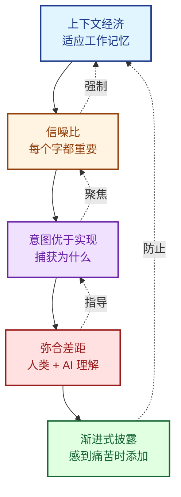

# 第一性原理

> "从约束出发，而非最佳实践。"

LeanSpec 的原则不是基于最佳实践，而是从基本约束推导而来。理解这些约束解释了为什么这些原则有效以及何时可以违反它们。

:::info 术语说明
**上下文**、**Token**、**信噪比** 等术语在[术语](/docs/guide/terminology/spec)中定义。本页解释了基于这些术语构建的原则。
:::

## 决策框架

在制定规格说明决策时，按优先级顺序应用这些原则:

### 1. 上下文经济（Context Economy） - 适应工作记忆
** 规格说明必须适应工作记忆——无论是人类还是 AI 的。 **

- ** 目标 **：每个规格说明文件 &lt;2,000 tokens
- ** 警告 **：2,000-3,500 tokens（可接受但需注意复杂性）
- ** 问题 **：>3,500 tokens（考虑拆分）
- ** 提问 **："能在 5-10 分钟内阅读完吗？能在脑海中记住整个结构吗？"
- ** 原因 **：注意力和认知能力是稀缺资源。AI 性能随上下文增长而下降（质量在 50K tokens 后下降，尽管有 200K 限制）。人类无法在工作记忆中保持 >7 个概念。** 使用 `lean-spec tokens <spec>` 进行检查。 **

### 2. 信噪比最大化（Signal-to-Noise Maximization） - 每个字都提供信息
** 每个字都必须提供决策信息，否则删除。 **

- ** 测试 **："这句话提供了什么决策信息？"
- ** 删除 **：显而易见、可推断或"未来可能"的内容
- ** 保留 **：决策理由、约束、成功标准
- ** 行动 **：删除任何无法回答测试问题的内容
- ** 原因 **：上下文经济问"能记住全部吗？"，信噪比问"每一条都值得记住吗？"认知负担、token 成本和维护负担都会惩罚低价值内容。

### 3. 意图优于实现（Intent Over Implementation） - 捕获为什么，而非仅仅如何
** 捕获"为什么"和"什么"，让"如何"自然出现。 **

- ** 必须有 **：问题、意图、成功标准
- ** 应该有 **：设计理由、权衡
- ** 可以有 **：实现细节、示例
- ** 提问 **："理由清晰吗？"
- ** 行动 **：解释权衡、约束、成功标准
- ** 原因 **：意图是稳定的，实现会变化，AI 需要知道为什么

### 4. 弥合差距（Bridge the Gap） - 人类和 AI 都必须理解
** 规格说明的存在是为了将人类意图与机器执行对齐。 **

- ** 对于人类 **：概述、上下文、理由
- ** 对于 AI **：明确的需求、清晰的结构、示例
- ** 两者都必须理解 **：使用清晰的结构 + 自然语言
- ** 提问 **："两者都能解析和推理吗？"
- ** 行动 **：清晰的结构 + 自然语言解释
- ** 原因 **：人类目标和机器执行之间的差距必须弥合

### 5. 渐进式披露（Progressive Disclosure） - 感到痛苦时再增加复杂性
** 从简单开始，仅在感到痛苦时添加结构。 **

- ** 独立开发者 **：仅状态 + 创建时间
- ** 感到痛苦？**：添加标签、优先级、自定义字段
- ** 永远不要添加 **："以防万一"的功能
- ** 提问 **："我们现在需要这个吗？"
- ** 行动 **：从最小开始，需要时再添加字段
- ** 原因 **：团队在演进，需求在出现，过早抽象是浪费

### 冲突解决示例

当实践冲突时，按优先级顺序应用原则：

** "我应该拆分这个 4,000-token 的规格说明吗？" **
→ ** 是 **（上下文经济：>3,500 tokens 需要拆分）

** "我应该记录每个边缘情况吗？" **
→ ** 仅当它提供当前决策信息时 **（信噪比测试）

** "我应该预先添加自定义字段吗？" **
→ ** 仅当没有它们就感到痛苦时 **（渐进式披露）

** "这个规格说明很复杂但只有 2,500 tokens，要拆分吗？" **
→ ** 否 **（低于上下文经济警告阈值）

## 原则推导

让我们从基本约束推导每个原则。

### 约束 1：注意力有限

** 人类约束 **：
- 工作记忆：7±2 项（[米勒定律](https://en.wikipedia.org/wiki/Miller%27s_law)）
- 注意力持续时间：持续阅读约 10 分钟
- 认知负荷：上下文切换成本高昂

** AI 约束 **：
- 上下文窗口：100k-1M tokens（但质量在约 50k 时下降）
- 注意力下降：距离检索点越远，性能越差
- Token 成本：每次推理都会消耗 token 预算

** 推导出的原则 **：** 上下文经济 **

规格说明必须适应工作记忆。如果它们太大：
- 人类跳过阅读它们
- AI 丢失重要细节
- 两者都采用氛围编码（猜测意图）

** 经验法则 **：
- < 2,000 tokens 适应人类 + AI 工作记忆
- 5-10 分钟阅读时间
- 可以在不重读的情况下记住结构

### 约束 2：时间稀缺

** 人类约束 **：
- 编写文档与编写代码竞争时间
- 维护比创建花费更多时间
- 陈旧文档比没有文档更糟糕

** AI 约束 **：
- 处理时间与上下文大小成线性关系
- 更大的规格说明 = 更慢的响应
- Token 成本 = 金钱成本

** 推导出的原则 **：** 信噪比最大化 **

每个字都必须证明其成本合理（时间 + 注意力 + token）。

** 测试 **："这个句子提供什么决策信息？"

如果没有，删除它：
- 显而易见的陈述（"测试很重要"）
- 可推断的细节（从代码显而易见）
- 投机性内容（"将来我们可能..."）
- 冗余解释（多次重复相同内容）

### 约束 3：现实变化

** 人类约束 **：
- 需求在实施过程中演变
- 技术约束出现
- 业务优先级转移

** AI 约束 **：
- 模型改进并改变能力
- 工具演进
- 集成模式转变

** 推导出的原则 **：** 意图优于实现 **

意图（为什么）是稳定的。实现（如何）会变化。

捕获意图：
- ** 问题 ** - 我们为什么要做这个？
- ** 约束 ** - 什么限制了我们？
- ** 成功标准 ** - 我们如何知道完成了？
- ** 权衡 ** - 我们在放弃什么？

跳过实现细节：
- 算法（从约束推导）
- 数据结构（从需求推导）
- 具体技术（从生态系统约束推导）

** 例外 **：当实现细节 ** 是 ** 约束时（例如，"必须使用 PostgreSQL"）

### 约束 4：人机鸿沟

** 人类强项 **：
- 模糊推理
- 上下文理解
- 目标对齐

** AI 强项 **：
- 模式识别
- 详尽搜索
- 代码生成

** 鸿沟 **：
- AI 不理解隐含意图
- 人类不能将所有内容清晰表达
- 误解代价高昂

** 推导出的原则 **：** 弥合差距 **

规格说明必须同时服务于人类和 AI：
- ** 结构 **：AI 可以解析的清晰部分
- ** 自然语言 **：人类可以理解的散文
- ** 示例 **：具体化抽象概念
- ** 明确性 **：减少歧义

** 测试 **：
- 人类能在 5 分钟内理解意图吗？
- AI 能生成符合意图的代码吗？

### 约束 5：团队演进

** 小团队 **：
- 最小协调开销
- 共享上下文
- 非正式沟通

** 大团队 **：
- 需要正式流程
- 协调成本高
- 需要可追溯性

** 推导出的原则 **：** 渐进式披露 **

不要预先建立复杂性。随着团队成长添加结构。

** 阶段 **：
- ** 独立 ** - 仅跟踪状态和创建时间
- ** 小团队 ** - 添加标签和优先级
- ** 大团队 ** - 添加分配、依赖关系、自定义字段
- ** 企业 ** - 添加合规、审计跟踪、集成

** 规则 **：仅在 ** 感到痛苦 ** 时添加复杂性。永远不要"以防万一"。

## 原则交互

这些原则相互强化：

** 示例循环 **：
1. ** 上下文经济 ** 限制规格说明为 2,000 tokens
2. ** 信噪比 ** 强制每个字都有价值
3. ** 意图优于实现 ** 聚焦于稳定的"为什么"
4. ** 弥合差距 ** 确保人类和 AI 都理解
5. ** 渐进式披露 ** 防止早期过度结构化

** 结果 **：规格说明保持精简、聚焦、可维护且有效。

## 何时违反原则

原则是 ** 约束，而非规则 **。当有充分理由时可以违反。

### 可以超过 2,000 tokens 当：
- 复杂性需要它
- 已尽可能分割
- 仍适应单次阅读会话（&lt;30 分钟）
- 信噪比保持高

** 警告级别 **：
- 2,000-3,500 tokens：可接受，但监控复杂性
- 3,500-5,000 tokens：警告——考虑拆分
- >5,000 tokens：红色标志——应该拆分

### 可以包含实现细节当：
- 实现 ** 是 ** 约束（"必须使用 Redis"）
- 显著的技术风险需要早期验证
- 遗留系统限制决策
- 合规要求规定方法

### 可以跳过意图当：
- 上下文绝对清晰
- 琐碎的更改
- 原型/实验性工作

** 规则 **：首先知道原则。然后有意识地决定何时以及为什么违反它们。

## 验证检查清单

通过以下方式验证您的规格说明是否遵循第一性原理：

### 上下文经济
- [ ] 规格说明 < 2,000 tokens（使用 `lean-spec tokens <spec>` 检查）
- [ ] 可以在 5-10 分钟内阅读
- [ ] 如果更长，是否拆分为子规格说明？

### 信噪比
- [ ] 每个句子都提供决策信息
- [ ] 删除了显而易见的陈述
- [ ] 删除了"将来我们可能..."的投机内容

### 意图优于实现
- [ ] "为什么"在"如何"之前清晰
- [ ] 权衡已解释
- [ ] 成功标准明确

### 弥合差距
- [ ] 人类可以理解意图
- [ ] AI 可以生成符合规格说明的代码
- [ ] 在需要时包含示例

### 渐进式披露
- [ ] 仅包含当前需要的字段
- [ ] 没有"以防万一"的部分
- [ ] 结构符合团队规模

## 底线

LeanSpec 的原则不是任意的——它们是从基本约束推导出来的：

1. ** 注意力有限 ** → 上下文经济
2. ** 时间稀缺 ** → 信噪比
3. ** 现实变化 ** → 意图优于实现
4. ** 人机鸿沟 ** → 弥合差距
5. ** 团队演进 ** → 渐进式披露

遵循这些原则不是因为"最佳实践"说要这样做，而是因为约束要求这样做。

当有疑问时：
- 按优先级顺序应用原则
- 有意识地违反（知道为什么）
- 让约束指导你

---

** 下一步 **：探索如何将这些原则应用于实践中的 [哲学与心态](/docs/advanced/philosophy) 或深入了解 [上下文工程](/docs/advanced/context-engineering) 以进行高级优化。
