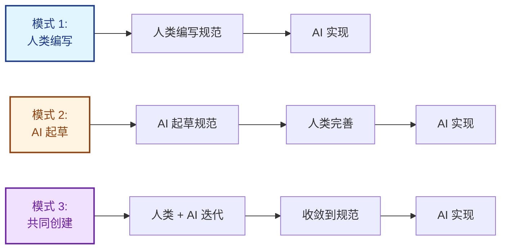
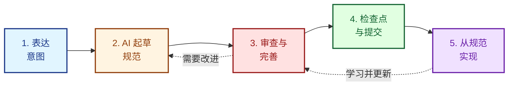
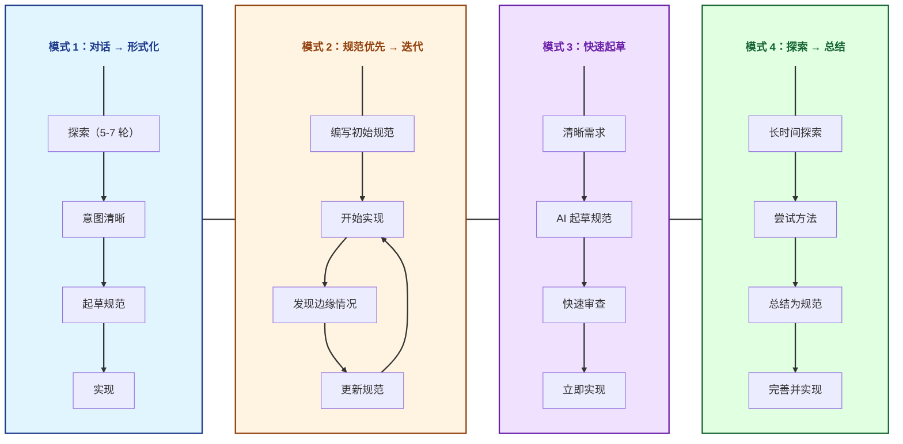
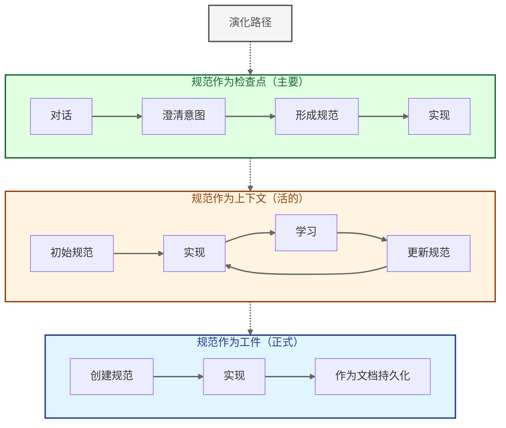

LeanSpec 规范可以由人类、AI 或协作共同创建。本指南介绍如何与 AI 合作起草、完善和维护规范，同时保持它们精简和可操作。

## 三种模式



### 模式 1：人类编写，AI 实现（传统）
您从头开始编写规范，AI 从中实现。当您拥有深厚的领域知识和清晰的愿景时最佳。

### 模式 2：AI 起草，人类完善（辅助）
AI 根据您的意图起草初始规范，您审查并完善。当需要快速入门或结构不清楚时最佳。

### 模式 3：迭代式共同创建（协作）
您和 AI 通过对话一起构建规范，逐步完善。当复杂功能在规范制定期间发现时最佳。

**所有三种模式都是有效的。**根据您的情况选择，而非意识形态。

## 何时使用 AI 辅助规范编写

### 何时编写规范（借助 AI）：

✅ **意图需要持久化** - 决策、理由和上下文应超越对话本身
✅ **多个利益相关者需要对齐** - 不能让每个人单独与 AI 聊天
✅ **复杂性需要结构** - 对话会偏离或丢失重要细节
✅ **需要合规性或审计跟踪** - 需要正式文档
✅ **对话已澄清意图** - 您已迭代足够了解自己想要什么

### 何时跳过规范，只是对话：

❌ **明确的快速功能** - AI 可以直接从清晰指令实现
❌ **探索性工作** - 仍在发现要构建什么
❌ **一次性原型** - 不需要将来参考
❌ **上下文在代码库中已清楚** - 实现自己说明问题

**关键洞察：**AI 辅助编写使规范更易访问（更易创建），但不改变何时需要它们。决策点仍然是：**"形式化是否增加价值？"**

## 5 步工作流



### 步骤 1：表达意图

从清晰的问题陈述或期望结果开始。先不要担心结构。

**好的提示：**
- "我们需要将用户入职时间从 14 分钟减少到 5 分钟"
- "添加速率限制以防止 API 滥用"
- "迁移身份验证以支持 SSO"

**差的提示：**
- "让应用更好"（太模糊）
- "添加一个按钮"（对于规范来说太琐碎）
- "使用 PKCE 流程和 JWT 令牌实现 OAuth 2.0..."（直接跳到实现）

### 步骤 2：AI 起草初始规范

要求 AI 遵循 LeanSpec 原则起草规范：

```
为[您的意图]起草 LeanSpec。遵循以下原则：
- 上下文经济：保持在 300 行以下
- 信噪比：每个句子都必须提供决策信息
- 意图优于实现：关注为什么和什么，而非如何
- 包括：问题、解决方案、成功标准、权衡
```

**期望得到：**
- 结构化部分（问题、解决方案、成功标准）
- 初始实现想法
- 可能有些冗长（AI 倾向于过度解释）

### 步骤 3：审查和完善

这是您增加价值的地方。检查：

**上下文经济违规：**
- 是否在 300 行以下？（300 行警告，400+ 行危险信号）
- 您能在 5-10 分钟内读完吗？
- 您能在脑中保持整个结构吗？

**信噪比问题：**
- 每个句子都提供决策信息吗？
- 有明显或可推断的内容可以删减吗？
- 有应该删除的"可能未来"功能吗？

**缺失意图：**
- "为什么"清楚吗？
- 权衡解释了吗？
- 成功标准可衡量吗？

**完善提示：**
```
根据 LeanSpec 第一原则审查此规范：
1. 删除任何不提供决策信息的内容（信噪比）
2. 确保在 300 行以下（上下文经济）
3. 添加缺失的"为什么"和权衡（意图优于实现）
4. 使成功标准可衡量
```

### 步骤 4：检查点和提交

一旦完善，规范就成为**检查点** - 您和 AI 之间关于要构建什么的正式协议。

**标记为检查点：**
- 保存规范文件
- 将状态标记为"planned"或"in-progress"
- 使用 `lean-spec create` 或更新前置元数据
- 在提交和 PR 中引用规范

**规范现在充当：**
- 实现的真实源
- 未来对话的上下文
- 团队对齐的文档
- 合规性/审计的工件

### 步骤 5：从规范实现

AI 现在从完善的规范实现，而非原始对话。规范就是契约。

**好处：**
- 清晰的范围（包含/排除什么）
- 可衡量的成功标准
- 为将来参考保留的理由
- 方法的团队对齐

## 常见模式



### 模式 1：对话 → 形式化 → 实现

最常见。您与 AI 迭代以澄清意图，然后在实现前形式化为规范。

**示例：**
1. 对话："我想要更快的用户入职"
2. AI 提出澄清性问题（当前流程、瓶颈、约束）
3. 5-7 轮后，意图清晰
4. 形式化："为包含延迟个人资料丰富的 2 屏入职起草规范"
5. 从完善的规范实现

**何时使用：**大多数项目。探索和结构的良好平衡。

### 模式 2：规范优先 → 实现期间迭代

预先编写规范，但在实现期间学习时演化它（规范驱动开发风格）。

**示例：**
1. 为新 API 端点起草规范
2. 开始实现
3. 发现边缘情况或更好的方法
4. 用学习更新规范
5. 用更新的上下文继续实现

**何时使用：**当初始需求清晰但细节将在工作期间出现时。

### 模式 3：快速起草 → 立即实现

AI 在一个流程中起草规范并实现。规范充当所做决策的快照。

**示例：**
1. "为 API 构建速率限制 - 每用户每分钟 100 次请求"
2. AI 起草最小规范（问题、解决方案、成功标准）
3. 您批准或调整
4. AI 立即实现
5. 规范存在以供将来参考

**何时使用：**具有清晰需求和最小歧义的简单功能。

### 模式 4：探索 → 总结 → 规范

通过对话探索，然后回顾性地将学习总结为规范。

**示例：**
1. 关于身份验证重新设计的长时间探索性对话
2. 尝试多种方法，讨论权衡
3. 一旦方法清晰："将我们的对话总结为 LeanSpec"
4. AI 将对话提炼为结构化规范
5. 您完善并形式化
6. 从规范实现

**何时使用：**高不确定性工作，通过对话进行发现。

## 心智模型



### 规范作为检查点（主要）

最常见的心智模型。规范是正在进行的工作中的正式协议/检查点。

**流程：**
1. 与 AI 对话澄清意图
2. 准备好时形成规范
3. 从规范继续实现

**何时使用：**
- 意图已通过对话澄清
- 准备提交方法
- 继续前需要正式协议

### 规范作为工件（正式）

规范作为持久的工件，超越即时工作。

**流程：**
1. 为长期参考创建规范
2. 从规范实现
3. 规范保留为文档

**何时使用：**
- 需要合规性或审计跟踪
- 需要团队入职文档
- 决策必须长期保留

### 规范作为上下文（活的）

规范作为与实现一起变化的演化上下文。

**流程：**
1. 创建初始规范
2. 在学习时实现
3. 用发现更新规范
4. 规范和代码一起演化

**何时使用：**
- 需求将在工作期间出现
- 预期迭代完善
- 规范充当工作文档

**关键洞察：**这些是阶段，而非单独的方法。大多数规范从检查点开始，作为上下文演化，最后成为工件。

## 最佳实践

### 要做：让 AI 专注于原则

在起草时明确提醒 AI 遵循 LeanSpec 原则：

```
按照 LeanSpec 原则起草此规范：
- 上下文经济：300 行以下，10 分钟可读
- 信噪比：每个句子都提供决策信息
- 意图优于实现：关注为什么和什么
- 渐进式披露：从最小开始，仅在需要时添加
```

### 要做：测试"决策测试"

对于每个部分，问："这提供了什么决策信息？"

如果您不能清楚回答，删除或澄清该部分。

### 要做：在 400 行拆分

如果 AI 起草的规范超过 400 行，拆分它。使用子规范（DESIGN.md、IMPLEMENTATION.md）或多个较小的规范。

### 要做：捕获权衡

AI 可能会呈现解决方案而不解释原因。始终询问：

```
这种方法的权衡是什么？
我们考虑了哪些替代方案，为什么拒绝它们？
```

### 不要：接受冗长的草稿

AI 倾向于过度解释。无情地删减：
- 显而易见的陈述
- 可推断的细节
- "可能未来"的功能
- 冗余解释

### 不要：跳过人类审查

永远不要在没有审查的情况下接受 AI 草稿。人类验证：
- 意图被正确捕获
- 权衡清楚
- 遵循第一原则
- 范围适当

### 不要：过度指定实现

规范应捕获意图和约束，而非规定每个实现细节。

**好：**"速率限制：每用户每分钟 100 次请求，返回 429 和 Retry-After 头"
**差：**"使用 Redis 和滑动窗口算法，在排序集中存储时间戳，使用 ZREMRANGEBYSCORE..."

### 不要：忘记更新状态

使用 `lean-spec update <spec> --status <status>` 跟踪进度。AI 可以帮助起草，但您管理生命周期。

## 常见陷阱

### 陷阱 1：AI 冗长

**问题：**AI 为简单功能起草 800 行规范
**解决方案：**设置明确约束："在 300 行内起草"或"仅一页规范"

### 陷阱 2：缺少"为什么"

**问题：**规范描述要构建什么但不说明为什么
**解决方案：**始终要求 AI 包含理由和权衡

### 陷阱 3：实现偏见

**问题：**AI 在澄清意图前跳到特定实现
**解决方案：**强制意图优先："先不要建议实现。首先，澄清问题和约束。"

### 陷阱 4：范围蔓延

**问题：**AI 用"最好有"的功能扩展范围
**解决方案：**明确说明超出范围的项目。激进删减。

### 陷阱 5：假设 AI 知道上下文

**问题：**AI 在不了解代码库约束的情况下起草
**解决方案：**提供上下文："我们的 API 使用 REST，不是 GraphQL"或"我们使用 PostgreSQL 14"

## 示例：AI 辅助规范创建

这是 AI 辅助规范编写的真实示例：

**步骤 1：初始提示**
```
我们需要 API 速率限制。目前我们没有，正在看到滥用。
目标是每用户每分钟 100 次请求。
```

**步骤 2：AI 起草规范（冗长，约 500 行）**

AI 生成包含以下内容的详细规范：
- 问题陈述
- 多种实现方法
- 数据库模式
- 缓存策略
- 监控计划
- （太详细，违反上下文经济）

**步骤 3：人类完善**
```
此规范太详细。简化为：
1. 问题（为什么需要速率限制？）
2. 解决方案（方法和限制）
3. 成功标准（可衡量）
4. 权衡（我们放弃了什么）

删除所有关于 Redis、算法、模式的实现细节。
保持在 200 行以下。
```

**步骤 4：AI 修订（简洁，约 180 行）**

AI 生成精简规范：
- **问题：**API 滥用，单个用户每分钟 1000 次请求
- **解决方案：**每用户每分钟限制 100 次请求，返回 429 + Retry-After
- **成功：**99% 的请求在限制内，没有合法用户受影响
- **权衡：**增加延迟（约 2ms），需要状态存储

**步骤 5：人类批准并提交**

规范被保存，标记为"planned"，成为实现的检查点。

## 何时不使用规范

即使有 AI 辅助，某些工作也不需要规范：

- **快速错误修复** - 实现显而易见，无需记录决策
- **探索性原型** - 仍在发现要构建什么
- **不言自明的重构** - 代码库清楚地显示需要更改什么
- **一行更改** - 无歧义，无需上下文

**记住：**当规范提供结构、持久性或对齐时，它们增加价值。如果工作琐碎或探索性，跳过规范，直接完成工作。

## 总结

AI 辅助规范编写使规范：
- **更易创建**（AI 处理初稿）
- **更快迭代**（AI 根据请求完善）
- **更易访问**（降低进入门槛）

但它不改变：
- **何时需要规范**（持久性、对齐、结构）
- **第一原则**（上下文经济、信噪比、意图）
- **什么是好规范**（清晰意图、可衡量成功、适当范围）

**工作流很简单：**
1. 表达意图
2. AI 起草规范
3. 根据第一原则审查
4. 无情完善
5. 检查点并实现

**心态不变：**
- 保持精简（上下文经济）
- 每个字都很重要（信噪比）
- 捕获为什么，而非仅仅如何（意图优于实现）
- 使其对人类和 AI 都有效（架起桥梁）
- 仅在需要时添加复杂性（渐进式披露）

AI 是编写工具，而非冗长规范的借口。标准仍然很高。
