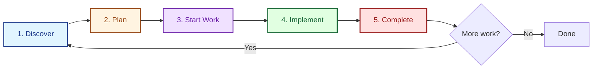

# AI Coding Workflow

LeanSpec enables a powerful **Spec-Driven Development (SDD)** workflow with AI coding assistants. This guide shows you the recommended workflow for building features with AI.

## The SDD Cycle



### 1. Discover - Check Existing Specs

Before creating new specs, see what already exists:

```bash
# What's the current state?
lean-spec board

# Search for related work
lean-spec search "authentication"

# List specs by tag
lean-spec list --tag api
```

**Why?** Avoid duplicating work and understand dependencies.

### 2. Plan - Create Spec

Create a spec to formalize your intent:

```bash
# Create new spec
lean-spec create user-auth-api --tags api,auth --priority high
```

This creates `specs/042-user-auth-api/README.md` with status `planned`.

**Work with AI to draft the spec:**

```
Draft a LeanSpec for user authentication API. Include:
- Problem: Why we need this
- Solution: High-level approach
- Success Criteria: Measurable outcomes
- Trade-offs: What we're giving up

Keep it under 300 lines. Follow Context Economy principles.
```

**See also:** [AI Assisted Spec Writing](/docs/advanced/ai-assisted-spec-writing) for detailed patterns.

### 3. Start Work - Update Status

Before implementing, mark the spec as in-progress:

```bash
lean-spec update 042 --status in-progress
```

**CRITICAL:** This tracks when work actually starts (not when the spec document was created).

### 4. Implement - Build & Refine

Now implement from the spec. AI reads the spec to guide implementation:

```
Implement the user authentication API according to spec 042.
Focus on the acceptance criteria in the spec.
```

As you learn during implementation:
- **Update the spec** with discoveries
- **Keep spec and code in sync**
- **Document trade-offs** you encounter

### 5. Complete - Mark Done

After implementation and testing:

```bash
# Mark spec as complete
lean-spec update 042 --status complete

# Validate everything
lean-spec validate
```

**The spec now serves as:**
- Documentation of what was built
- Record of decisions made
- Context for future changes

## Example: Full Workflow

Let's build a rate limiting feature using SDD:

### Step 1: Discover

```bash
$ lean-spec search "rate limit"
No results found

$ lean-spec list --tag api
🟡 ⏳ 041-api-authentication [in-progress]
🟢 ✅ 038-api-error-handling [complete]
```

No existing rate limiting work. Let's create it.

### Step 2: Plan

```bash
$ lean-spec create api-rate-limiting --tags api,security --priority high
✅ Created spec 042-api-rate-limiting
   📁 specs/042-api-rate-limiting/README.md
   Status: planned
```

**Edit the spec with AI:**

```
Draft a spec for API rate limiting:

Problem: We're seeing API abuse (1000+ req/min from single users)
Goal: Limit to 100 req/min per user
Constraints: Must not affect legitimate users

Include success criteria and trade-offs.
Keep under 200 lines.
```

AI drafts the spec. You review and refine.

### Step 3: Start Work

```bash
$ lean-spec update 042 --status in-progress
✅ Updated 042-api-rate-limiting: status → in-progress
```

### Step 4: Implement

**Ask AI to implement:**

```
Implement rate limiting according to spec 042.
Use the approach and limits defined in the spec.
```

AI reads the spec via MCP and implements:
- Rate limiting middleware
- Response headers (X-RateLimit-*)
- 429 error handling
- Tests for limits

**During implementation, update spec with learnings:**

```bash
# Open spec to add notes
lean-spec open 042
```

Add discovered details:
- Performance impact (2ms latency)
- Storage requirements
- Edge cases handled

### Step 5: Complete

```bash
# Mark complete
$ lean-spec update 042 --status complete
✅ Updated 042-api-rate-limiting: status → complete

# Validate project
$ lean-spec validate
✅ All specs valid
```

**Result:** Working feature + documented decisions.

## Working with AI Assistants

### MCP Integration (Recommended)

Connect LeanSpec to Claude, Cursor, or other MCP-compatible AI:

```bash
# Add to MCP settings
{
  "mcpServers": {
    "lean-spec": {
      "command": "npx",
      "args": ["-y", "@leanspec/mcp"]
    }
  }
}
```

Now AI can:
- **Search specs:** "What specs relate to authentication?"
- **Read specs:** "Implement according to spec 042"
- **List specs:** "What work is in-progress?"

**See also:** [MCP Integration Guide](/docs/guide/usage/mcp-integration)

### Direct Spec References

Even without MCP, you can reference specs:

```
Read specs/042-api-rate-limiting/README.md and implement the rate limiting middleware.
```

AI reads the spec file and implements accordingly.

### Spec-as-Context Pattern

Use specs to maintain context across sessions:

**Session 1:**
```
Create spec for user authentication refactor.
Include current problems and proposed solution.
```

**Session 2 (next day):**
```
Read spec 043 and continue implementation.
Focus on the JWT token validation part.
```

The spec preserves context between sessions.

## Advanced Patterns

### Incremental Refinement

Start with minimal spec, expand as needed:

1. **Initial spec:** Problem + high-level solution (50 lines)
2. **Start implementation:** Discover edge cases
3. **Update spec:** Add edge case handling (100 lines)
4. **Continue:** Spec and code evolve together

### Sub-Spec Organization

For complex features, split into sub-specs:

```
specs/042-api-rate-limiting/
  README.md        # Overview, success criteria
  DESIGN.md        # Detailed design
  TESTING.md       # Test strategy
  IMPLEMENTATION.md # Implementation notes
```

Each sub-spec stays under 300 lines (Context Economy).

### Dependency Management

Link related specs:

```bash
# Spec 043 depends on 042 being complete
lean-spec link 043 --depends-on 042

# Spec 044 is related (informational)
lean-spec link 043 --related 044
```

Check dependencies:

```bash
$ lean-spec deps 043

Dependency Graph for 043-user-dashboard

Depends On:
  → 042-api-rate-limiting [complete]  ✅ Ready to start

Required By:
  ← 045-admin-panel [planned]
```

**See also:** [Dependencies](/docs/guide/usage/cli/project-management#dependencies)

## Best Practices

### DO: Keep Specs Lean

✅ Under 300 lines per file  
✅ Focus on intent, not implementation  
✅ Cut anything that doesn't inform decisions  

**Check token count:**
```bash
lean-spec tokens 042
```

### DO: Update Status Religiously

✅ Mark `in-progress` BEFORE starting work  
✅ Mark `complete` AFTER implementation done  
✅ Never leave specs with stale status  

### DO: Use AI to Draft, Human to Refine

✅ AI drafts initial spec (fast iteration)  
✅ Human validates intent and principles  
✅ Spec becomes contract for implementation  

### DON'T: Skip the Spec

❌ Don't jump straight to implementation  
❌ Don't rely on conversation history alone  
❌ Don't assume AI remembers context  

**Why?** Specs persist across sessions, conversations don't.

### DON'T: Over-Specify

❌ Don't document every implementation detail  
❌ Don't write 500+ line specs  
❌ Don't include "maybe future" features  

**Remember:** Intent over implementation.

## Common Workflows

### Quick Feature

```bash
# 1. Create spec
lean-spec create quick-feature

# 2. Draft with AI
"Draft minimal spec for [feature]"

# 3. Start work
lean-spec update <spec> --status in-progress

# 4. Implement
"Implement according to spec <spec>"

# 5. Complete
lean-spec update <spec> --status complete
```

### Complex Feature

```bash
# 1. Create main spec
lean-spec create complex-feature

# 2. Draft with AI
"Draft spec with sub-specs: DESIGN.md, TESTING.md"

# 3. Link dependencies
lean-spec link <spec> --depends-on <other-spec>

# 4. Start work
lean-spec update <spec> --status in-progress

# 5. Implement incrementally
"Implement phase 1 according to spec <spec>"
# Update spec with learnings
"Implement phase 2"

# 6. Complete
lean-spec update <spec> --status complete
```

### Refactoring

```bash
# 1. Document current state
lean-spec create refactor-auth

# 2. Define problem and solution
"Draft spec explaining why refactor is needed"

# 3. Start work
lean-spec update <spec> --status in-progress

# 4. Implement with spec as guide
"Refactor according to spec <spec>, preserving behavior"

# 5. Complete
lean-spec update <spec> --status complete
```

## Troubleshooting

### Spec is too long (>400 lines)

**Solution:** Split into sub-specs or multiple specs.

```bash
# Check token count
lean-spec tokens 042

# If >3,500 Token, split it
# Create DESIGN.md for detailed design
# Keep README.md as overview
```

### AI ignores spec content

**Problem:** AI doesn't have access to spec.

**Solutions:**
1. Use MCP integration (automatic access)
2. Explicitly reference: "Read spec file at specs/042-..."
3. Copy relevant spec sections into prompt

### Specs drift from implementation

**Problem:** Spec and code out of sync.

**Solution:** Update spec during implementation.

```bash
# Open spec
lean-spec open 042

# Add "Implementation Notes" section
# Document actual approach vs. planned
```

### Status tracking confusion

**Problem:** Not clear when to update status.

**Remember:**
- `planned`: Spec exists, work not started
- `in-progress`: Actually implementing (not just writing spec)
- `complete`: Implementation done and working
- `archived`: Work complete, no longer active

## Next Steps

- **[CLI Usage](/docs/guide/usage/cli/creating-managing)** - Master CLI commands
- **[MCP Integration](/docs/guide/usage/mcp-integration)** - Set up AI access
- **[AI Assisted Spec Writing](/docs/advanced/ai-assisted-spec-writing)** - Advanced patterns
- **[Visual Mode](/docs/guide/visual-mode)** - Browse specs visually

---

**Remember:** The spec is your contract with AI. Keep it lean, keep it current, and let it guide your implementation.
