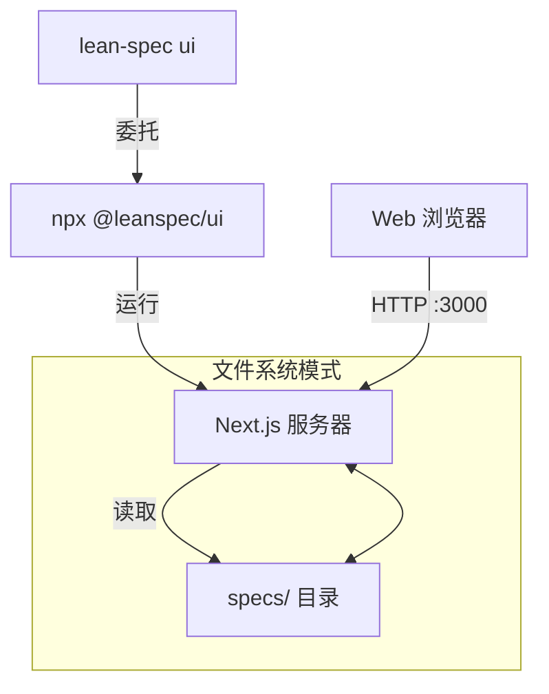
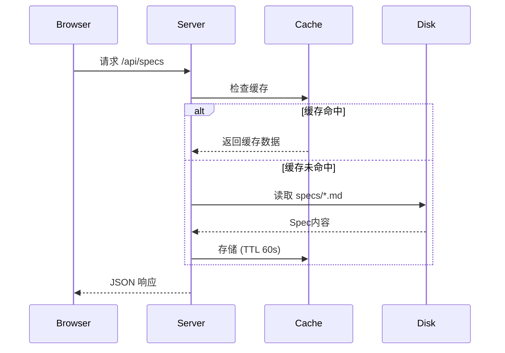

# @leanspec/ui 包

`@leanspec/ui` 包是一个独立的 LeanSpec 网页 UI，无需安装 CLI 即可运行。

## 概述

`@leanspec/ui` 是一个基于 Next.js 的网页应用程序，为浏览和管理 LeanSpec Spec提供可视化界面。它发布在 npm 上，可以直接使用 `npx` 运行或全局安装。

**主要特性：**
- 独立包 - 无需安装 CLI
- 文件系统模式 - 直接从磁盘读取Spec
- 零配置 - 自动检测Spec目录
- 快速响应 - 使用 Next.js standalone 输出构建

## 安装与使用

### 直接使用（推荐）

无需安装：

```bash
npx @leanspec/ui
```

这将：
1. 下载最新版本（如果未缓存）
2. 自动检测您的Spec目录
3. 在 3000 端口启动网页服务器
4. 打开您的默认浏览器

### 全局安装

一次安装，随处使用：

```bash
# 全局安装
npm install -g @leanspec/ui

# 从任何目录运行
leanspec-ui

# 或使用简短别名
lsui
```

### 项目本地安装

添加到项目的开发依赖：

```bash
npm install --save-dev @leanspec/ui
```

然后添加到 `package.json` 脚本：

```json
{
  "scripts": {
    "specs": "leanspec-ui"
  }
}
```

运行：

```bash
npm run specs
```

## CLI 选项

该包提供了一个具有以下选项的 CLI 界面：

```bash
leanspec-ui [选项]
```

### 选项

| 选项 | 别名 | 描述 | 默认值 |
|------|------|------|--------|
| `--specs <dir>` | `-s` | Spec目录路径 | 自动检测 |
| `--port <port>` | `-p` | 服务器端口 | 3000 |
| `--no-open` | - | 不自动打开浏览器 | false |
| `--help` | `-h` | 显示帮助信息 | - |
| `--version` | `-v` | 显示版本号 | - |

### 示例

```bash
# 基本用法（自动检测Spec）
npx @leanspec/ui

# 自定义Spec目录
npx @leanspec/ui --specs ./documentation/specs

# 自定义端口
npx @leanspec/ui --port 8080

# 不打开浏览器
npx @leanspec/ui --no-open

# 组合选项
npx @leanspec/ui --specs ./specs --port 3100 --no-open
```

## 环境变量

该包内部使用以下环境变量：

| 变量 | 描述 | 设置者 |
|------|------|--------|
| `SPECS_MODE` | 操作模式（始终为 "filesystem"） | 包 |
| `SPECS_DIR` | Spec目录的绝对路径 | 包 |
| `PORT` | 服务器端口 | CLI 选项 |
| `NODE_ENV` | Node 环境 | Node.js |

**注意**：这些由包自动设置。通常不需要手动设置。

## 架构

### 组件交互



### Next.js Standalone 输出

该包使用 Next.js 的 standalone 输出模式：

```javascript
// next.config.js
module.exports = {
  output: 'standalone',
  // ...
}
```

**优势：**
- 自包含 - 所有依赖项打包在一起
- 快速启动 - 预编译和优化
- 可移植 - 单个目录可以部署到任何地方

### 文件系统模式

UI 在文件系统模式下运行，这意味着：

**数据流：**



**直接文件访问：**
- 从Spec目录读取 `README.md` 文件
- 解析frontmatter和 markdown 内容
- 无需数据库或持久存储

**缓存策略：**
- Spec在内存中缓存 60 秒
- 缓存在 TTL 过期时失效
- 后续请求获取新数据

**实现：**
```typescript
// 简化的缓存逻辑
const cache = new Map<string, { data: any; timestamp: number }>();
const CACHE_TTL = 60 * 1000; // 60 秒

function getCachedSpec(id: string) {
  const cached = cache.get(id);
  if (cached && Date.now() - cached.timestamp < CACHE_TTL) {
    return cached.data;
  }
  // 从文件系统获取
  const data = readSpecFromDisk(id);
  cache.set(id, { data, timestamp: Date.now() });
  return data;
}
```

### 包结构

```
@leanspec/ui/
├── bin/
│   └── ui.js              # CLI 入口点
├── .next/
│   └── standalone/        # Next.js 构建输出
│       ├── server.js      # 服务器入口
│       └── ...            # 依赖和块
├── public/                # 静态资源
├── package.json           # 包元数据
└── README.md              # 基本文档
```

## 工作原理

### 执行流程

1. **CLI 解析**：`bin/ui.js` 解析命令行参数
2. **Spec检测**：自动检测Spec目录或使用 `--specs` 选项
3. **环境设置**：设置 `SPECS_MODE=filesystem` 和 `SPECS_DIR`
4. **服务器启动**：启动 Next.js standalone 服务器
5. **浏览器启动**：打开默认浏览器（除非 `--no-open`）

### Spec目录检测

包按以下顺序查找Spec：

1. `--specs` CLI 选项（如果提供）
2. 当前目录中的 `specs/`
3. `../specs/`（父目录）
4. `../../specs/`（祖父目录）

在第一个找到包含Spec文件的目录处停止。

### 自动检测算法

```javascript
function detectSpecsDir() {
  // 首先检查 CLI 选项
  if (options.specs) {
    return path.resolve(options.specs);
  }
  
  // 检查当前目录和父目录
  const dirs = [
    path.join(process.cwd(), 'specs'),
    path.join(process.cwd(), '..', 'specs'),
    path.join(process.cwd(), '..', '..', 'specs'),
  ];
  
  for (const dir of dirs) {
    if (fs.existsSync(dir)) {
      // 验证它包含Spec
      const files = fs.readdirSync(dir);
      if (files.some(f => f.match(/^\d{3}-/))) {
        return dir;
      }
    }
  }
  
  throw new Error('Could not find specs directory');
}
```

## 开发

### 对于贡献者

如果您正在为 LeanSpec 做贡献，可以本地使用 UI 包：

```bash
# 克隆 LeanSpec monorepo
git clone https://github.com/codervisor/lean-spec.git
cd lean-spec

# 安装依赖
pnpm install

# 构建 UI 包
cd packages/web
pnpm run build

# 准备 standalone 分发
node scripts/prepare-dist.mjs

# 测试包
cd packages/ui
node bin/ui.js
```

### 从源代码构建

构建过程：

1. **构建 Next.js**：在 `packages/web` 中运行 `pnpm run build`
2. **提取 Standalone**：复制 `.next/standalone` 输出
3. **准备分发**：运行 `prepare-dist.mjs` 脚本
4. **复制到 UI 包**：将文件移动到 `packages/ui`

### 发布

```bash
# 从 packages/ui
npm version patch  # 或 minor、major
npm publish
```

**注意**：只有维护者可以发布到 npm。

## 故障排除

### 安装问题

**问题**：`npm install -g` 因权限错误失败

**解决方案**：
```bash
# 使用 npx 代替（无需安装）
npx @leanspec/ui

# 或修复 npm 权限
# https://docs.npmjs.com/resolving-eacces-permissions-errors
```

### 端口冲突

**问题**：端口 3000 已被使用

**解决方案**：
```bash
# 使用不同端口
npx @leanspec/ui --port 3100
```

### 找不到Spec

**问题**：`Error: Could not find specs directory`

**解决方案**：
```bash
# 明确指定
npx @leanspec/ui --specs ./path/to/specs

# 或确保您在正确的目录
cd /path/to/project
npx @leanspec/ui
```

### 版本过时

**问题**：功能缺失或与文档不同

**解决方案**：
```bash
# 清除 npx 缓存
npx clear-npx-cache

# 明确运行最新版本
npx @leanspec/ui@latest

# 或更新全局安装
npm update -g @leanspec/ui
```

### 服务器无法启动

**问题**：服务器启动但立即崩溃

**解决方案**：
```bash
# 检查 Node.js 版本（需要 v18+）
node --version

# 如果需要，更新 Node.js
# https://nodejs.org/

# 检查错误日志
npx @leanspec/ui 2>&1 | tee ui-error.log
```

## 与 CLI 的比较

| 功能 | `@leanspec/ui` | `lean-spec ui`（CLI） |
|------|----------------|---------------------|
| 安装 | 无需安装（npx） | 需要 CLI 安装 |
| Spec创建 | 否 | 是 |
| Spec编辑 | 否（仅查看） | 是（通过 CLI） |
| 可视化浏览 | ✅ 是 | ✅ 是 |
| 依赖关系图 | ✅ 是 | ✅ 是 |
| 看板视图 | ✅ 是 | ✅ 是 |
| Monorepo 开发模式 | 否 | 是 |
| 用例 | 快速查看 | 完整工作流 |

**何时使用：**

- **使用 `@leanspec/ui`** 用于无需安装任何内容的快速查看
- **使用 `lean-spec ui`** 如果您已经有 CLI 并希望命令一致

两者都启动相同的网页界面 - 区别在于您如何启动它。

## 版本历史

`@leanspec/ui` 包遵循语义版本控制：

- **Major**：CLI 界面或行为的破坏性更改
- **Minor**：新功能、非破坏性更改
- **Patch**：错误修复、性能改进

查看 [CHANGELOG](https://github.com/codervisor/lean-spec/blob/main/CHANGELOG.md) 了解版本详情。

## 包信息

- **npm**：https://www.npmjs.com/package/@leanspec/ui
- **仓库**：https://github.com/codervisor/lean-spec
- **错误报告**：https://github.com/codervisor/lean-spec/issues
- **许可证**：MIT

## 相关文档

- [可视化模式指南](/docs/guide/visual-mode) - 全面的使用指南
- [CLI 参考](/docs/reference/cli#lean-spec-ui) - `lean-spec ui` 命令
- [入门指南](/docs/guide/getting-started) - 设置 LeanSpec
- [配置](/docs/reference/config) - 配置 LeanSpec 设置
