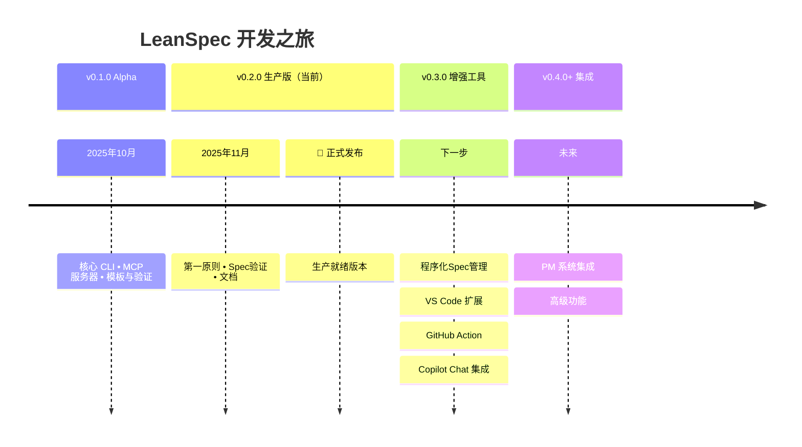
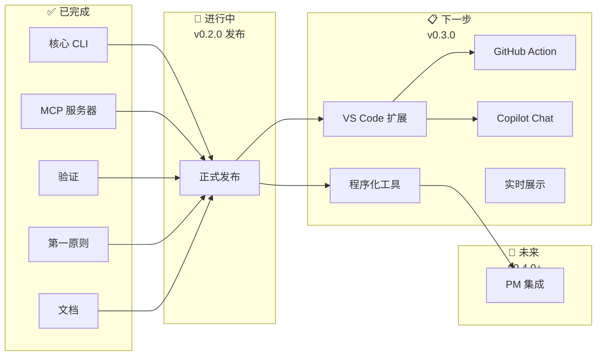

# 路线图

LeanSpec 正在使用 AI 驱动的Spec驱动开发 (Spec-Driven Development, SDD)积极开发中。以下是即将推出的内容——链接到我们正在使用的实际Spec来构建它们。（我们自己实践 LeanSpec！）

:::info AI 驱动的开发速度
我们使用 AI 代理按照我们自己的Spec驱动方法论构建 LeanSpec。传统的时间线估计不适用——功能通常比传统开发提前数周或数月交付。已完成的工作显示实际日期；未来工作显示优先级顺序，而不是固定时间线。
:::

## 发布时间线

## 开发状态

## 开发中（v0.2.0）

**正式发布** - 将 LeanSpec 确立为生产就绪
- 坚如磐石的稳定性和全面的文档
- 实践我们所宣扬的：通过实现展示第一原则
- 通过验证和复杂性检查操作化原则
- [查看Spec 043](https://github.com/codervisor/lean-spec/tree/main/specs/043-official-launch-02)

## 近期计划（v0.3.0）

**程序化Spec管理** - 通过自动化进行上下文工程
- 程序化工具来拆分、压实和转换Spec
- 比手动 LLM 文本生成快 100 倍
- 基于 AST 的转换，带有人机协作工作流程
- 大规模应用上下文工程原则
- [查看Spec 059](https://github.com/codervisor/lean-spec/tree/main/specs/059-programmatic-spec-management)

**VS Code 扩展** - 原生 IDE 集成
- 无需离开编辑器的内联Spec管理
- 带状态指示器和快速操作的树视图
- frontmatter验证和自动完成
- 与 GitHub Copilot 上下文集成
- [查看Spec 017](https://github.com/codervisor/lean-spec/tree/main/specs/017-vscode-extension)

**GitHub Action** - 在 CI/CD 中自动化Spec工作流程
- 在拉取请求中验证Spec
- 如果计划的Spec未完成则阻止 PR
- 在 PR 评论中自动生成Spec摘要
- 随时间跟踪Spec完成度指标
- [查看Spec 016](https://github.com/codervisor/lean-spec/tree/main/specs/016-github-action)

**Copilot Chat 集成** - 通过 AI 聊天与Spec交互
- 用于自然语言Spec操作的聊天参与者
- 开发期间的上下文感知Spec建议
- 无缝的 AI 驱动Spec管理
- [查看Spec 034](https://github.com/codervisor/lean-spec/tree/main/specs/034-copilot-slash-commands)

**实时Spec展示** - 自我实践透明度
- 文档站点上的嵌入式Spec浏览器
- 看板和统计仪表板
- 演示 LeanSpec 的实际应用
- [查看Spec 035](https://github.com/codervisor/lean-spec/tree/main/specs/035-live-specs-showcase)

## 长期计划（v0.4.0+）

**PM 系统集成** - 与现有工作流程连接
- 与 GitHub Issues、Jira 和 Azure DevOps 的双向同步
- LeanSpec 作为Spec的真实来源，PM 系统用于跟踪
- 在添加Spec驱动清晰度的同时保持现有工作流程
- [查看Spec 036](https://github.com/codervisor/lean-spec/tree/main/specs/036-pm-integrations)

## 已完成

**v0.2.0** - 生产就绪版本
- 第一原则基础和文档
- 带复杂性分析的Spec验证
- 上下文经济 (Context Economy)强制执行（&lt;400 行）
- 统一仪表板（看板 + 统计）
- 基于 Git 的时间戳回填
- 品牌和全面的文档
- 从现有工具的迁移指南

**v0.1.0** - Alpha 版本
- 带Spec管理的核心 CLI
- 用于 AI 集成的 MCP 服务器
- 模板和自定义字段
- 模式感知列表分组
- 关系跟踪

---

## 想要贡献？

LeanSpec 是开源的！查看我们的 [GitHub 仓库](https://github.com/codervisor/lean-spec)并查看[贡献指南](https://github.com/codervisor/lean-spec/blob/main/CONTRIBUTING.md)。

有想法或反馈？[提交问题](https://github.com/codervisor/lean-spec/issues)或开始[讨论](https://github.com/codervisor/lean-spec/discussions)。
