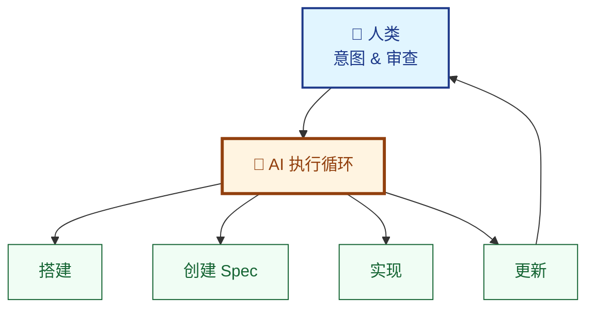

# 无需工具实践 SDD

学习 **LeanSpec 方法论**，让您的 AI Agent 为您构建自定义 Spec 管理系统。几分钟内，您就能拥有完整的 SDD 工作流——无需安装工具包。

**时长**：10 分钟  
**成果**：可用的 Spec 管理系统 + AI 驱动的 SDD 工作流

:::tip "LeanSpec" 的两层含义
1. **LeanSpec 方法论** - 规格驱动开发方法（本教程重点）
2. **LeanSpec 工具包** - CLI/MCP/UI 工具（`lean-spec`、MCP 服务器等）

本教程聚焦于第一点。您的 AI 将创建一个 **自定义脚手架脚本**，零依赖实现方法论。
:::

## AI 优先的方法

**您不编写任何代码。您不编辑任何文件。AI 完成一切。**

您扮演 **指挥官** 的角色：提供意图、审查结果、批准下一步。AI 是您的 **Spec 创建者、维护者和执行者**。



**这是软件开发的未来**：人类提供战略方向，AI 处理战术执行。

## 您需要什么

- **AI 编码助手**（GitHub Copilot、Claude、Cursor、Windsurf 等）
- **任何项目** 可用（或从头开始）

仅此而已。无需 npm 包，无需安装，无需设置。

## 步骤 1：引导您的 Spec 系统

**💬 发送此提示给您的 AI 助手：**

```
为这个项目搭建一个轻量级 Spec 管理系统。

创建：
1. specs/ 文件夹用于存放 Spec
2. spec.js - Node.js 脚本，包含以下命令：
   - create <name> - 创建新 Spec，自动分配序列号
   - update <spec> --status <status> - 更新 Spec 状态
   - list [--status <status>] - 列出 Spec，可选状态过滤
   - view <spec> - 显示 Spec 内容
3. AGENTS.md - AI Agent 的 SDD 工作流指令
4. Spec 格式模板（嵌入在 spec.js 中）

要求：
- 零 npm 依赖（仅使用 Node.js 内置模块）
- Spec 使用 frontmatter（status、created、priority、tags）
- 遵循 LeanSpec 第一性原理
- 保持最简和实用
```

**AI 做什么**（您什么都不做）：

1. 创建 `specs/` 目录
2. 生成包含完整 CLI 功能的 `spec.js`
3. 编写包含 SDD 工作流指令的 `AGENTS.md`
4. 在脚本中嵌入 Spec 模板

**结果**：约 2 分钟内拥有可用的 Spec 管理系统。

:::tip 验证设置
```bash
node spec.js --help
```

您应该看到可用命令。AI 创建了一个完全功能的 CLI！
:::

## 步骤 2：创建您的第一个 Spec

**💬 发送此提示给您的 AI 助手：**

```
为这个应用创建一个添加深色主题支持的 Spec。

要求：
- 自动检测系统偏好
- 平滑过渡
- 保持当前设计美学
```

**AI 做什么**：

1. 运行 `node spec.js create dark-theme`
2. 按照模板编写 Spec 内容
3. 在 Overview 中捕获您的需求
4. 添加实现计划
5. 提交：`git commit -m "spec: add 001-dark-theme"`

**您得到**（无需编写一行代码）：

```markdown title="specs/001-dark-theme/README.md"
---
status: planned
created: 2025-11-25
priority: high
tags: [ui, enhancement]
---

# Dark Theme Support

## Overview
添加响应系统偏好的深色主题。目前仅有浅色主题，
在弱光环境下导致眼睛疲劳。

**为什么**：改善夜间或暗环境下工作的用户体验。

## Design
- 使用 CSS `prefers-color-scheme` 媒体查询
- 使用 CSS 变量定义主题颜色
- 主题间平滑过渡（200ms）
- 符合 WCAG AA 对比度标准

## Plan
- [ ] 定义颜色变量（浅色 + 深色调色板）
- [ ] 为深色模式添加媒体查询
- [ ] 更新所有组件使用变量
- [ ] 测试对比度比率

## Success Criteria
- [ ] 主题随系统偏好切换
- [ ] 所有文本符合 WCAG AA 对比度
- [ ] 主题切换时无闪烁
```

**检查**：
```bash
node spec.js list
# 001-dark-theme [planned] Dark Theme Support
```

## 步骤 3：实现功能

**💬 发送此提示给您的 AI 助手：**

```
实现 Spec 001。
```

就这样。三个字。

**AI 做什么**：

1. 运行 `node spec.js view 001` 读取需求
2. 更新状态：`node spec.js update 001 --status in-progress`
3. 实现功能：
   - 添加 CSS 变量
   - 实现媒体查询
   - 更新所有颜色引用
   - 在两种主题下测试
4. 随着工作进展更新 Spec 复选框
5. 运行 `node spec.js update 001 --status complete`
6. 提交：`git commit -m "feat: implement dark theme (closes #001)"`

**您审查**：打开应用，切换系统主题。成功！

## 步骤 4：包含多个 Spec 的复杂功能

**💬 发送此提示给您的 AI 助手：**

```
使用 JWT 添加用户身份验证。

这需要多个 Spec：
- JWT 服务（令牌生成/验证）
- 登录/登出端点
- 受保护路由中间件
- 密码哈希

为每个组件创建 Spec 并按顺序实现。
```

**AI 做什么**：

1. **创建 4 个相关 Spec**：
   ```bash
   node spec.js create jwt-service
   node spec.js create auth-endpoints  
   node spec.js create auth-middleware
   node spec.js create password-hashing
   ```

2. **链接依赖关系**（手动编辑 frontmatter）：
   ```yaml
   # 在 003-auth-endpoints/README.md 中
   depends_on: [002, 004]  # 需要 JWT 服务 + 密码哈希
   ```

3. **按顺序实现**：
   - Spec 002（JWT 服务）→ complete
   - Spec 004（密码哈希）→ complete
   - Spec 003（认证端点）→ complete
   - Spec 005（认证中间件）→ complete

4. **在实现过程中自动更新所有 Spec**

**您审查**： 
```bash
node spec.js list
# 显示 4 个已完成的 Spec，依赖关系正确处理
```

## 脚手架脚本 (spec.js)

这是 AI 为您创建的：

```javascript title="spec.js (由 AI 生成)"
#!/usr/bin/env node
const fs = require('fs');
const path = require('path');

const SPECS_DIR = 'specs';
const TEMPLATE = `---
status: planned
created: {{DATE}}
priority: medium
tags: []
---

# {{TITLE}}

## Overview
[描述问题以及为什么选择此方案]

## Design
[关键决策和理由]

## Plan
- [ ] 任务 1
- [ ] 任务 2

## Success Criteria
- [ ] 标准 1
`;

// 命令实现
function create(name) {
  const seq = getNextSequence();
  const slug = \`\${seq}-\${name}\`;
  const dir = path.join(SPECS_DIR, slug);
  
  fs.mkdirSync(dir, { recursive: true });
  
  const content = TEMPLATE
    .replace('{{DATE}}', new Date().toISOString().split('T')[0])
    .replace('{{TITLE}}', toTitle(name));
    
  fs.writeFileSync(path.join(dir, 'README.md'), content);
  console.log(\`✓ Created \${slug}\`);
}

function update(spec, options) {
  const dir = findSpec(spec);
  const file = path.join(dir, 'README.md');
  let content = fs.readFileSync(file, 'utf8');
  
  // 更新 frontmatter
  content = content.replace(
    /status: \w+/,
    \`status: \${options.status}\`
  );
  
  fs.writeFileSync(file, content);
  console.log(\`✓ Updated \${spec}\`);
}

function list(options = {}) {
  const specs = fs.readdirSync(SPECS_DIR);
  
  specs.forEach(spec => {
    const content = fs.readFileSync(
      path.join(SPECS_DIR, spec, 'README.md'),
      'utf8'
    );
    const status = content.match(/status: (\w+)/)[1];
    
    if (!options.status || status === options.status) {
      console.log(\`\${spec} [\${status}]\`);
    }
  });
}

// 辅助函数
function getNextSequence() {
  const specs = fs.readdirSync(SPECS_DIR);
  const numbers = specs
    .map(s => parseInt(s.split('-')[0]))
    .filter(n => !isNaN(n));
  
  return String(Math.max(0, ...numbers) + 1).padStart(3, '0');
}

function findSpec(spec) {
  const specs = fs.readdirSync(SPECS_DIR);
  return specs.find(s => s.startsWith(spec) || s.includes(spec));
}

function toTitle(slug) {
  return slug.split('-')
    .map(w => w[0].toUpperCase() + w.slice(1))
    .join(' ');
}

// CLI 解析器
const [,, command, ...args] = process.argv;

switch(command) {
  case 'create': create(args[0]); break;
  case 'update': update(args[0], { status: args[2] }); break;
  case 'list': list(); break;
  case 'view': 
    console.log(fs.readFileSync(
      path.join(findSpec(args[0]), 'README.md'), 
      'utf8'
    )); 
    break;
  default:
    console.log('Usage: node spec.js <create|update|list|view>');
}
```

**AI 在几秒内生成了这个。零依赖。纯 Node.js。**

## AGENTS.md 文件

AI 还为自己创建了指令：

```markdown title="AGENTS.md (由 AI 生成)"
# AI Agent Instructions

## Spec-Driven Development Workflow

1. **Discover**: 运行 `node spec.js list` 检查现有 Spec
2. **Plan**: 为新功能运行 `node spec.js create <name>`
3. **Start Work**: 运行 `node spec.js update <spec> --status in-progress`
4. **Implement**: 编写代码，边做边更新 Spec 复选框
5. **Complete**: 运行 `node spec.js update <spec> --status complete`

## Spec Creation Guidelines

- 保持 Spec \<300 行（约 2K Token）
- 关注"为什么"和"是什么"，而非"如何做"
- 随着实现揭示新见解更新 Spec
- 使用清晰、能帮助决策的语言

## Status Workflow

- `planned` - Spec 已编写，未开始
- `in-progress` - 当前正在实现
- `complete` - 实现完成并测试

## First Principles

按顺序应用：
1. **Context Economy** - 适应工作记忆
2. **Signal-to-Noise** - 每个词都帮助决策
3. **Intent Over Implementation** - 捕获为什么，而非仅仅如何
```

**现在每个 AI 会话都从这些指令开始。保证一致性。**

## 为什么这种方法有效

**最佳的人机协作：**

| 角色 | 人类 | AI |
|------|------|-----|
| **战略** | 定义目标、优先级 | 建议权衡、替代方案 |
| **战术** | 审查、批准 | 创建 Spec、编写代码、更新文档 |
| **操作** | 监控结果 | 执行命令、管理状态 |

**您停留在"指挥中心"**——高层次思考、决策制定。AI 处理苦力活。

## 扩展系统

**根据需要添加更多命令：**

```
使用以下命令增强 spec.js：
- search <query> - 通过内容查找 Spec
- deps <spec> - 显示依赖图
- board - 显示看板式状态视图
- validate - 检查 Spec 质量（Token 数、结构）
```

AI 在几分钟内添加完成。您的系统随需求演进。

**添加 Spec 模板：**

```
创建 templates/ 目录，包含：
- feature.md - 用于新功能
- bug.md - 用于 Bug 修复
- refactor.md - 用于重构工作

更新 spec.js 支持：node spec.js create <name> --template <type>
```

## 应用第一性原理

LeanSpec 方法论建立在 5 个第一性原理之上（按优先级排序）：

### 1. 上下文经济 (Context Economy)
**Spec 必须适应工作记忆——无论是人类还是 AI。**

- 目标：\<2,000 Token（约 300 行）
- AI 在创建时检查 Token 数
- 如果太大自动建议拆分

### 2. 信噪比最大化 (Signal-to-Noise Maximization)
**每个词都必须帮助决策，否则删除。**

- AI 在编写 Spec 时删除冗余内容
- 专注于决策、权衡、理由
- 删除显而易见或可推断的内容

### 3. 意图优于实现 (Intent Over Implementation)
**捕获"为什么"和"是什么"，让"如何做"自然涌现。**

- AI 强调问题定义
- 记录设计决策
- 实现细节保持最简

### 4. 弥合差距 (Bridge the Gap)
**人类和 AI 都必须理解。**

- 清晰的结构（frontmatter + 章节）
- 自然语言，无术语
- 为复杂概念添加示例

### 5. 渐进式披露 (Progressive Disclosure)
**仅在感到痛苦时才增加复杂性。**

- 从最简脚本开始（create、update、list）
- 按需添加功能（search、deps、validate）
- 无过早抽象

**了解更多**：[第一性原理](/zh-Hans/docs/advanced/first-principles)

## 方法对比

| 方面 | 自定义脚本（本教程） | LeanSpec 工具包 |
|------|---------------------|-----------------|
| **设置** | AI 在 2 分钟内创建 | `npm install -g lean-spec` |
| **依赖** | 零（纯 Node.js） | Node.js + 多个包 |
| **定制** | 完全属于您，随时修改 | 预定义功能 |
| **功能** | 从最简开始，按需添加 | 完整功能集 |
| **学习曲线** | 平缓（您看到所有代码） | 更陡（黑盒 CLI） |
| **最适合** | 小团队、自定义需求 | 想要开箱即用的团队 |
| **AI 集成** | AGENTS.md + 脚本 | MCP 服务器 + CLI |

**两者遵循相同的方法论。** 根据需求选择。

## 何时采用工具包

当出现以下情况时考虑官方工具包：

**痛点出现：**
- 团队规模 \>5（需要更好的协作）
- \>50 个 Spec（需要高级搜索/分析）
- 多个项目（需要共享工具）
- 非技术利益相关者（需要可视化模式）
- 复杂依赖（需要依赖图）

**工具包优势：**
- 智能语义搜索
- 可视化看板
- 依赖图可视化
- 深度 AI 集成的 MCP 服务器
- 验证和复杂度分析
- 经过实战检验，处理边缘情况

**迁移很容易：** Spec 只是 Markdown 文件。工具包读取您现有的 `specs/` 目录，无需任何更改。

## 练习

**现在就试试**（约 10 分钟）：

1. **引导**："使用 spec.js + AGENTS.md 搭建 Spec 系统"
2. **创建**："为 [您想要的功能] 创建 Spec"
3. **实现**："实现 Spec 001"
4. **审查**：检查代码，测试功能
5. **完成**：AI 自动标记 Spec 完成

**额外挑战：**
- 让 AI 创建 3 个带依赖关系的相关 Spec
- 要求 AI 按正确顺序实现它们
- 向 spec.js 添加 `search` 命令
- 为您的领域创建自定义模板

## 关键要点

**AI 优先的开发已经到来：**
- **您指挥**，AI 执行
- **您审查**，AI 实现
- **您决策**，AI 记录

**LeanSpec 方法论促成这一工作流：**
- Spec 作为人类和 AI 之间的共享记忆
- 清晰的工作流：发现 → 规划 → 实现 → 完成
- 第一性原理保持 Spec 专注和可执行
- 需要时零依赖自定义工具

**未来**：人类战略思维 + AI 战术执行 = 10 倍生产力

## 下一步

**继续使用自定义脚本：**
- 添加更多命令（search、deps、validate）
- 为您的领域创建自定义模板
- 与现有工具集成
- 随需求演进

**准备尝试工具包？**
- [快速开始](/zh-Hans/docs/guide/getting-started) - 安装 `lean-spec`
- [CLI 使用](/zh-Hans/docs/guide/usage/cli/overview) - 完整命令参考
- [MCP 集成](/zh-Hans/docs/guide/usage/mcp-integration) - 深度 AI 集成

**深入了解方法论：**
- [第一性原理](/zh-Hans/docs/advanced/first-principles) - 决策框架
- [上下文工程](/zh-Hans/docs/advanced/context-engineering) - 为 AI 优化
- [AI 辅助 Spec 编写](/zh-Hans/docs/advanced/ai-assisted-spec-writing) - 高级模式
- [SDD 工作流](/zh-Hans/docs/guide/terminology/sdd-workflow) - 完整工作流指南

**有问题？** 查看 [常见问题](/zh-Hans/docs/faq) 或 [提交 Issue](https://github.com/codervisor/lean-spec/issues)。

---

**记住**：方法论与工具无关。无论您使用自定义脚本还是完整工具包，原则和工作流保持不变。从简单开始，按需演进。让 AI 承担重任，您专注于重要的事情——构建优秀的软件。
