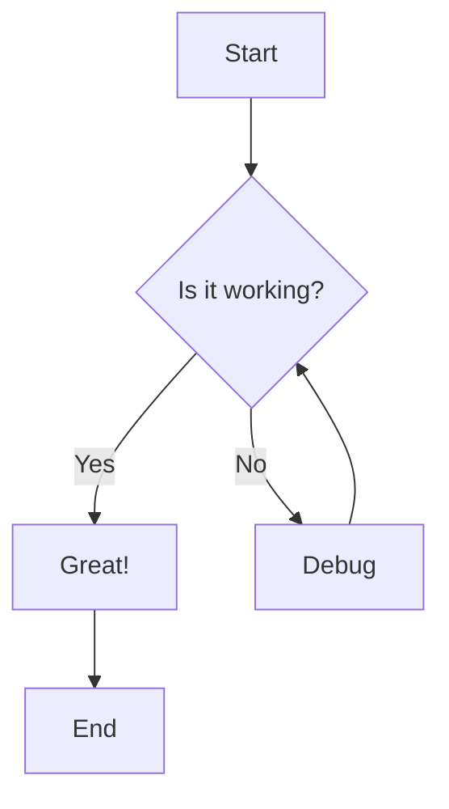
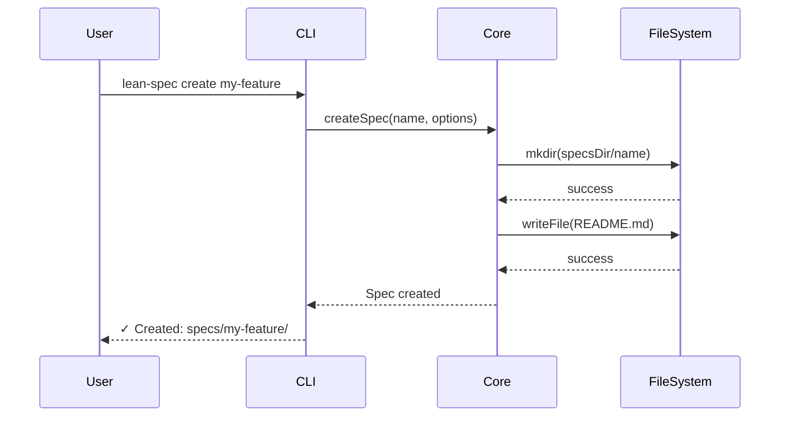
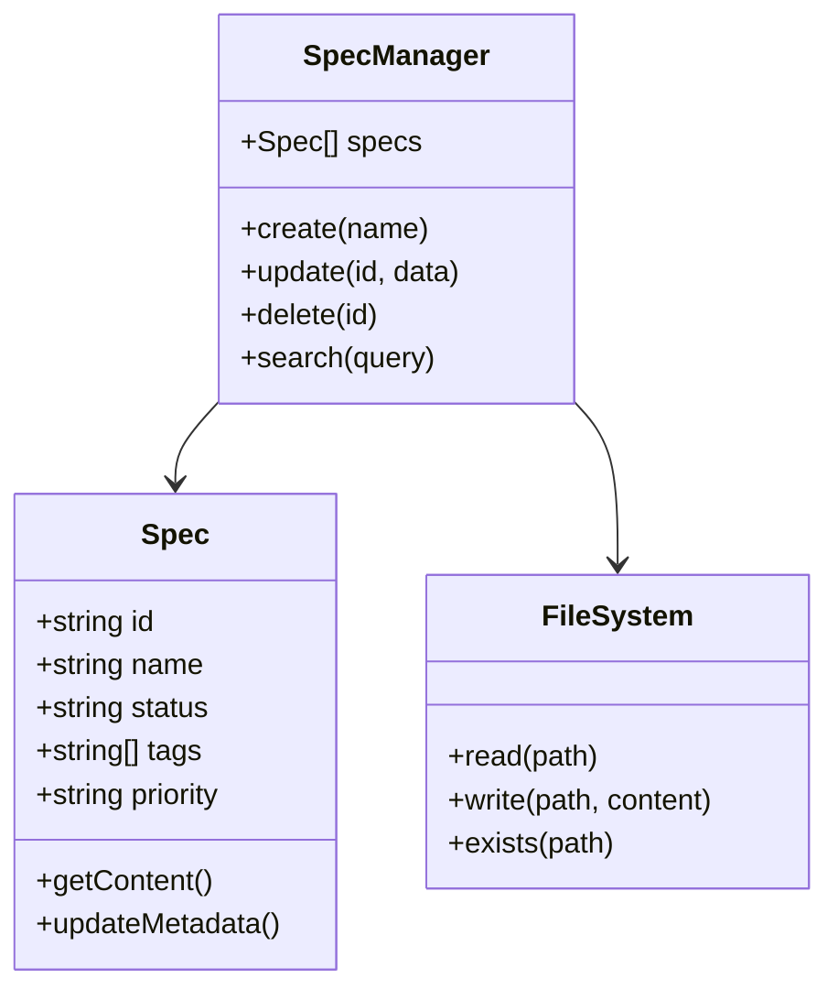
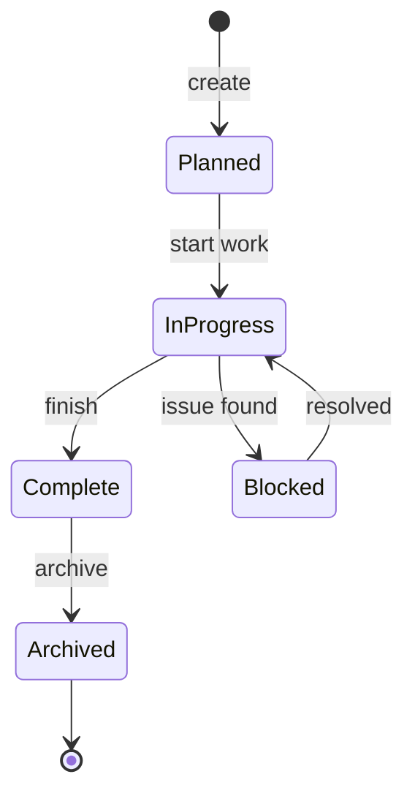
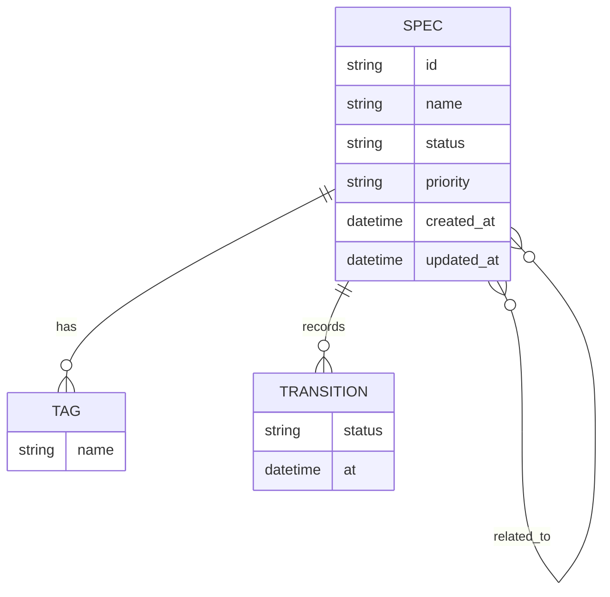
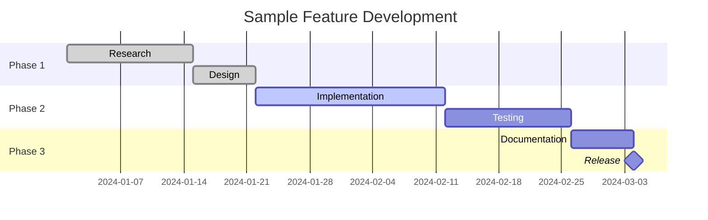
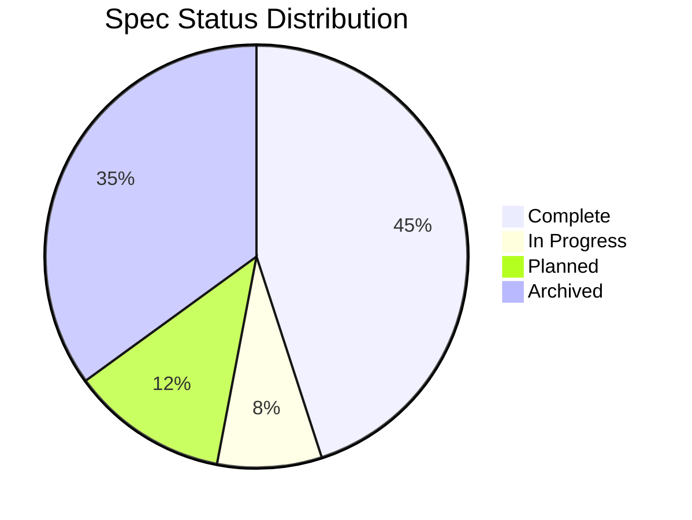
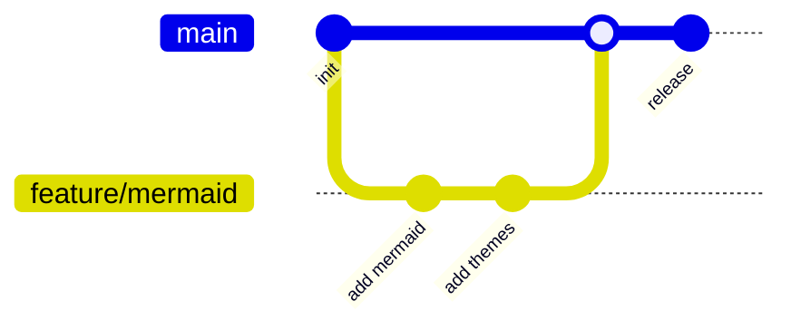

# Mermaid Diagram Showcase

> **Status**: ✅ Complete · **Priority**: Medium · **Created**: 2025-11-25 · **Tags**: test, ui, mermaid, visualization

**Project**: lean-spec  
**Team**: Core Development

## Overview

This spec serves as a test fixture for validating Mermaid diagram rendering in the LeanSpec UI. It contains various diagram types to ensure the `@leanspec/ui` package correctly renders all supported Mermaid diagram formats.

**Related**: See spec 119 (UI Diagram Rendering) for the implementation details.

## Diagram Examples

### Flowchart

A basic flowchart showing a decision process:

### Sequence Diagram

Illustrating component interactions:

### Class Diagram

Showing the core architecture:

### State Diagram

Spec lifecycle states:

### Entity Relationship Diagram

Spec relationships model:

### Gantt Chart

Project timeline visualization:

### Pie Chart

Spec status distribution:

### Git Graph

Branch and merge visualization:

## Test Criteria

### Rendering Tests
- [ ] Flowchart renders with correct node shapes and arrows
- [ ] Sequence diagram shows all participants and messages
- [ ] Class diagram displays classes with attributes and methods
- [ ] State diagram shows states and transitions
- [ ] ER diagram renders entities and relationships
- [ ] Gantt chart displays timeline correctly
- [ ] Pie chart shows segments with labels
- [ ] Git graph shows branches and commits

### Theme Support
- [ ] Diagrams render correctly in light mode
- [ ] Diagrams render correctly in dark mode
- [ ] Theme switching updates diagram colors

### Error Handling
- [ ] Invalid syntax shows error message
- [ ] Fallback to code block on render failure

## Notes

This spec is intentionally kept as a test fixture and should not be marked as complete or archived. It serves as a living reference for validating diagram rendering functionality in the UI package.
